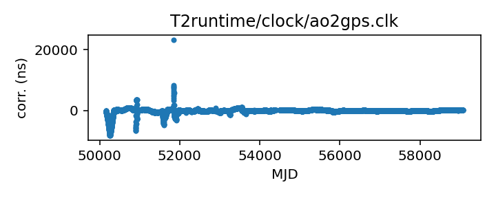
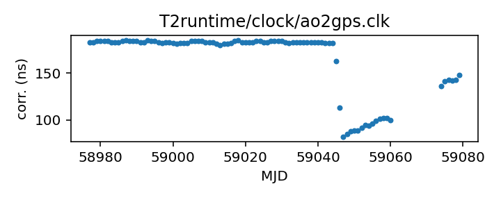

## Arecibo (TEMPO2 converted from TEMPO)

Arecibo clock corrections (TEMPO2 converted version)

This file was automativally converted from the TEMPO-format Arecibo
clock corrections (time_ao.dat), which cover the observatory's full
operational history. Please see the Arecibo clock corrections for
details, provenance, and contact information for the original data.

The earliest clock corrections in time_ao.dat predate GPS and are
actually referenced to NIST time directly. Clock corrections from
after 1995 are referenced to GPS. This file has been manually trimmed
to contain only the GPS-referenced data.

If questions arise about the original data, contact David Nice
<niced@lafayette.edu>.

If questions arise about the conversion, contact Anne Archibald
<anne.archibald@nanograv.org>.

|     |     |
|:--- |:--- |
| File | `T2runtime/clock/ao2gps.clk` |
| Authority | temporary |
| URL in repository | <https://raw.githubusercontent.com/ipta/pulsar-clock-corrections/main/T2runtime/clock/ao2gps.clk> |
| Original download URL | <None> |
| Format | tempo2 |
| Bogus last correction | False |
| Clock file start | 1996-03-13 MJD 50155.0 |
| Clock file end | 2020-08-18 MJD 59079.0 |
| Update interval (days) | inf |
| Last update attempt | 2022-06-01 |
| Last update result | Updated |

Log entries from the last few update attempts:
```
2022-06-01 14:19:54.628 - Updated
```
[Full log](https://raw.githubusercontent.com/ipta/pulsar-clock-corrections/main/log/T2runtime/clock/ao2gps.clk.log)

Leading comments from clock file:

    # This file was automatically converted from tempo/clock/time_ao.dat on 2022-06-01 14:19:54.601
    # Early data in time_ao.dat is referenced to NIST rather than to GPS, so
    # that data has been removed and is present in ao2nist.clk.
    #
    # May 2022: it was noticed that the following are out of time order,
    #    so Tempo won't use them correctly.
    # Their origin is unknown.  They look like a hack.
    #    They are being commented outfor now.
    #  49528.1       73.492      71.487 3 f  25-JUN-94  raw readouts
    #  49544.9       72.0        73.0   3 f  11-JUL-94  no data, rough interp.-->
    #  49545.9       72.0        73.1   3 f  12-JUL-94  --> need more precision
    #  49557.79      74.213      74.287 3 f  24-JUL-94  your time.dat


All clock corrections:



Recent clock corrections:



