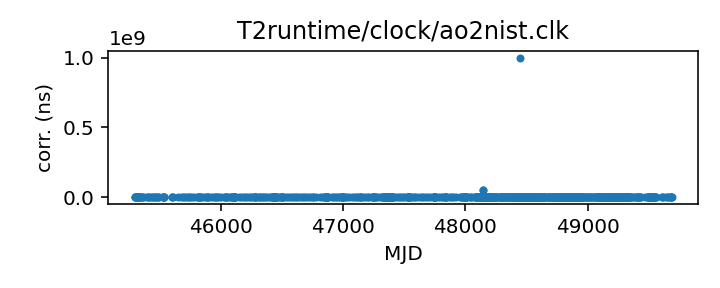
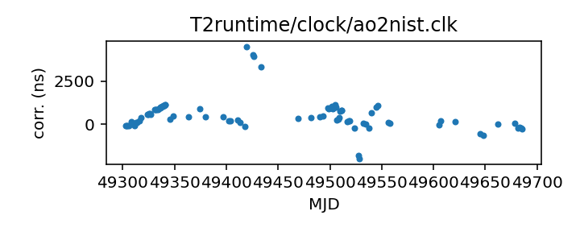

## Arecibo to NIST (TEMPO2)

Arecibo clock corrections to UTC(NIST) (TEMPO2 version)

The early clock corrections for Arecibo predate GPS and are
actually referenced directly to NIST. This clock correction file
separates these out so their corrections can be handled using a
different clock chain.

This file is pulled from the TEMPO2 repository and may not be fully up-to-date.

|     |     |
|:--- |:--- |
| File | `T2runtime/clock/ao2nist.clk` |
| Authority | temporary |
| URL in repository | <https://raw.githubusercontent.com/nanograv/pulsar-clock-corrections/main/T2runtime/clock/ao2nist.clk> |
| Original download URL | <https://bitbucket.org/psrsoft/tempo2/raw/HEAD/T2runtime/clock/ao2nist.clk> |
| Format | tempo2 |
| Bogus last correction | False |
| Clock file start | 1982-11-29 MJD 45302.8 |
| Clock file end | 1994-11-29 MJD 49685.4 |
| Update interval (days) | inf |
| Last update attempt | 2022-05-26 |
| Last update result | Unchanged |

Log entries from the last few update attempts:
```
2022-05-26 20:40:04.320 - Unchanged
```
[Full log](https://raw.githubusercontent.com/nanograv/pulsar-clock-corrections/main/log/T2runtime/clock/ao2nist.clk.log)


All clock corrections:



Recent clock corrections:



