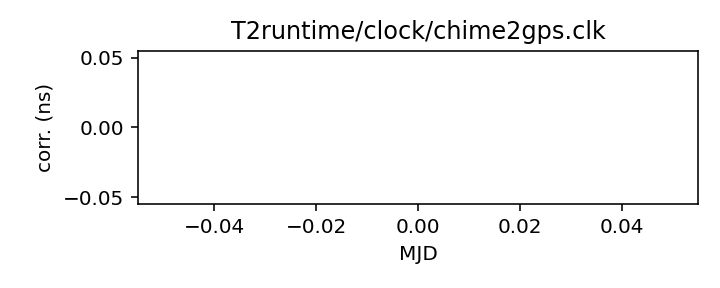
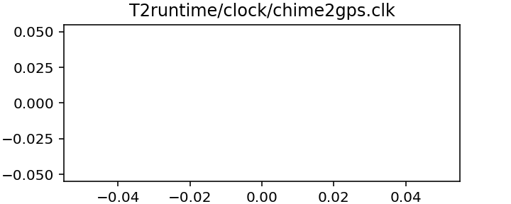

## CHIME

CHIME (null) clock corrections

CHIME records data directly against GPS time, and thus no clock
corrections are necessary. This file is a placeholder to make that
obvious.

|     |     |
|:--- |:--- |
| File | `T2runtime/clock/chime2gps.clk` |
| Authority | observatory |
| URL in repository | <https://raw.githubusercontent.com/ipta/pulsar-clock-corrections/main/T2runtime/clock/chime2gps.clk> |
| Original download URL | <None> |
| Format | tempo2 |
| Bogus last correction | True |
| Clock file start | --- |
| Clock file end | --- |
| Update interval (days) | inf |
| Last update attempt | 2022-06-20 |
| Last update result | No way to download |

Log entries from the last few update attempts:
```
2022-06-20 22:07:51.282 - No way to download: 'T2runtime/clock/chime2gps.clk'
```
[Full log](https://raw.githubusercontent.com/ipta/pulsar-clock-corrections/main/log/T2runtime/clock/chime2gps.clk.log)

Leading comments from clock file:

    # Chime references its data directly to GPS time and therefore
    # requires no clock corrections. This file exists to make that
    # explicit.


All clock corrections:



Recent clock corrections:



