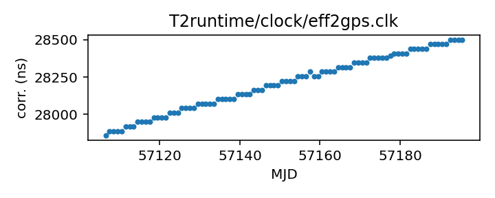

Effelsberg
---------------------------
Effelsberg telescope clock corrections

This file is pulled from the TEMPO2 repository and may not be fully up-to-date.

Originally made from time_bonn.dat with an awk script, according to
the comments.

|     |     |
|:--- |:--- |
| File | `T2runtime/clock/eff2gps.clk` |
| Authority | temporary |
| Download URL | <https://bitbucket.org/psrsoft/tempo2/raw/HEAD/T2runtime/clock/eff2gps.clk> |
| Format | tempo2 |
| Bogus last correction | False |
| Clock file start | 1993-11-29 MJD 49320.0 |
| Clock file end | 2023-02-25 MJD 60000.0 |
| Update interval (days) | 7 |
| Last update attempt | 2022-05-26 |
| Last update result | Unchanged |

Log entries from the last few update attempts:
```
2022-05-26 20:40:08.243 - Unchanged
```
[Full log](https://raw.githubusercontent.com/nanograv/pulsar-clock-corrections/main/log/T2runtime/clock/eff2gps.clk.log)


All clock corrections:


Recent clock corrections:



