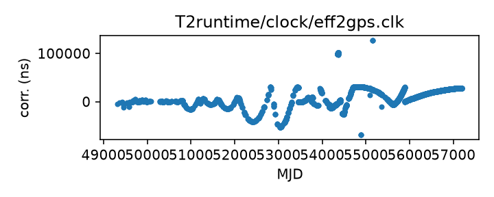
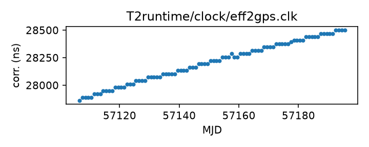

## Effelsberg

Effelsberg telescope clock corrections

This file is pulled from the TEMPO2 repository and may not be fully
up-to-date.

Originally made from time_bonn.dat with an awk script, according to
the comments.

|     |     |
|:--- |:--- |
| File | `T2runtime/clock/eff2gps.clk` |
| Authority | temporary |
| URL in repository | <https://raw.githubusercontent.com/ipta/pulsar-clock-corrections/main/T2runtime/clock/eff2gps.clk> |
| Original download URL | <https://bitbucket.org/psrsoft/tempo2/raw/HEAD/T2runtime/clock/eff2gps.clk> |
| Format | tempo2 |
| Bogus last correction | True |
| Clock file start | 1993-11-29 MJD 49320.0 |
| Clock file end | 2015-06-22 MJD 57195.5 |
| Update interval (days) | 7 |
| Last update attempt | 2026-04-24 |
| Last update result | Unchanged |

Log entries from the last few update attempts:
```
2026-02-10 21:08:04.872 - Unchanged
2026-02-17 21:03:19.791 - Unchanged
2026-03-06 20:56:14.837 - Unchanged
2026-03-13 21:00:03.190 - Unchanged
2026-03-20 20:57:43.772 - Unchanged
2026-03-27 21:04:36.320 - Unchanged
2026-04-03 21:02:09.816 - Unchanged
2026-04-10 21:02:57.998 - Unchanged
2026-04-17 21:10:29.589 - Unchanged
2026-04-24 21:13:44.131 - Unchanged
```
[Full log](https://raw.githubusercontent.com/ipta/pulsar-clock-corrections/main/log/T2runtime/clock/eff2gps.clk.log)

Leading comments from clock file:

    # From old tempo time_bonn.dat:
    # awk '{printf("%11.5f %10.5e\n",$1,$3/1.e6)}' time_bonn.dat
    #  > $TEMPO2/clock/eff2gps.clk
    #


All clock corrections:



Recent clock corrections:



