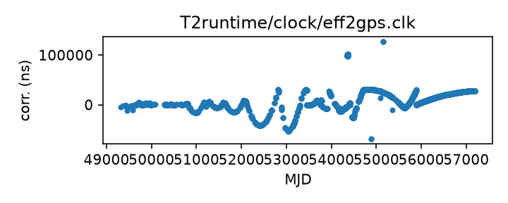
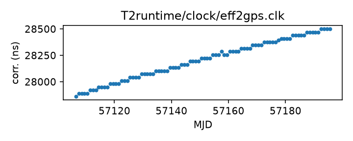

## Effelsberg

Effelsberg telescope clock corrections

This file is pulled from the TEMPO2 repository and may not be fully
up-to-date.

Originally made from time_bonn.dat with an awk script, according to
the comments.

|     |     |
|:--- |:--- |
| File | `T2runtime/clock/eff2gps.clk` |
| Authority | temporary |
| URL in repository | <https://raw.githubusercontent.com/ipta/pulsar-clock-corrections/main/T2runtime/clock/eff2gps.clk> |
| Original download URL | <https://bitbucket.org/psrsoft/tempo2/raw/HEAD/T2runtime/clock/eff2gps.clk> |
| Format | tempo2 |
| Bogus last correction | True |
| Clock file start | 1993-11-29 MJD 49320.0 |
| Clock file end | 2015-06-22 MJD 57195.5 |
| Update interval (days) | 7 |
| Last update attempt | 2026-08-29 |
| Last update result | Unchanged |

Log entries from the last few update attempts:
```
2026-06-26 21:48:34.278 - Unchanged
2026-07-03 21:39:57.247 - Unchanged
2026-07-10 21:35:05.579 - Unchanged
2026-07-17 21:16:03.726 - Unchanged
2026-07-24 21:37:03.273 - Unchanged
2026-07-31 21:37:33.327 - Unchanged
2026-08-07 21:04:58.149 - Unchanged
2026-08-14 20:55:04.781 - Unchanged
2026-08-21 20:48:54.947 - Unchanged
2026-08-29 02:51:59.660 - Unchanged
```
[Full log](https://raw.githubusercontent.com/ipta/pulsar-clock-corrections/main/log/T2runtime/clock/eff2gps.clk.log)

Leading comments from clock file:

    # From old tempo time_bonn.dat:
    # awk '{printf("%11.5f %10.5e\n",$1,$3/1.e6)}' time_bonn.dat
    #  > $TEMPO2/clock/eff2gps.clk
    #


All clock corrections:



Recent clock corrections:



