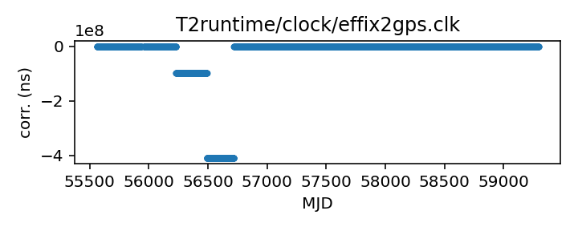
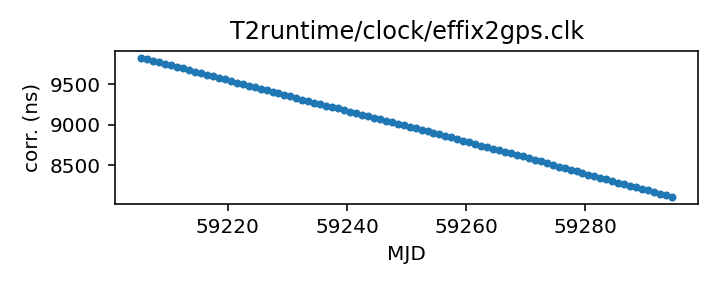

## Effelsberg Asterix/PSRix

Effelsberg Asterix/PSRix clock correction file

This file is pulled from the TEMPO2 repository and may not be fully
up-to-date. The European Pulsar Timing Array maintains an internal
repository of clock corrections, which they have transferred to the TEMPO2
repository, so  EPTA telescope data in the TEMPO2 repository (and
thus here) can be expected to be somewhat up to date.

|     |     |
|:--- |:--- |
| File | `T2runtime/clock/effix2gps.clk` |
| Authority | temporary |
| URL in repository | <https://raw.githubusercontent.com/ipta/pulsar-clock-corrections/main/T2runtime/clock/effix2gps.clk> |
| Original download URL | <https://bitbucket.org/psrsoft/tempo2/raw/HEAD/T2runtime/clock/effix2gps.clk> |
| Format | tempo2 |
| Bogus last correction | False |
| Clock file start | 2011-01-01 MJD 55562.5 |
| Clock file end | 2021-03-21 MJD 59294.5 |
| Update interval (days) | 7 |
| Last update attempt | 2024-12-11 |
| Last update result | Unchanged |

Log entries from the last few update attempts:
```
2024-08-30 20:32:33.986 - Unchanged
2024-09-06 20:31:32.596 - Unchanged
2024-09-13 20:32:08.558 - Unchanged
2024-09-20 20:33:32.234 - Unchanged
2024-09-27 20:33:24.985 - Unchanged
2024-10-04 20:33:17.392 - Unchanged
2024-10-11 20:39:12.002 - Unchanged
2024-11-27 20:39:55.475 - Unchanged
2024-12-04 20:40:28.956 - Unchanged
2024-12-11 20:40:41.969 - Unchanged
```
[Full log](https://raw.githubusercontent.com/ipta/pulsar-clock-corrections/main/log/T2runtime/clock/effix2gps.clk.log)

Leading comments from clock file:

    # Effelsberg Asterix/PSRix clock correction file
    # Generated on Jan 27, 2021 by Huanchen Hu
    # Measurements until 24/07/2021, the new maser-gps recording starts from 24/03/2021, an offset may occur.
    # 08/10/2020, Correct the offsets on MJD 56720 and 56981, add offset on MJD 57000 based on LEAP. Remove the jumps in the MJD range 57240 - 57400.
    # 08/09/2020, Add new measurements from MJD 58611 to now
    # 04/03,2020, Add VLBI maser measurement to the old clock file, MJD 57790 to 58611
    # The following clock offsets are included:
    #    MJD:  -inf to 56230; offset=0.000000000 s
    #    MJD: 56230 to 56490; offset=-0.097284254 s
    #    MJD: 56490 to 56720; offset=-0.409268005 s
    #    MJD: 56720 to 56981; offset=-0.000001111 s
    #    MJD: 56981 to 57000; offset=-0.000000545 s
    #    MJD: 57000 to   inf; offset=-0.000000374 s
    #


All clock corrections:



Recent clock corrections:



