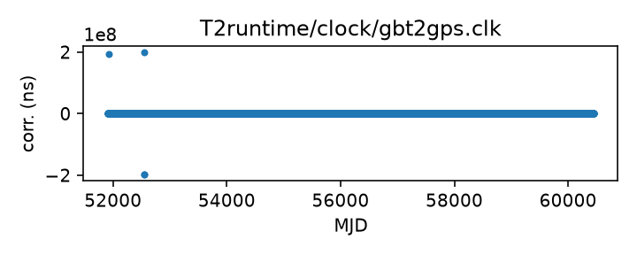
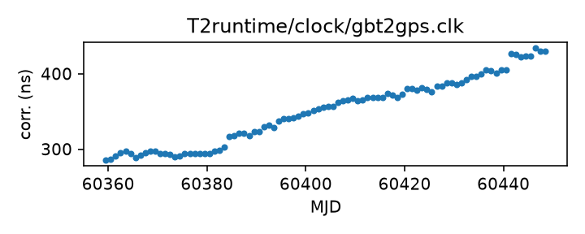

## GBT (TEMPO2 converted from TEMPO)

Green Bank Telescope clock corrections (TEMPO2 converted version)

This file is automativally converted from the TEMPO-format GBT
clock corrections, which are obtained directly from the observatory.
Thus these can be expected to be fully up to date. Please see the
GBT clock corrections file entry for further details.

If questions arise about the original data, contact Ryan S. Lynch
<rlynch@nrao.edu>.

If questions arise about the conversion, contact Anne Archibald
<anne.archibald@nanograv.org>.

|     |     |
|:--- |:--- |
| File | `T2runtime/clock/gbt2gps.clk` |
| Authority | converted |
| URL in repository | <https://raw.githubusercontent.com/ipta/pulsar-clock-corrections/main/T2runtime/clock/gbt2gps.clk> |
| Original download URL | <None> |
| Format | tempo2 |
| Bogus last correction | False |
| Clock file start | 2000-12-31 MJD 51909.5 |
| Clock file end | 2024-05-18 MJD 60448.5 |
| Update interval (days) | 1 |
| Last update attempt | 2026-03-11 |
| Last update result | Validation failed |

Log entries from the last few update attempts:
```
2026-02-17 21:03:09.110 - Validation failed: New version of T2runtime/clock/gbt2gps.clk MJDs differ from old version where they overlap in 8407 places
2026-02-18 21:04:45.035 - Validation failed: New version of T2runtime/clock/gbt2gps.clk MJDs differ from old version where they overlap in 8407 places
2026-02-19 20:58:03.573 - Validation failed: New version of T2runtime/clock/gbt2gps.clk MJDs differ from old version where they overlap in 8407 places
2026-03-06 20:56:00.248 - Validation failed: New version of T2runtime/clock/gbt2gps.clk MJDs differ from old version where they overlap in 8407 places
2026-03-07 20:47:59.631 - Validation failed: New version of T2runtime/clock/gbt2gps.clk MJDs differ from old version where they overlap in 8407 places
2026-03-08 20:49:00.850 - Validation failed: New version of T2runtime/clock/gbt2gps.clk MJDs differ from old version where they overlap in 8407 places
2026-03-09 20:58:42.916 - Validation failed: New version of T2runtime/clock/gbt2gps.clk MJDs differ from old version where they overlap in 8407 places
2026-03-10 20:57:24.607 - Validation failed: New version of T2runtime/clock/gbt2gps.clk MJDs differ from old version where they overlap in 8407 places
2026-03-11 20:57:32.646 - Validation failed: New version of T2runtime/clock/gbt2gps.clk MJDs differ from old version where they overlap in 8407 places
2026-03-11 23:20:32.240 - Validation failed: New version of T2runtime/clock/gbt2gps.clk MJDs differ from old version where they overlap in 8407 places
```
[Full log](https://raw.githubusercontent.com/ipta/pulsar-clock-corrections/main/log/T2runtime/clock/gbt2gps.clk.log)

Leading comments from clock file:

    # This file was automatically converted from tempo/clock/time_gbt.dat on 2024-05-19 20:29:30.939


All clock corrections:



Recent clock corrections:



