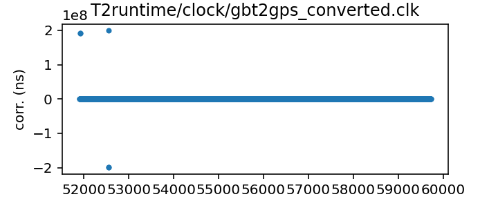
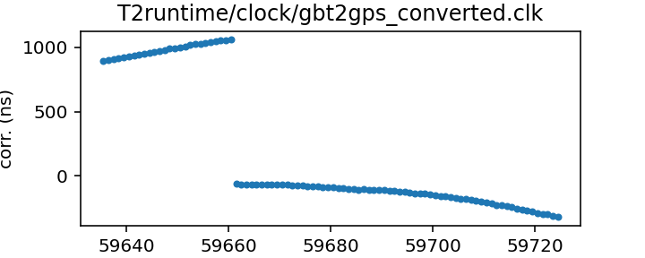

GBT (TEMPO2 converted from TEMPO)
---------------------------
Green Bank Telescope clock corrections (TEMPO2 converted version)

This file is automativally converted from the TEMPO-format GBT
clock corrections, which are obtained directly from the observatory.
Thus these can be expected to be fully up to date.

|     |     |
|:--- |:--- |
| File | `T2runtime/clock/gbt2gps_converted.clk` |
| Authority | converted |
| Download URL | <None> |
| Format | tempo2 |
| Bogus last correction | False |
| Clock file start | 2000-12-31 MJD 51909.5 |
| Clock file end | 2022-05-25 MJD 59724.5 |
| Update interval (days) | 0 |
| Last update attempt | 2022-05-26 |
| Last update result | Updated |

Log entries from the last few update attempts:
```
2022-05-26 14:50:47.642 - Updated
2022-05-26 18:54:53.491 - Updated
2022-05-26 19:10:25.757 - Updated
2022-05-26 19:16:14.424 - Updated
2022-05-26 20:40:01.207 - Updated
```
[Full log](https://raw.githubusercontent.com/nanograv/pulsar-clock-corrections/main/log/T2runtime/clock/gbt2gps_converted.clk.log)


All clock corrections:



Recent clock corrections:



