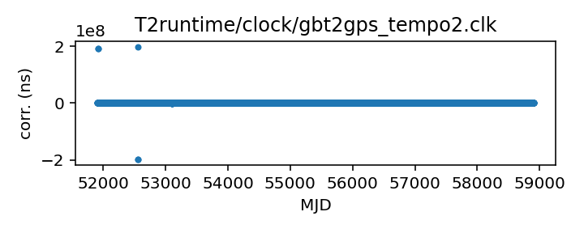
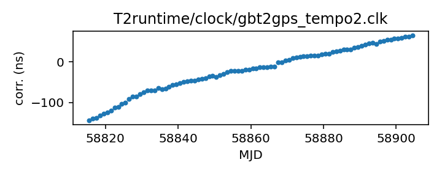

## GBT (TEMPO2)

Green Bank Telescope clock corrections (TEMPO2 version)

This file is pulled from the TEMPO2 repository and may not be fully
up-to-date.

|     |     |
|:--- |:--- |
| File | `T2runtime/clock/gbt2gps_tempo2.clk` |
| Authority | temporary |
| URL in repository | <https://raw.githubusercontent.com/ipta/pulsar-clock-corrections/main/T2runtime/clock/gbt2gps_tempo2.clk> |
| Original download URL | <https://bitbucket.org/psrsoft/tempo2/raw/HEAD/T2runtime/clock/gbt2gps.clk> |
| Format | tempo2 |
| Bogus last correction | False |
| Clock file start | 2000-12-31 MJD 51909.5 |
| Clock file end | 2020-02-25 MJD 58904.5 |
| Update interval (days) | 7 |
| Last update attempt | 2023-04-03 |
| Last update result | Unchanged |

Log entries from the last few update attempts:
```
2023-01-30 20:28:56.039 - Unchanged
2023-02-06 20:29:46.733 - Unchanged
2023-02-13 20:30:38.827 - Unchanged
2023-02-20 20:29:01.177 - Unchanged
2023-02-27 20:30:43.627 - Unchanged
2023-03-06 20:30:58.497 - Unchanged
2023-03-13 20:28:36.504 - Unchanged
2023-03-20 20:27:17.489 - Unchanged
2023-03-27 20:29:27.456 - Unchanged
2023-04-03 20:26:04.899 - Unchanged
```
[Full log](https://raw.githubusercontent.com/ipta/pulsar-clock-corrections/main/log/T2runtime/clock/gbt2gps_tempo2.clk.log)


All clock corrections:



Recent clock corrections:



