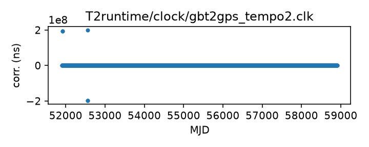
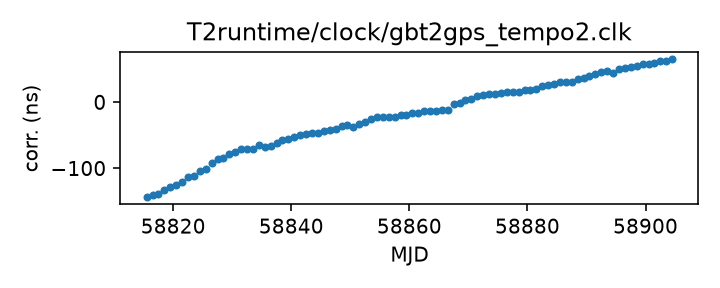

## GBT (TEMPO2)

Green Bank Telescope clock corrections (TEMPO2 version)

This file is pulled from the TEMPO2 repository and may not be fully
up-to-date.

|     |     |
|:--- |:--- |
| File | `T2runtime/clock/gbt2gps_tempo2.clk` |
| Authority | temporary |
| URL in repository | <https://raw.githubusercontent.com/ipta/pulsar-clock-corrections/main/T2runtime/clock/gbt2gps_tempo2.clk> |
| Original download URL | <https://bitbucket.org/psrsoft/tempo2/raw/HEAD/T2runtime/clock/gbt2gps.clk> |
| Format | tempo2 |
| Bogus last correction | False |
| Clock file start | 2000-12-31 MJD 51909.5 |
| Clock file end | 2020-02-25 MJD 58904.5 |
| Update interval (days) | 7 |
| Last update attempt | 2026-06-05 |
| Last update result | Unchanged |

Log entries from the last few update attempts:
```
2026-04-03 21:02:02.076 - Unchanged
2026-04-10 21:02:50.245 - Unchanged
2026-04-17 21:10:21.889 - Unchanged
2026-04-24 21:13:35.889 - Unchanged
2026-05-01 21:14:42.588 - Unchanged
2026-05-08 21:34:51.339 - Unchanged
2026-05-15 21:35:29.800 - Unchanged
2026-05-22 21:43:09.829 - Unchanged
2026-05-29 22:14:00.527 - Unchanged
2026-06-05 21:54:02.107 - Unchanged
```
[Full log](https://raw.githubusercontent.com/ipta/pulsar-clock-corrections/main/log/T2runtime/clock/gbt2gps_tempo2.clk.log)


All clock corrections:



Recent clock corrections:



