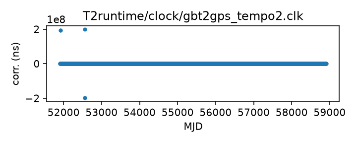
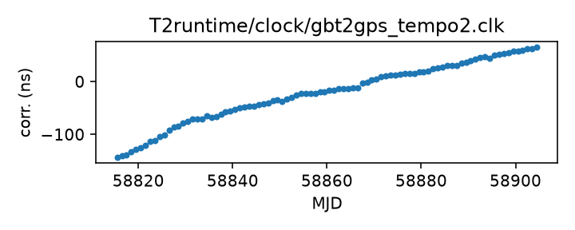

## GBT (TEMPO2)

Green Bank Telescope clock corrections (TEMPO2 version)

This file is pulled from the TEMPO2 repository and may not be fully
up-to-date.

|     |     |
|:--- |:--- |
| File | `T2runtime/clock/gbt2gps_tempo2.clk` |
| Authority | temporary |
| URL in repository | <https://raw.githubusercontent.com/ipta/pulsar-clock-corrections/main/T2runtime/clock/gbt2gps_tempo2.clk> |
| Original download URL | <https://bitbucket.org/psrsoft/tempo2/raw/HEAD/T2runtime/clock/gbt2gps.clk> |
| Format | tempo2 |
| Bogus last correction | False |
| Clock file start | 2000-12-31 MJD 51909.5 |
| Clock file end | 2020-02-25 MJD 58904.5 |
| Update interval (days) | 7 |
| Last update attempt | 2026-08-07 |
| Last update result | Unchanged |

Log entries from the last few update attempts:
```
2026-06-05 21:54:02.107 - Unchanged
2026-06-12 22:06:09.665 - Unchanged
2026-06-19 21:42:49.886 - Unchanged
2026-06-26 21:48:25.403 - Unchanged
2026-07-03 21:39:50.080 - Unchanged
2026-07-10 21:34:56.887 - Unchanged
2026-07-17 21:15:55.299 - Unchanged
2026-07-24 21:36:54.519 - Unchanged
2026-07-31 21:37:24.504 - Unchanged
2026-08-07 21:04:50.127 - Unchanged
```
[Full log](https://raw.githubusercontent.com/ipta/pulsar-clock-corrections/main/log/T2runtime/clock/gbt2gps_tempo2.clk.log)


All clock corrections:



Recent clock corrections:



