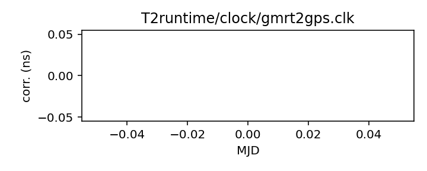
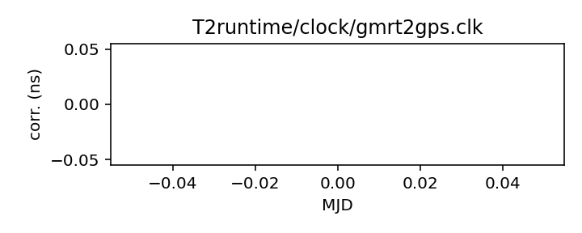

## GMRT

GMRT (null) clock corrections

The GMRT records data directly against GPS time, and thus no clock
corrections are necessary. This file is a placeholder to make that
obvious.

|     |     |
|:--- |:--- |
| File | `T2runtime/clock/gmrt2gps.clk` |
| Authority | observatory |
| URL in repository | <https://raw.githubusercontent.com/ipta/pulsar-clock-corrections/main/T2runtime/clock/gmrt2gps.clk> |
| Original download URL | <None> |
| Format | tempo2 |
| Bogus last correction | True |
| Clock file start | --- |
| Clock file end | --- |
| Update interval (days) | inf |
| Last update attempt | 2022-06-01 |
| Last update result | Failed to download |

Log entries from the last few update attempts:
```
2022-06-01 12:20:21.838 - Failed to download: HTTP Error 404: Not Found
```
[Full log](https://raw.githubusercontent.com/ipta/pulsar-clock-corrections/main/log/T2runtime/clock/gmrt2gps.clk.log)

Leading comments from clock file:

    # The GMRT references its data directly to GPS time and therefore
    # requires no clock corrections. This file exists to make that
    # explicit.


All clock corrections:



Recent clock corrections:




### Further information

- [Description of this repository](index.html)
- [Instructions for using this repository with various software](instructions.html)
- [Status page](status.html)


This repository is currently maintained by Anne Archibald <anne.archibald@nanograv.org>.

