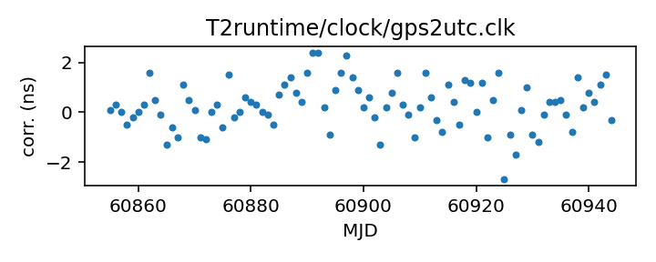

## GPS to UTC

GPS to UTC clock corrections

This file is constructed from BIPM published data and should be up-to-date.

The BIPM publishes two different corrections from GPS to UTC:
the first, C0, corrects from the GPS Combined Clock to UTC. The second,
C0', corrects from a timescale that takes advantage of the broadcast
GPS almanac data to track UTC more closely.

This file uses C0' data when available, but that is only since 2011.
Prior to that this uses C0.

You may want to consider whether your GPS time standard is returning
the Combined Clock or whether it is using the almanac data. There are
more specific correction files suitable for one case or the other.

If you have questions about this, contact Anne Archibald
<anne.archibald@nanograv.org>. For more detailed questions
about the BIPM's published corrections, contact <tai@bipm.org>.

|     |     |
|:--- |:--- |
| File | `T2runtime/clock/gps2utc.clk` |
| Authority | observatory |
| URL in repository | <https://raw.githubusercontent.com/ipta/pulsar-clock-corrections/main/T2runtime/clock/gps2utc.clk> |
| Original download URL | <None> |
| Format | tempo2 |
| Bogus last correction | False |
| Clock file start | 1993-01-01 MJD 48988.0 |
| Clock file end | 2024-04-29 MJD 60429.0 |
| Update interval (days) | 1 |
| Last update attempt | 2024-07-22 |
| Last update result | Unchanged |

Log entries from the last few update attempts:
```
2024-07-13 20:29:46.347 - Unchanged
2024-07-14 20:29:24.098 - Unchanged
2024-07-15 20:29:37.317 - Unchanged
2024-07-16 20:29:25.892 - Unchanged
2024-07-17 20:29:50.742 - Unchanged
2024-07-18 20:29:59.567 - Unchanged
2024-07-19 20:31:01.734 - Unchanged
2024-07-20 20:29:34.839 - Unchanged
2024-07-21 20:31:28.538 - Unchanged
2024-07-22 20:29:53.084 - Unchanged
```
[Full log](https://raw.githubusercontent.com/ipta/pulsar-clock-corrections/main/log/T2runtime/clock/gps2utc.clk.log)

Leading comments from clock file:

    # Corrections from GPS to UTC.
    # Leap seconds do not appear here.
    #
    # Note that the GPS "almanac" signal also includes predictions of the
    # Combined Clock's deviations from UTC, so a suitable receiver can produce a
    # good approximation of UTC.
    #
    # The BIPM publishes these values as "C0'", from about 2011 to the present.
    # The BIPM also publishes corrections for the Combined Clock, going back to
    # 1993. This file contains both: when available, we use C0', before that we
    # use C0. This may or may not resemble what your GPS receiver system uses.
    #
    # The first values in this file are from the BIPM yearly summary tables
    # available for years YY=93 to 03 from
    # ftp://ftp2.bipm.org/pub/tai/scale/UTCGPS/utcgpsYY.ar
    # and for years YY=03 to 11 from
    # ftp://ftp2.bipm.org/pub/tai/scale/UTCGPSGLO/utcgpsgloYY.ar
    # Later entries in the file (there is a comment to mark the place)
    # are obtained from
    # https://webtai.bipm.org/ftp/pub/tai/other-products/utcgnss/utc-gnss
    # which is updated monthly.
    #
    # These entries are based on C0 values.


All clock corrections:


Recent clock corrections:



