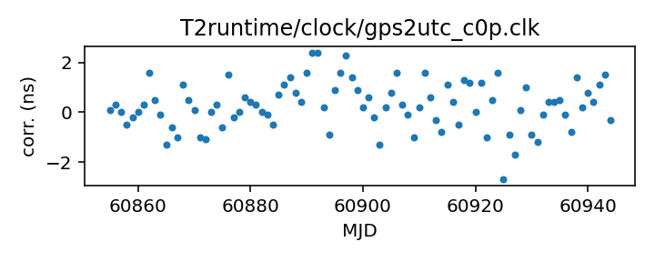

## GPS to UTC (Corrected)

GPS to UTC clock corrections (Corrected)

This file is constructed from BIPM published data and should be up-to-date.

The BIPM publishes two different corrections from GPS to UTC:
the first, C0, corrects from the GPS Combined Clock to UTC. The second,
C0', corrects from a timescale that takes advantage of the broadcast
GPS almanac data to track UTC more closely.

This file uses C0' data, that is, it is for GPS time standards that
take advantage of the almanac data to improve their time correction.
Unfortunately the BIPM only publishes these corrections going back
to 2011.

If you have questions about this, contact Anne Archibald
<anne.archibald@nanograv.org>. For more detailed questions
about the BIPM's published corrections, contact <tai@bipm.org>.

|     |     |
|:--- |:--- |
| File | `T2runtime/clock/gps2utc_c0p.clk` |
| Authority | observatory |
| URL in repository | <https://raw.githubusercontent.com/ipta/pulsar-clock-corrections/main/T2runtime/clock/gps2utc_c0p.clk> |
| Original download URL | <None> |
| Format | tempo2 |
| Bogus last correction | False |
| Clock file start | 2010-12-29 MJD 55559.0 |
| Clock file end | 2025-03-30 MJD 60764.0 |
| Update interval (days) | 1 |
| Last update attempt | 2025-05-11 |
| Last update result | Unchanged |

Log entries from the last few update attempts:
```
2025-02-11 20:36:32.738 - Unchanged
2025-02-12 20:36:24.907 - Updated
2025-02-13 20:35:52.629 - Unchanged
2025-05-05 14:30:52.177 - Updated
2025-05-06 20:41:52.700 - Unchanged
2025-05-07 20:42:57.548 - Unchanged
2025-05-08 20:42:41.267 - Unchanged
2025-05-09 20:41:35.212 - Unchanged
2025-05-10 20:37:53.239 - Unchanged
2025-05-11 20:38:18.421 - Unchanged
```
[Full log](https://raw.githubusercontent.com/ipta/pulsar-clock-corrections/main/log/T2runtime/clock/gps2utc_c0p.clk.log)

Leading comments from clock file:

    # Corrections from the GPS predictions of UTC to UTC.
    # Leap seconds do not appear here.
    #
    # Note that the GPS "almanac" signal also includes predictions of the
    # Combined Clock's deviations from UTC, so a suitable receiver can produce a
    # good approximation of UTC. This file records the errors in that approximation.
    #
    # The BIPM publishes these values as "C0'", from about 2011 to the present.
    # The BIPM also publishes corrections for the Combined Clock, going back to
    # 1993. Those are available in a separate file.
    #
    # The data in this file is obtained from
    # https://webtai.bipm.org/ftp/pub/tai/other-products/utcgnss/utc-gps
    # which is updated monthly.
    #


All clock corrections:


Recent clock corrections:



