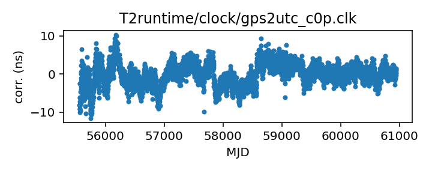

## GPS to UTC (Corrected)

GPS to UTC clock corrections (Corrected)

This file is constructed from BIPM published data and should be up-to-date.

The BIPM publishes two different corrections from GPS to UTC:
the first, C0, corrects from the GPS Combined Clock to UTC. The second,
C0', corrects from a timescale that takes advantage of the broadcast
GPS almanac data to track UTC more closely.

This file uses C0' data, that is, it is for GPS time standards that
take advantage of the almanac data to improve their time correction.
Unfortunately the BIPM only publishes these corrections going back
to 2011.

If you have questions about this, contact Anne Archibald
<anne.archibald@newcastle.ac.uk>. For more detailed questions
about the BIPM's published corrections, contact <tai@bipm.org>.

|     |     |
|:--- |:--- |
| File | `T2runtime/clock/gps2utc_c0p.clk` |
| Authority | observatory |
| URL in repository | <https://raw.githubusercontent.com/nanograv/pulsar-clock-corrections/main/T2runtime/clock/gps2utc_c0p.clk> |
| Original download URL | <None> |
| Format | tempo2 |
| Bogus last correction | False |
| Clock file start | 2010-12-29 MJD 55559.0 |
| Clock file end | 2022-04-30 MJD 59699.0 |
| Update interval (days) | 1 |
| Last update attempt | 2022-06-08 |
| Last update result | Updated |

Log entries from the last few update attempts:
```
2022-06-08 10:46:41.942 - No way to download: 'T2runtime/clock/gps2utc_c0p.clk'
2022-06-08 10:46:41.957 - Updated
```
[Full log](https://raw.githubusercontent.com/nanograv/pulsar-clock-corrections/main/log/T2runtime/clock/gps2utc_c0p.clk.log)


All clock corrections:



Recent clock corrections:


