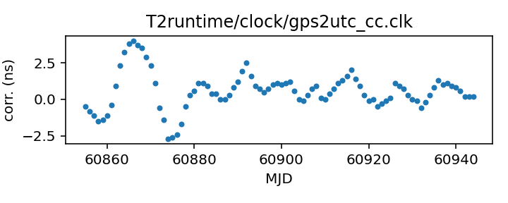

## GPS to UTC (Combined Clock)

GPS to UTC clock corrections (Combined Clock)

This file is constructed from BIPM published data and should be up-to-date.

The BIPM publishes two different corrections from GPS to UTC:
the first, C0, corrects from the GPS Combined Clock to UTC. The second,
C0', corrects from a timescale that takes advantage of the broadcast
GPS almanac data to track UTC more closely.

This file uses C0 data, that is, it is for GPS time standards that
do not take advantage of the almanac data to improve their time
correction.

If you have questions about this, contact Anne Archibald
<anne.archibald@nanograv.org>. For more detailed questions
about the BIPM's published corrections, contact <tai@bipm.org>.

|     |     |
|:--- |:--- |
| File | `T2runtime/clock/gps2utc_cc.clk` |
| Authority | observatory |
| URL in repository | <https://raw.githubusercontent.com/ipta/pulsar-clock-corrections/main/T2runtime/clock/gps2utc_cc.clk> |
| Original download URL | <None> |
| Format | tempo2 |
| Bogus last correction | False |
| Clock file start | 1993-01-01 MJD 48988.0 |
| Clock file end | 2023-11-26 MJD 60274.0 |
| Update interval (days) | 1 |
| Last update attempt | 2024-01-02 |
| Last update result | Unchanged |

Log entries from the last few update attempts:
```
2023-12-24 20:29:34.824 - Unchanged
2023-12-25 20:29:50.569 - Unchanged
2023-12-26 20:29:23.461 - Unchanged
2023-12-27 20:29:33.797 - Unchanged
2023-12-28 20:29:18.832 - Unchanged
2023-12-29 20:29:24.098 - Unchanged
2023-12-30 20:29:13.888 - Unchanged
2023-12-31 20:29:17.809 - Unchanged
2024-01-01 20:29:34.949 - Unchanged
2024-01-02 20:29:24.090 - Unchanged
```
[Full log](https://raw.githubusercontent.com/ipta/pulsar-clock-corrections/main/log/T2runtime/clock/gps2utc_cc.clk.log)

Leading comments from clock file:

    # Corrections from UTC inferred from the GPS Combined Clock to UTC.
    # Leap seconds do not appear here, and the Combined Clock is steered
    # to try to make it approximate UTC, but there is some residual drift.
    #
    # Note that the GPS "almanac" signal also includes predictions of its
    # deviations from UTC, so the Combined Clock is not necessarily the best
    # available approximation of UTC; a suitable receiver can do better.
    #
    # The BIPM publishes these values as "C0", from about 1995 to the present.
    # The BIPM also publishes corrections for the predicted UTC, but only from
    # 2011. Those are available in a separate file.
    #
    # The first values in this file are from the BIPM yearly summary tables
    # available for years YY=93 to 03 from
    # ftp://ftp2.bipm.org/pub/tai/scale/UTCGPS/utcgpsYY.ar
    # and for years YY=03 to 11 from
    # ftp://ftp2.bipm.org/pub/tai/scale/UTCGPSGLO/utcgpsgloYY.ar
    # Later entries in the file (there is a comment to mark the place)
    # are obtained from
    # https://webtai.bipm.org/ftp/pub/tai/other-products/utcgnss/utc-gnss
    # which is updated monthly.
    #


All clock corrections:


Recent clock corrections:



