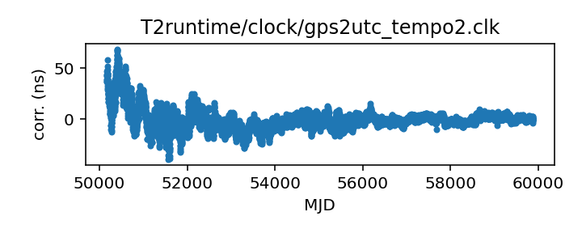

## GPS to UTC (TEMPO2)

GPS to UTC clock corrections

This file is used in the clock correction process for almost all
observatories.

This file is pulled from the TEMPO2 repository and may not be fully up-to-date.

In TEMPO2 this file was traditionally generated by a script that parsed
BIPM Circular T and merged any new data into this file. This has
resulted in some anomalous entries at the merge points and also
a change in entries as Circular T has redefined what it publishes
(early entries in this file are from the column C0, later entries
are from the column C0').

|     |     |
|:--- |:--- |
| File | `T2runtime/clock/gps2utc_tempo2.clk` |
| Authority | temporary |
| URL in repository | <https://raw.githubusercontent.com/ipta/pulsar-clock-corrections/main/T2runtime/clock/gps2utc_tempo2.clk> |
| Original download URL | <https://bitbucket.org/psrsoft/tempo2/raw/HEAD/T2runtime/clock/gps2utc.clk> |
| Format | tempo2 |
| Bogus last correction | True |
| Clock file start | 1996-03-27 MJD 50169.0 |
| Clock file end | 2020-10-27 MJD 59149.0 |
| Update interval (days) | 7 |
| Last update attempt | 2022-10-13 |
| Last update result | Unchanged |

Log entries from the last few update attempts:
```
2022-08-11 20:33:12.669 - Unchanged
2022-08-18 20:36:19.222 - Unchanged
2022-08-25 20:34:33.023 - Unchanged
2022-09-01 20:35:21.334 - Unchanged
2022-09-08 20:39:02.511 - Unchanged
2022-09-15 20:40:30.345 - Unchanged
2022-09-22 20:38:59.345 - Unchanged
2022-09-29 20:42:32.142 - Unchanged
2022-10-06 20:41:31.643 - Unchanged
2022-10-13 20:42:16.517 - Unchanged
```
[Full log](https://raw.githubusercontent.com/ipta/pulsar-clock-corrections/main/log/T2runtime/clock/gps2utc_tempo2.clk.log)

Leading comments from clock file:

    # RTE 29 Sep 2004 generated from cirt.100-200
    #    using update_clkcorr -t gpsutc cirt.[12]*
    #Comments from merged data file:
    #>Fri Nov 12 11:07:05 2004 Imported from file cirt.201
    #Comments from merged data file:
    #>Thu Nov 18 10:41:27 2004 Imported from file cirt.202
    #Comments from merged data file:
    #>Thu Feb 17 10:07:52 2005 Imported from file cirt.203
    #Comments from merged data file:
    #>Thu Feb 17 10:07:52 2005 Imported from file cirt.204
    #Comments from merged data file:
    #>Thu Feb 17 10:07:52 2005 Imported from file cirt.205
    #Comments from merged data file:
    #>Wed May 18 11:57:43 2005 Imported from file cirt.206
    #Comments from merged data file:
    #>Wed May 18 11:57:43 2005 Imported from file cirt.207
    #Comments from merged data file:
    #>Wed May 18 11:57:43 2005 Imported from file cirt.208
    #Comments from merged data file:
    #>Mon Jul 18 15:49:28 2005 Imported from file cirt.209
    #Comments from merged data file:
    #>Mon Jul 18 15:49:28 2005 Imported from file cirt.210
    #Comments from merged data file:
    #>Thu Sep 29 16:30:07 2005 Imported from file cirt.211
    #Comments from merged data file:
    #>Thu Sep 29 16:30:07 2005 Imported from file cirt.212
    #Comments from merged data file:
    #>Wed Dec  7 12:28:55 2005 Imported from file cirt.213
    #Comments from merged data file:
    #>Wed Dec  7 12:28:55 2005 Imported from file cirt.214
    #Comments from merged data file:
    #>Thu Mar 16 14:13:19 2006 Imported from file cirt.215
    #Comments from merged data file:
    #>Thu Mar 16 14:13:19 2006 Imported from file cirt.216
    #Comments from merged data file:
    #>Thu Mar 16 14:13:19 2006 Imported from file cirt.217
    #Comments from merged data file:
    #>Tue Jun 13 15:28:32 2006 Imported from file cirt.218
    #Comments from merged data file:
    #>Tue Jun 13 15:28:32 2006 Imported from file cirt.219
    #Comments from merged data file:
    #>Mon Aug 14 14:29:05 2006 Imported from file cirt.220
    #Comments from merged data file:
    #>Mon Aug 14 14:29:05 2006 Imported from file cirt.221
    #Comments from merged data file:
    #>Mon Aug 14 14:29:05 2006 Imported from file cirt.222
    #Comments from merged data file:
    #>Mon Aug 14 14:29:05 2006 Imported from file cirt.223
    #Comments from merged data file:
    #>Thu Jan 11 14:09:40 2007 Imported from file cirt.224
    #Comments from merged data file:
    #>Thu Jan 11 14:12:22 2007 Imported from file cirt.225
    #Comments from merged data file:
    #>Thu Jan 11 14:14:30 2007 Imported from file cirt.226
    #Comments from merged data file:
    #>Thu Jan 11 14:16:30 2007 Imported from file cirt.227
    #Comments from merged data file:
    #>Thu Feb  8 16:01:09 2007 Imported from file cirt.228
    #Comments from merged data file:
    #>Thu Mar  8 12:59:42 2007 Imported from file cirt.229
    #Comments from merged data file:
    #>Thu Apr  5 11:18:45 2007 Imported from file cirt.230
    #Comments from merged data file:
    #>Thu May  3 12:02:00 2007 Imported from file cirt.231
    #Comments from merged data file:
    #>Thu Jun 14 15:01:53 2007 Imported from file cirt.232
    #Comments from merged data file:
    #>Thu Jun 14 15:03:46 2007 Imported from file cirt.233
    #Comments from merged data file:
    #>Tue Jul 17 12:16:28 2007 Imported from file cirt.234
    #Comments from merged data file:
    #>Thu Sep  6 11:31:46 2007 Imported from file cirt.235
    #Comments from merged data file:
    #>Wed Oct  3 15:33:35 2007 Imported from file cirt.236
    #Comments from merged data file:
    #>Thu Nov  8 14:12:06 2007 Imported from file cirt.237
    #Comments from merged data file:
    #>Fri Dec  7 16:02:41 2007 Imported from file cirt.238
    #Comments from merged data file:
    #>Thu Jan 31 13:21:08 2008 Imported from file cirt.239
    #Comments from merged data file:
    #>Thu Jan 31 13:23:50 2008 Imported from file cirt.240
    #Comments from merged data file:
    #>Wed Mar 12 15:32:48 2008 Imported from file cirt.241
    #Comments from merged data file:
    #>Fri Mar 14 10:32:12 2008 Imported from file cirt.242
    #Comments from merged data file:
    #>Wed Apr 23 02:11:51 2008 Imported from file cirt.243
    #Comments from merged data file:
    #>Thu Jul 10 13:43:35 2008 Imported from file cirt.244
    #Comments from merged data file:
    #>Thu Jul 10 13:45:52 2008 Imported from file cirt.245
    #Comments from merged data file:
    #>Wed Aug 13 15:37:20 2008 Imported from file cirt.246
    #Comments from merged data file:
    #>Wed Aug 13 15:39:31 2008 Imported from file cirt.247
    #Comments from merged data file:
    #>Wed Oct  8 11:02:58 2008 Imported from file cirt.248
    #Comments from merged data file:
    #>Tue Nov 11 15:18:23 2008 Imported from file cirt.249
    #Comments from merged data file:
    #>Wed Dec 10 10:49:27 2008 Imported from file cirt.250
    #Comments from merged data file:
    #>Thu Jan 15 15:16:32 2009 Imported from file cirt.251
    #Comments from merged data file:
    #>Thu Feb 19 11:43:18 2009 Imported from file cirt.252
    #Comments from merged data file:
    #>Thu Feb 19 11:51:50 2009 Imported from file cirt.253
    #Comments from merged data file:
    #>Wed Mar 25 15:49:12 2009 Imported from file cirt.254
    #Comments from merged data file:
    #>Wed May  6 17:11:58 2009 Imported from file cirt.255
    #Comments from merged data file:
    #>Thu Jun 11 14:34:16 2009 Imported from file cirt.256
    #Comments from merged data file:
    #>Tue Aug 18 11:51:27 2009 Imported from file cirt.257
    #Comments from merged data file:
    #>Tue Aug 18 11:54:26 2009 Imported from file cirt.258
    #Comments from merged data file:
    #>Tue Aug 18 11:55:04 2009 Imported from file cirt.259
    #Comments from merged data file:
    #>Tue Sep 15 11:29:27 2009 Imported from file cirt.260
    #Comments from merged data file:
    #>Tue Oct 13 08:58:51 2009 Imported from file cirt.261
    #Comments from merged data file:
    #>Wed Nov 18 11:30:37 2009 Imported from file cirt.262
    #Comments from merged data file:
    #>Thu Jan  7 19:05:21 2010 Imported from file circularT/cirt.263
    #Comments from merged data file:
    #>Tue Feb  2 12:18:05 2010 Imported from file circularT/cirt.264
    #Comments from merged data file:
    #>Tue Jul 13 16:17:38 2010 Imported from file circularT/cirt.265
    #Comments from merged data file:
    #>Tue Jul 13 16:18:03 2010 Imported from file circularT/cirt.266
    #Comments from merged data file:
    #>Tue Jul 13 16:18:11 2010 Imported from file circularT/cirt.267
    #Comments from merged data file:
    #>Tue Jul 13 16:18:16 2010 Imported from file circularT/cirt.268
    #Comments from merged data file:
    #>Tue Jul 13 16:18:19 2010 Imported from file circularT/cirt.269
    #Comments from merged data file:
    #>Tue Jul 13 16:18:23 2010 Imported from file circularT/cirt.270
    #Comments from merged data file:
    #>Thu Sep 30 15:17:59 2010 Imported from file circularT/cirt.271
    #Comments from merged data file:
    #>Thu Oct 28 15:20:03 2010 Imported from file circularT/cirt.273
    #Comments from merged data file:
    #>Wed Nov 17 11:14:31 2010 Imported from file circularT/cirt.274
    #Comments from merged data file:
    #>Mon Jan 10 14:50:14 2011 Imported from file circularT/cirt.275
    #Comments from merged data file:
    #>Mon Jan 10 14:50:54 2011 Imported from file circularT/cirt.276
    #Comments from merged data file:
    #>Thu Mar 31 16:51:25 2011 Imported from file circularT/cirt.277
    #Comments from merged data file:
    #>Thu Mar 31 16:51:58 2011 Imported from file circularT/cirt.278
    #Comments from merged data file:
    #>Wed Apr 20 11:23:02 2011 Imported from file circularT/cirt.279
    #Comments from merged data file:
    #>Mon Jun  6 15:25:08 2011 Imported from file circularT/cirt.280
    #Comments from merged data file:
    #>Fri Sep  2 12:46:11 2011 Imported from file circularT/cirt.281
    #Comments from merged data file:
    #>Fri Sep  2 12:46:43 2011 Imported from file circularT/cirt.282
    #Comments from merged data file:
    #>Fri Sep  2 12:46:54 2011 Imported from file circularT/cirt.283
    #Comments from merged data file:
    #>Wed Sep 28 15:06:13 2011 Imported from file circularT/cirt.284
    #Comments from merged data file:
    #>Mon Oct 31 10:00:45 2011 Imported from file circularT/cirt.285
    #Comments from merged data file:
    #>Wed Dec  7 10:20:21 2011 Imported from file circularT/cirt.286
    #Comments from merged data file:
    #>Tue Jan 24 15:02:24 2012 Imported from file circularT/cirt.287
    #Comments from merged data file:
    #>Tue Jan 24 15:02:49 2012 Imported from file circularT/cirt.288
    #Comments from merged data file:
    #>Fri Mar  2 12:17:47 2012 Imported from file circularT/cirt.289
    #Comments from merged data file:
    #>Tue Apr 10 17:20:54 2012 Imported from file circularT/cirt.290
    #Comments from merged data file:
    #>Thu Jun  7 11:43:04 2012 Imported from file circularT/cirt.291
    #Comments from merged data file:
    #>Thu Jun  7 11:43:55 2012 Imported from file circularT/cirt.292
    #Comments from merged data file:
    #>Thu Aug  2 13:50:03 2012 Imported from file circularT/cirt.294
    #Comments from merged data file:
    #>Mon Oct  8 17:15:27 2012 Imported from file circularT/cirt.295
    #Comments from merged data file:
    #>Mon Oct  8 17:15:38 2012 Imported from file circularT/cirt.296
    #Comments from merged data file:
    #>Mon Nov 26 16:10:40 2012 Imported from file circularT/cirt.297
    #Comments from merged data file:
    #>Mon Nov 26 16:10:56 2012 Imported from file circularT/cirt.298
    #Comments from merged data file:
    #>Wed Jan  9 15:35:44 2013 Imported from file circularT/cirt.299
    #Comments from merged data file:
    #>Fri May 24 17:22:20 2013 Imported from file circularT/cirt.300
    #Comments from merged data file:
    #>Fri May 24 17:22:49 2013 Imported from file circularT/cirt.301
    #Comments from merged data file:
    #>Fri May 24 17:22:55 2013 Imported from file circularT/cirt.302
    #Comments from merged data file:
    #>Fri May 24 17:22:58 2013 Imported from file circularT/cirt.303
    #Comments from merged data file:
    #>Fri May 24 17:23:01 2013 Imported from file circularT/cirt.304
    #Comments from merged data file:
    #>Wed Aug 21 11:28:10 2013 Imported from file circularT/cirt.305
    #Comments from merged data file:
    #>Wed Aug 21 11:29:09 2013 Imported from file circularT/cirt.306
    #Comments from merged data file:
    #>Wed Aug 21 11:29:40 2013 Imported from file circularT/cirt.307
    #Comments from merged data file:
    #>Thu Jan  9 10:53:33 2014 Imported from file circularT/cirt.308
    #Comments from merged data file:
    #>Thu Jan  9 10:54:01 2014 Imported from file circularT/cirt.309
    #Comments from merged data file:
    #>Thu Jan  9 10:54:13 2014 Imported from file circularT/cirt.310
    #Comments from merged data file:
    #>Thu Jan  9 10:54:21 2014 Imported from file circularT/cirt.311
    #Comments from merged data file:
    #>Tue Mar 11 14:18:35 2014 Imported from file circularT/cirt.312
    #Comments from merged data file:
    #>Tue Mar 11 14:19:01 2014 Imported from file circularT/cirt.313
    #Comments from merged data file:
    #>Tue Mar 11 14:19:07 2014 Imported from file circularT/cirt.314
    #Comments from merged data file:
    #>Fri May 16 17:04:52 2014 Imported from file circularT/cirt.315
    #Comments from merged data file:
    #>Fri May 16 17:06:28 2014 Imported from file circularT/cirt.316
    #Comments from merged data file:
    #>Tue Dec 23 10:48:53 2014 Imported from file cirt.100
    #Comments from merged data file:
    #>Tue Dec 23 10:48:53 2014 Imported from file cirt.101
    #Comments from merged data file:
    #>Tue Dec 23 10:48:53 2014 Imported from file cirt.102
    #Comments from merged data file:
    #>Tue Dec 23 10:48:53 2014 Imported from file cirt.103
    #Comments from merged data file:
    #>Tue Dec 23 10:48:53 2014 Imported from file cirt.104
    #Comments from merged data file:
    #>Tue Dec 23 10:48:53 2014 Imported from file cirt.105
    #Comments from merged data file:
    #>Tue Dec 23 10:48:53 2014 Imported from file cirt.106
    #Comments from merged data file:
    #>Tue Dec 23 10:48:53 2014 Imported from file cirt.107
    #Comments from merged data file:
    #>Tue Dec 23 10:48:53 2014 Imported from file cirt.108
    #Comments from merged data file:
    #>Tue Dec 23 10:48:53 2014 Imported from file cirt.109
    #Comments from merged data file:
    #>Tue Dec 23 10:48:53 2014 Imported from file cirt.110
    #Comments from merged data file:
    #>Tue Dec 23 10:48:53 2014 Imported from file cirt.111
    #Comments from merged data file:
    #>Tue Dec 23 10:48:53 2014 Imported from file cirt.112
    #Comments from merged data file:
    #>Tue Dec 23 10:48:53 2014 Imported from file cirt.113
    #Comments from merged data file:
    #>Tue Dec 23 10:48:53 2014 Imported from file cirt.114
    #Comments from merged data file:
    #>Tue Dec 23 10:48:53 2014 Imported from file cirt.115
    #Comments from merged data file:
    #>Tue Dec 23 10:48:53 2014 Imported from file cirt.116
    #Comments from merged data file:
    #>Tue Dec 23 10:48:53 2014 Imported from file cirt.117
    #Comments from merged data file:
    #>Tue Dec 23 10:48:53 2014 Imported from file cirt.118
    #Comments from merged data file:
    #>Tue Dec 23 10:48:53 2014 Imported from file cirt.119
    #Comments from merged data file:
    #>Tue Dec 23 10:48:53 2014 Imported from file cirt.120
    #Comments from merged data file:
    #>Tue Dec 23 10:48:53 2014 Imported from file cirt.121
    #Comments from merged data file:
    #>Tue Dec 23 10:48:53 2014 Imported from file cirt.122
    #Comments from merged data file:
    #>Tue Dec 23 10:48:53 2014 Imported from file cirt.123
    #Comments from merged data file:
    #>Tue Dec 23 10:48:53 2014 Imported from file cirt.124
    #Comments from merged data file:
    #>Tue Dec 23 10:48:53 2014 Imported from file cirt.125
    #Comments from merged data file:
    #>Tue Dec 23 10:48:53 2014 Imported from file cirt.126
    #Comments from merged data file:
    #>Tue Dec 23 10:48:53 2014 Imported from file cirt.127
    #Comments from merged data file:
    #>Tue Dec 23 10:48:53 2014 Imported from file cirt.128
    #Comments from merged data file:
    #>Tue Dec 23 10:48:53 2014 Imported from file cirt.129
    #Comments from merged data file:
    #>Tue Dec 23 10:48:53 2014 Imported from file cirt.130
    #Comments from merged data file:
    #>Tue Dec 23 10:48:53 2014 Imported from file cirt.131
    #Comments from merged data file:
    #>Tue Dec 23 10:48:53 2014 Imported from file cirt.132
    #Comments from merged data file:
    #>Tue Dec 23 10:48:53 2014 Imported from file cirt.133
    #Comments from merged data file:
    #>Tue Dec 23 10:48:53 2014 Imported from file cirt.134
    #Comments from merged data file:
    #>Tue Dec 23 10:48:53 2014 Imported from file cirt.135
    #Comments from merged data file:
    #>Tue Dec 23 10:48:53 2014 Imported from file cirt.136
    #Comments from merged data file:
    #>Tue Dec 23 10:48:53 2014 Imported from file cirt.137
    #Comments from merged data file:
    #>Tue Dec 23 10:48:53 2014 Imported from file cirt.138
    #Comments from merged data file:
    #>Tue Dec 23 10:48:53 2014 Imported from file cirt.139
    #Comments from merged data file:
    #>Tue Dec 23 10:48:53 2014 Imported from file cirt.140
    #Comments from merged data file:
    #>Tue Dec 23 10:48:53 2014 Imported from file cirt.141
    #Comments from merged data file:
    #>Tue Dec 23 10:48:53 2014 Imported from file cirt.142
    #Comments from merged data file:
    #>Tue Dec 23 10:48:53 2014 Imported from file cirt.143
    #Comments from merged data file:
    #>Tue Dec 23 10:48:53 2014 Imported from file cirt.144
    #Comments from merged data file:
    #>Tue Dec 23 10:48:53 2014 Imported from file cirt.145
    #Comments from merged data file:
    #>Tue Dec 23 10:48:53 2014 Imported from file cirt.146
    #Comments from merged data file:
    #>Tue Dec 23 10:48:53 2014 Imported from file cirt.147
    #Comments from merged data file:
    #>Tue Dec 23 10:48:53 2014 Imported from file cirt.148
    #Comments from merged data file:
    #>Tue Dec 23 10:48:53 2014 Imported from file cirt.149
    #Comments from merged data file:
    #>Tue Dec 23 10:48:53 2014 Imported from file cirt.150
    #Comments from merged data file:
    #>Tue Dec 23 10:48:53 2014 Imported from file cirt.151
    #Comments from merged data file:
    #>Tue Dec 23 10:48:53 2014 Imported from file cirt.152
    #Comments from merged data file:
    #>Tue Dec 23 10:48:53 2014 Imported from file cirt.153
    #Comments from merged data file:
    #>Tue Dec 23 10:48:53 2014 Imported from file cirt.154
    #Comments from merged data file:
    #>Tue Dec 23 10:48:53 2014 Imported from file cirt.155
    #Comments from merged data file:
    #>Tue Dec 23 10:48:53 2014 Imported from file cirt.156
    #Comments from merged data file:
    #>Tue Dec 23 10:48:53 2014 Imported from file cirt.157
    #Comments from merged data file:
    #>Tue Dec 23 10:48:53 2014 Imported from file cirt.158
    #Comments from merged data file:
    #>Tue Dec 23 10:48:53 2014 Imported from file cirt.159
    #Comments from merged data file:
    #>Tue Dec 23 10:48:53 2014 Imported from file cirt.160
    #Comments from merged data file:
    #>Tue Dec 23 10:48:53 2014 Imported from file cirt.161
    #Comments from merged data file:
    #>Tue Dec 23 10:48:53 2014 Imported from file cirt.162
    #Comments from merged data file:
    #>Tue Dec 23 10:48:53 2014 Imported from file cirt.163
    #Comments from merged data file:
    #>Tue Dec 23 10:48:53 2014 Imported from file cirt.164
    #Comments from merged data file:
    #>Tue Dec 23 10:48:53 2014 Imported from file cirt.165
    #Comments from merged data file:
    #>Tue Dec 23 10:48:53 2014 Imported from file cirt.166
    #Comments from merged data file:
    #>Tue Dec 23 10:48:53 2014 Imported from file cirt.167
    #Comments from merged data file:
    #>Tue Dec 23 10:48:53 2014 Imported from file cirt.168
    #Comments from merged data file:
    #>Tue Dec 23 10:48:53 2014 Imported from file cirt.169
    #Comments from merged data file:
    #>Tue Dec 23 10:48:53 2014 Imported from file cirt.170
    #Comments from merged data file:
    #>Tue Dec 23 10:48:53 2014 Imported from file cirt.171
    #Comments from merged data file:
    #>Tue Dec 23 10:48:53 2014 Imported from file cirt.172
    #Comments from merged data file:
    #>Tue Dec 23 10:48:53 2014 Imported from file cirt.173
    #Comments from merged data file:
    #>Tue Dec 23 10:48:53 2014 Imported from file cirt.174
    #Comments from merged data file:
    #>Tue Dec 23 10:48:53 2014 Imported from file cirt.175
    #Comments from merged data file:
    #>Tue Dec 23 10:48:53 2014 Imported from file cirt.176
    #Comments from merged data file:
    #>Tue Dec 23 10:48:53 2014 Imported from file cirt.177
    #Comments from merged data file:
    #>Tue Dec 23 10:48:53 2014 Imported from file cirt.178
    #Comments from merged data file:
    #>Tue Dec 23 10:48:53 2014 Imported from file cirt.179
    #Comments from merged data file:
    #>Tue Dec 23 10:48:53 2014 Imported from file cirt.180
    #Comments from merged data file:
    #>Tue Dec 23 10:48:53 2014 Imported from file cirt.181
    #Comments from merged data file:
    #>Tue Dec 23 10:48:53 2014 Imported from file cirt.182
    #Comments from merged data file:
    #>Tue Dec 23 10:48:53 2014 Imported from file cirt.183
    #Comments from merged data file:
    #>Tue Dec 23 10:48:53 2014 Imported from file cirt.184
    #Comments from merged data file:
    #>Tue Dec 23 10:48:53 2014 Imported from file cirt.185
    #Comments from merged data file:
    #>Tue Dec 23 10:48:53 2014 Imported from file cirt.186
    #Comments from merged data file:
    #>Tue Dec 23 10:48:53 2014 Imported from file cirt.187
    #Comments from merged data file:
    #>Tue Dec 23 10:48:53 2014 Imported from file cirt.188
    #Comments from merged data file:
    #>Tue Dec 23 10:48:53 2014 Imported from file cirt.189
    #Comments from merged data file:
    #>Tue Dec 23 10:48:53 2014 Imported from file cirt.190
    #Comments from merged data file:
    #>Tue Dec 23 10:48:53 2014 Imported from file cirt.191
    #Comments from merged data file:
    #>Tue Dec 23 10:48:53 2014 Imported from file cirt.192
    #Comments from merged data file:
    #>Tue Dec 23 10:48:53 2014 Imported from file cirt.193
    #Comments from merged data file:
    #>Tue Dec 23 10:48:53 2014 Imported from file cirt.194
    #Comments from merged data file:
    #>Tue Dec 23 10:48:53 2014 Imported from file cirt.195
    #Comments from merged data file:
    #>Tue Dec 23 10:48:53 2014 Imported from file cirt.196
    #Comments from merged data file:
    #>Tue Dec 23 10:48:53 2014 Imported from file cirt.197
    #Comments from merged data file:
    #>Tue Dec 23 10:48:53 2014 Imported from file cirt.198
    #Comments from merged data file:
    #>Tue Dec 23 10:48:53 2014 Imported from file cirt.199
    #Comments from merged data file:
    #>Tue Dec 23 10:48:53 2014 Imported from file cirt.200
    #Comments from merged data file:
    #>Tue Dec 23 10:48:53 2014 Imported from file cirt.201
    #Comments from merged data file:
    #>Tue Dec 23 10:48:53 2014 Imported from file cirt.202
    #Comments from merged data file:
    #>Tue Dec 23 10:48:53 2014 Imported from file cirt.203
    #Comments from merged data file:
    #>Tue Dec 23 10:48:53 2014 Imported from file cirt.204
    #Comments from merged data file:
    #>Tue Dec 23 10:48:53 2014 Imported from file cirt.205
    #Comments from merged data file:
    #>Tue Dec 23 10:48:53 2014 Imported from file cirt.206
    #Comments from merged data file:
    #>Tue Dec 23 10:48:53 2014 Imported from file cirt.207
    #Comments from merged data file:
    #>Tue Dec 23 10:48:53 2014 Imported from file cirt.208
    #Comments from merged data file:
    #>Tue Dec 23 10:48:53 2014 Imported from file cirt.209
    #Comments from merged data file:
    #>Tue Dec 23 10:48:53 2014 Imported from file cirt.210
    #Comments from merged data file:
    #>Tue Dec 23 10:48:53 2014 Imported from file cirt.211
    #Comments from merged data file:
    #>Tue Dec 23 10:48:53 2014 Imported from file cirt.212
    #Comments from merged data file:
    #>Tue Dec 23 10:48:53 2014 Imported from file cirt.213
    #Comments from merged data file:
    #>Tue Dec 23 10:48:53 2014 Imported from file cirt.214
    #Comments from merged data file:
    #>Tue Dec 23 10:48:53 2014 Imported from file cirt.215
    #Comments from merged data file:
    #>Tue Dec 23 10:48:53 2014 Imported from file cirt.216
    #Comments from merged data file:
    #>Tue Dec 23 10:48:53 2014 Imported from file cirt.217
    #Comments from merged data file:
    #>Tue Dec 23 10:48:53 2014 Imported from file cirt.218
    #Comments from merged data file:
    #>Tue Dec 23 10:48:53 2014 Imported from file cirt.219
    #Comments from merged data file:
    #>Tue Dec 23 10:48:53 2014 Imported from file cirt.220
    #Comments from merged data file:
    #>Tue Dec 23 10:48:53 2014 Imported from file cirt.221
    #Comments from merged data file:
    #>Tue Dec 23 10:48:53 2014 Imported from file cirt.222
    #Comments from merged data file:
    #>Tue Dec 23 10:48:53 2014 Imported from file cirt.223
    #Comments from merged data file:
    #>Tue Dec 23 10:48:53 2014 Imported from file cirt.224
    #Comments from merged data file:
    #>Tue Dec 23 10:48:53 2014 Imported from file cirt.225
    #Comments from merged data file:
    #>Tue Dec 23 10:48:53 2014 Imported from file cirt.226
    #Comments from merged data file:
    #>Tue Dec 23 10:48:53 2014 Imported from file cirt.228
    #Comments from merged data file:
    #>Tue Dec 23 10:48:53 2014 Imported from file cirt.229
    #Comments from merged data file:
    #>Tue Dec 23 10:48:53 2014 Imported from file cirt.230
    #Comments from merged data file:
    #>Tue Dec 23 10:48:53 2014 Imported from file cirt.232
    #Comments from merged data file:
    #>Tue Dec 23 10:48:53 2014 Imported from file cirt.233
    #Comments from merged data file:
    #>Tue Dec 23 10:48:53 2014 Imported from file cirt.234
    #Comments from merged data file:
    #>Tue Dec 23 10:48:53 2014 Imported from file cirt.235
    #Comments from merged data file:
    #>Tue Dec 23 10:48:53 2014 Imported from file cirt.236
    #Comments from merged data file:
    #>Tue Dec 23 10:48:53 2014 Imported from file cirt.237
    #Comments from merged data file:
    #>Tue Dec 23 10:48:53 2014 Imported from file cirt.238
    #Comments from merged data file:
    #>Tue Dec 23 10:48:53 2014 Imported from file cirt.239
    #Comments from merged data file:
    #>Tue Dec 23 10:48:53 2014 Imported from file cirt.240
    #Comments from merged data file:
    #>Tue Dec 23 10:48:53 2014 Imported from file cirt.241
    #Comments from merged data file:
    #>Tue Dec 23 10:48:53 2014 Imported from file cirt.242
    #Comments from merged data file:
    #>Tue Dec 23 10:48:53 2014 Imported from file cirt.243
    #Comments from merged data file:
    #>Tue Dec 23 10:48:53 2014 Imported from file cirt.244
    #Comments from merged data file:
    #>Tue Dec 23 10:48:53 2014 Imported from file cirt.245
    #Comments from merged data file:
    #>Tue Dec 23 10:48:53 2014 Imported from file cirt.246
    #Comments from merged data file:
    #>Tue Dec 23 10:48:53 2014 Imported from file cirt.247
    #Comments from merged data file:
    #>Tue Dec 23 10:48:53 2014 Imported from file cirt.248
    #Comments from merged data file:
    #>Tue Dec 23 10:48:53 2014 Imported from file cirt.249
    #Comments from merged data file:
    #>Tue Dec 23 10:48:53 2014 Imported from file cirt.250
    #Comments from merged data file:
    #>Tue Dec 23 10:48:53 2014 Imported from file cirt.251
    #Comments from merged data file:
    #>Tue Dec 23 10:48:53 2014 Imported from file cirt.252
    #Comments from merged data file:
    #>Tue Dec 23 10:48:53 2014 Imported from file cirt.253
    #Comments from merged data file:
    #>Tue Dec 23 10:48:53 2014 Imported from file cirt.254
    #Comments from merged data file:
    #>Tue Dec 23 10:48:53 2014 Imported from file cirt.255
    #Comments from merged data file:
    #>Tue Dec 23 10:48:53 2014 Imported from file cirt.256
    #Comments from merged data file:
    #>Tue Dec 23 10:48:53 2014 Imported from file cirt.257
    #Comments from merged data file:
    #>Tue Dec 23 10:48:53 2014 Imported from file cirt.258
    #Comments from merged data file:
    #>Tue Dec 23 10:48:53 2014 Imported from file cirt.259
    #Comments from merged data file:
    #>Tue Dec 23 10:48:53 2014 Imported from file cirt.260
    #Comments from merged data file:
    #>Tue Dec 23 10:48:53 2014 Imported from file cirt.261
    #Comments from merged data file:
    #>Tue Dec 23 10:48:53 2014 Imported from file cirt.262
    #Comments from merged data file:
    #>Tue Dec 23 10:48:53 2014 Imported from file cirt.263
    #Comments from merged data file:
    #>Tue Dec 23 10:48:53 2014 Imported from file cirt.264
    #Comments from merged data file:
    #>Tue Dec 23 10:48:53 2014 Imported from file cirt.265
    #Comments from merged data file:
    #>Tue Dec 23 10:48:53 2014 Imported from file cirt.266
    #Comments from merged data file:
    #>Tue Dec 23 10:48:53 2014 Imported from file cirt.267
    #Comments from merged data file:
    #>Tue Dec 23 10:48:53 2014 Imported from file cirt.268
    #Comments from merged data file:
    #>Tue Dec 23 10:48:53 2014 Imported from file cirt.269
    #Comments from merged data file:
    #>Tue Dec 23 10:48:53 2014 Imported from file cirt.27
    #Comments from merged data file:
    #>Tue Dec 23 10:48:53 2014 Imported from file cirt.270
    #Comments from merged data file:
    #>Tue Dec 23 10:48:53 2014 Imported from file cirt.271
    #Comments from merged data file:
    #>Tue Dec 23 10:48:53 2014 Imported from file cirt.272
    #Comments from merged data file:
    #>Tue Dec 23 10:48:53 2014 Imported from file cirt.273
    #Comments from merged data file:
    #>Tue Dec 23 10:48:53 2014 Imported from file cirt.274
    #Comments from merged data file:
    #>Tue Dec 23 10:48:53 2014 Imported from file cirt.275
    #Comments from merged data file:
    #>Tue Dec 23 10:48:53 2014 Imported from file cirt.276
    #Comments from merged data file:
    #>Tue Dec 23 10:48:53 2014 Imported from file cirt.277
    #Comments from merged data file:
    #>Tue Dec 23 10:48:53 2014 Imported from file cirt.278
    #Comments from merged data file:
    #>Tue Dec 23 10:48:53 2014 Imported from file cirt.279
    #Comments from merged data file:
    #>Tue Dec 23 10:48:53 2014 Imported from file cirt.280
    #Comments from merged data file:
    #>Tue Dec 23 10:48:53 2014 Imported from file cirt.281
    #Comments from merged data file:
    #>Tue Dec 23 10:48:53 2014 Imported from file cirt.282
    #Comments from merged data file:
    #>Tue Dec 23 10:48:53 2014 Imported from file cirt.283
    #Comments from merged data file:
    #>Tue Dec 23 10:48:53 2014 Imported from file cirt.284
    #Comments from merged data file:
    #>Tue Dec 23 10:48:53 2014 Imported from file cirt.285
    #Comments from merged data file:
    #>Tue Dec 23 10:48:53 2014 Imported from file cirt.286
    #Comments from merged data file:
    #>Tue Dec 23 10:48:53 2014 Imported from file cirt.287
    #Comments from merged data file:
    #>Tue Dec 23 10:48:53 2014 Imported from file cirt.288
    #Comments from merged data file:
    #>Tue Dec 23 10:48:53 2014 Imported from file cirt.289
    #Comments from merged data file:
    #>Tue Dec 23 10:48:53 2014 Imported from file cirt.290
    #Comments from merged data file:
    #>Tue Dec 23 10:48:53 2014 Imported from file cirt.291
    #Comments from merged data file:
    #>Tue Dec 23 10:48:53 2014 Imported from file cirt.292
    #Comments from merged data file:
    #>Tue Dec 23 10:48:53 2014 Imported from file cirt.293
    #Comments from merged data file:
    #>Tue Dec 23 10:48:53 2014 Imported from file cirt.294
    #Comments from merged data file:
    #>Tue Dec 23 10:48:53 2014 Imported from file cirt.295
    #Comments from merged data file:
    #>Tue Dec 23 10:48:53 2014 Imported from file cirt.296
    #Comments from merged data file:
    #>Tue Dec 23 10:48:53 2014 Imported from file cirt.297
    #Comments from merged data file:
    #>Tue Dec 23 10:48:53 2014 Imported from file cirt.298
    #Comments from merged data file:
    #>Tue Dec 23 10:48:53 2014 Imported from file cirt.299
    #Comments from merged data file:
    #>Tue Dec 23 10:48:53 2014 Imported from file cirt.300
    #Comments from merged data file:
    #>Tue Dec 23 10:48:53 2014 Imported from file cirt.301
    #Comments from merged data file:
    #>Tue Dec 23 10:48:53 2014 Imported from file cirt.302
    #Comments from merged data file:
    #>Tue Dec 23 10:48:53 2014 Imported from file cirt.303
    #Comments from merged data file:
    #>Tue Dec 23 10:48:53 2014 Imported from file cirt.304
    #Comments from merged data file:
    #>Tue Dec 23 10:48:53 2014 Imported from file cirt.305
    #Comments from merged data file:
    #>Tue Dec 23 10:48:53 2014 Imported from file cirt.306
    #Comments from merged data file:
    #>Tue Dec 23 10:48:53 2014 Imported from file cirt.307
    #Comments from merged data file:
    #>Tue Dec 23 10:48:53 2014 Imported from file cirt.308
    #Comments from merged data file:
    #>Tue Dec 23 10:48:53 2014 Imported from file cirt.309
    #Comments from merged data file:
    #>Tue Dec 23 10:48:53 2014 Imported from file cirt.310
    #Comments from merged data file:
    #>Tue Dec 23 10:48:53 2014 Imported from file cirt.311
    #Comments from merged data file:
    #>Tue Dec 23 10:48:53 2014 Imported from file cirt.312
    #Comments from merged data file:
    #>Tue Dec 23 10:48:53 2014 Imported from file cirt.313
    #Comments from merged data file:
    #>Tue Dec 23 10:48:53 2014 Imported from file cirt.314
    #Comments from merged data file:
    #>Tue Dec 23 10:48:53 2014 Imported from file cirt.315
    #Comments from merged data file:
    #>Tue Dec 23 10:48:53 2014 Imported from file cirt.316
    #Comments from merged data file:
    #>Tue Dec 23 10:48:53 2014 Imported from file cirt.317
    #Comments from merged data file:
    #>Tue Dec 23 10:48:53 2014 Imported from file cirt.318
    #Comments from merged data file:
    #>Tue Dec 23 10:48:53 2014 Imported from file cirt.319
    #Comments from merged data file:
    #>Tue Dec 23 10:48:53 2014 Imported from file cirt.320
    #Comments from merged data file:
    #>Tue Dec 23 10:48:53 2014 Imported from file cirt.321
    #Comments from merged data file:
    #>Tue Dec 23 10:48:53 2014 Imported from file cirt.322
    #Comments from merged data file:
    #>Tue Dec 23 10:48:53 2014 Imported from file cirt.323
    #Comments from merged data file:
    #>Wed Dec 31 13:30:37 2014 Imported from file cirt.100
    #Comments from merged data file:
    #>Wed Dec 31 13:30:37 2014 Imported from file cirt.101
    #Comments from merged data file:
    #>Wed Dec 31 13:30:37 2014 Imported from file cirt.102
    #Comments from merged data file:
    #>Wed Dec 31 13:30:37 2014 Imported from file cirt.103
    #Comments from merged data file:
    #>Wed Dec 31 13:30:37 2014 Imported from file cirt.104
    #Comments from merged data file:
    #>Wed Dec 31 13:30:37 2014 Imported from file cirt.105
    #Comments from merged data file:
    #>Wed Dec 31 13:30:37 2014 Imported from file cirt.106
    #Comments from merged data file:
    #>Wed Dec 31 13:30:37 2014 Imported from file cirt.107
    #Comments from merged data file:
    #>Wed Dec 31 13:30:37 2014 Imported from file cirt.108
    #Comments from merged data file:
    #>Wed Dec 31 13:30:37 2014 Imported from file cirt.109
    #Comments from merged data file:
    #>Wed Dec 31 13:30:37 2014 Imported from file cirt.110
    #Comments from merged data file:
    #>Wed Dec 31 13:30:37 2014 Imported from file cirt.111
    #Comments from merged data file:
    #>Wed Dec 31 13:30:37 2014 Imported from file cirt.112
    #Comments from merged data file:
    #>Wed Dec 31 13:30:37 2014 Imported from file cirt.113
    #Comments from merged data file:
    #>Wed Dec 31 13:30:38 2014 Imported from file cirt.114
    #Comments from merged data file:
    #>Wed Dec 31 13:30:38 2014 Imported from file cirt.115
    #Comments from merged data file:
    #>Wed Dec 31 13:30:38 2014 Imported from file cirt.116
    #Comments from merged data file:
    #>Wed Dec 31 13:30:38 2014 Imported from file cirt.117
    #Comments from merged data file:
    #>Wed Dec 31 13:30:38 2014 Imported from file cirt.118
    #Comments from merged data file:
    #>Wed Dec 31 13:30:38 2014 Imported from file cirt.119
    #Comments from merged data file:
    #>Wed Dec 31 13:30:38 2014 Imported from file cirt.120
    #Comments from merged data file:
    #>Wed Dec 31 13:30:38 2014 Imported from file cirt.121
    #Comments from merged data file:
    #>Wed Dec 31 13:30:38 2014 Imported from file cirt.122
    #Comments from merged data file:
    #>Wed Dec 31 13:30:38 2014 Imported from file cirt.123
    #Comments from merged data file:
    #>Wed Dec 31 13:30:38 2014 Imported from file cirt.124
    #Comments from merged data file:
    #>Wed Dec 31 13:30:38 2014 Imported from file cirt.125
    #Comments from merged data file:
    #>Wed Dec 31 13:30:38 2014 Imported from file cirt.126
    #Comments from merged data file:
    #>Wed Dec 31 13:30:38 2014 Imported from file cirt.127
    #Comments from merged data file:
    #>Wed Dec 31 13:30:38 2014 Imported from file cirt.128
    #Comments from merged data file:
    #>Wed Dec 31 13:30:38 2014 Imported from file cirt.129
    #Comments from merged data file:
    #>Wed Dec 31 13:30:38 2014 Imported from file cirt.130
    #Comments from merged data file:
    #>Wed Dec 31 13:30:38 2014 Imported from file cirt.131
    #Comments from merged data file:
    #>Wed Dec 31 13:30:38 2014 Imported from file cirt.132
    #Comments from merged data file:
    #>Wed Dec 31 13:30:38 2014 Imported from file cirt.133
    #Comments from merged data file:
    #>Wed Dec 31 13:30:38 2014 Imported from file cirt.134
    #Comments from merged data file:
    #>Wed Dec 31 13:30:38 2014 Imported from file cirt.135
    #Comments from merged data file:
    #>Wed Dec 31 13:30:38 2014 Imported from file cirt.136
    #Comments from merged data file:
    #>Wed Dec 31 13:30:38 2014 Imported from file cirt.137
    #Comments from merged data file:
    #>Wed Dec 31 13:30:38 2014 Imported from file cirt.138
    #Comments from merged data file:
    #>Wed Dec 31 13:30:38 2014 Imported from file cirt.139
    #Comments from merged data file:
    #>Wed Dec 31 13:30:38 2014 Imported from file cirt.140
    #Comments from merged data file:
    #>Wed Dec 31 13:30:38 2014 Imported from file cirt.141
    #Comments from merged data file:
    #>Wed Dec 31 13:30:38 2014 Imported from file cirt.142
    #Comments from merged data file:
    #>Wed Dec 31 13:30:38 2014 Imported from file cirt.143
    #Comments from merged data file:
    #>Wed Dec 31 13:30:38 2014 Imported from file cirt.144
    #Comments from merged data file:
    #>Wed Dec 31 13:30:38 2014 Imported from file cirt.145
    #Comments from merged data file:
    #>Wed Dec 31 13:30:38 2014 Imported from file cirt.146
    #Comments from merged data file:
    #>Wed Dec 31 13:30:38 2014 Imported from file cirt.147
    #Comments from merged data file:
    #>Wed Dec 31 13:30:38 2014 Imported from file cirt.148
    #Comments from merged data file:
    #>Wed Dec 31 13:30:38 2014 Imported from file cirt.149
    #Comments from merged data file:
    #>Wed Dec 31 13:30:38 2014 Imported from file cirt.150
    #Comments from merged data file:
    #>Wed Dec 31 13:30:38 2014 Imported from file cirt.151
    #Comments from merged data file:
    #>Wed Dec 31 13:30:38 2014 Imported from file cirt.152
    #Comments from merged data file:
    #>Wed Dec 31 13:30:38 2014 Imported from file cirt.153
    #Comments from merged data file:
    #>Wed Dec 31 13:30:38 2014 Imported from file cirt.154
    #Comments from merged data file:
    #>Wed Dec 31 13:30:38 2014 Imported from file cirt.155
    #Comments from merged data file:
    #>Wed Dec 31 13:30:38 2014 Imported from file cirt.156
    #Comments from merged data file:
    #>Wed Dec 31 13:30:38 2014 Imported from file cirt.157
    #Comments from merged data file:
    #>Wed Dec 31 13:30:38 2014 Imported from file cirt.158
    #Comments from merged data file:
    #>Wed Dec 31 13:30:38 2014 Imported from file cirt.159
    #Comments from merged data file:
    #>Wed Dec 31 13:30:38 2014 Imported from file cirt.160
    #Comments from merged data file:
    #>Wed Dec 31 13:30:38 2014 Imported from file cirt.161
    #Comments from merged data file:
    #>Wed Dec 31 13:30:38 2014 Imported from file cirt.162
    #Comments from merged data file:
    #>Wed Dec 31 13:30:38 2014 Imported from file cirt.163
    #Comments from merged data file:
    #>Wed Dec 31 13:30:38 2014 Imported from file cirt.164
    #Comments from merged data file:
    #>Wed Dec 31 13:30:38 2014 Imported from file cirt.165
    #Comments from merged data file:
    #>Wed Dec 31 13:30:38 2014 Imported from file cirt.166
    #Comments from merged data file:
    #>Wed Dec 31 13:30:38 2014 Imported from file cirt.167
    #Comments from merged data file:
    #>Wed Dec 31 13:30:38 2014 Imported from file cirt.168
    #Comments from merged data file:
    #>Wed Dec 31 13:30:38 2014 Imported from file cirt.169
    #Comments from merged data file:
    #>Wed Dec 31 13:30:38 2014 Imported from file cirt.170
    #Comments from merged data file:
    #>Wed Dec 31 13:30:38 2014 Imported from file cirt.171
    #Comments from merged data file:
    #>Wed Dec 31 13:30:38 2014 Imported from file cirt.172
    #Comments from merged data file:
    #>Wed Dec 31 13:30:38 2014 Imported from file cirt.173
    #Comments from merged data file:
    #>Wed Dec 31 13:30:38 2014 Imported from file cirt.174
    #Comments from merged data file:
    #>Wed Dec 31 13:30:38 2014 Imported from file cirt.175
    #Comments from merged data file:
    #>Wed Dec 31 13:30:38 2014 Imported from file cirt.176
    #Comments from merged data file:
    #>Wed Dec 31 13:30:38 2014 Imported from file cirt.177
    #Comments from merged data file:
    #>Wed Dec 31 13:30:38 2014 Imported from file cirt.178
    #Comments from merged data file:
    #>Wed Dec 31 13:30:38 2014 Imported from file cirt.179
    #Comments from merged data file:
    #>Wed Dec 31 13:30:38 2014 Imported from file cirt.180
    #Comments from merged data file:
    #>Wed Dec 31 13:30:38 2014 Imported from file cirt.181
    #Comments from merged data file:
    #>Wed Dec 31 13:30:38 2014 Imported from file cirt.182
    #Comments from merged data file:
    #>Wed Dec 31 13:30:38 2014 Imported from file cirt.183
    #Comments from merged data file:
    #>Wed Dec 31 13:30:38 2014 Imported from file cirt.184
    #Comments from merged data file:
    #>Wed Dec 31 13:30:38 2014 Imported from file cirt.185
    #Comments from merged data file:
    #>Wed Dec 31 13:30:38 2014 Imported from file cirt.186
    #Comments from merged data file:
    #>Wed Dec 31 13:30:38 2014 Imported from file cirt.187
    #Comments from merged data file:
    #>Wed Dec 31 13:30:38 2014 Imported from file cirt.188
    #Comments from merged data file:
    #>Wed Dec 31 13:30:38 2014 Imported from file cirt.189
    #Comments from merged data file:
    #>Wed Dec 31 13:30:38 2014 Imported from file cirt.190
    #Comments from merged data file:
    #>Wed Dec 31 13:30:38 2014 Imported from file cirt.191
    #Comments from merged data file:
    #>Wed Dec 31 13:30:38 2014 Imported from file cirt.192
    #Comments from merged data file:
    #>Wed Dec 31 13:30:38 2014 Imported from file cirt.193
    #Comments from merged data file:
    #>Wed Dec 31 13:30:38 2014 Imported from file cirt.194
    #Comments from merged data file:
    #>Wed Dec 31 13:30:38 2014 Imported from file cirt.195
    #Comments from merged data file:
    #>Wed Dec 31 13:30:38 2014 Imported from file cirt.196
    #Comments from merged data file:
    #>Wed Dec 31 13:30:38 2014 Imported from file cirt.197
    #Comments from merged data file:
    #>Wed Dec 31 13:30:38 2014 Imported from file cirt.198
    #Comments from merged data file:
    #>Wed Dec 31 13:30:38 2014 Imported from file cirt.199
    #Comments from merged data file:
    #>Wed Dec 31 13:30:38 2014 Imported from file cirt.200
    #Comments from merged data file:
    #>Wed Dec 31 13:30:38 2014 Imported from file cirt.201
    #Comments from merged data file:
    #>Wed Dec 31 13:30:38 2014 Imported from file cirt.202
    #Comments from merged data file:
    #>Wed Dec 31 13:30:38 2014 Imported from file cirt.203
    #Comments from merged data file:
    #>Wed Dec 31 13:30:38 2014 Imported from file cirt.204
    #Comments from merged data file:
    #>Wed Dec 31 13:30:38 2014 Imported from file cirt.205
    #Comments from merged data file:
    #>Wed Dec 31 13:30:38 2014 Imported from file cirt.206
    #Comments from merged data file:
    #>Wed Dec 31 13:30:38 2014 Imported from file cirt.207
    #Comments from merged data file:
    #>Wed Dec 31 13:30:38 2014 Imported from file cirt.208
    #Comments from merged data file:
    #>Wed Dec 31 13:30:38 2014 Imported from file cirt.209
    #Comments from merged data file:
    #>Wed Dec 31 13:30:38 2014 Imported from file cirt.210
    #Comments from merged data file:
    #>Wed Dec 31 13:30:38 2014 Imported from file cirt.211
    #Comments from merged data file:
    #>Wed Dec 31 13:30:38 2014 Imported from file cirt.212
    #Comments from merged data file:
    #>Wed Dec 31 13:30:38 2014 Imported from file cirt.213
    #Comments from merged data file:
    #>Wed Dec 31 13:30:38 2014 Imported from file cirt.214
    #Comments from merged data file:
    #>Wed Dec 31 13:30:38 2014 Imported from file cirt.215
    #Comments from merged data file:
    #>Wed Dec 31 13:30:38 2014 Imported from file cirt.216
    #Comments from merged data file:
    #>Wed Dec 31 13:30:38 2014 Imported from file cirt.217
    #Comments from merged data file:
    #>Wed Dec 31 13:30:38 2014 Imported from file cirt.218
    #Comments from merged data file:
    #>Wed Dec 31 13:30:38 2014 Imported from file cirt.219
    #Comments from merged data file:
    #>Wed Dec 31 13:30:38 2014 Imported from file cirt.220
    #Comments from merged data file:
    #>Wed Dec 31 13:30:38 2014 Imported from file cirt.221
    #Comments from merged data file:
    #>Wed Dec 31 13:30:38 2014 Imported from file cirt.222
    #Comments from merged data file:
    #>Wed Dec 31 13:30:38 2014 Imported from file cirt.223
    #Comments from merged data file:
    #>Wed Dec 31 13:30:38 2014 Imported from file cirt.224
    #Comments from merged data file:
    #>Wed Dec 31 13:30:38 2014 Imported from file cirt.225
    #Comments from merged data file:
    #>Wed Dec 31 13:30:38 2014 Imported from file cirt.226
    #Comments from merged data file:
    #>Wed Dec 31 13:30:38 2014 Imported from file cirt.228
    #Comments from merged data file:
    #>Wed Dec 31 13:30:38 2014 Imported from file cirt.229
    #Comments from merged data file:
    #>Wed Dec 31 13:30:38 2014 Imported from file cirt.230
    #Comments from merged data file:
    #>Wed Dec 31 13:30:38 2014 Imported from file cirt.232
    #Comments from merged data file:
    #>Wed Dec 31 13:30:38 2014 Imported from file cirt.233
    #Comments from merged data file:
    #>Wed Dec 31 13:30:38 2014 Imported from file cirt.234
    #Comments from merged data file:
    #>Wed Dec 31 13:30:38 2014 Imported from file cirt.235
    #Comments from merged data file:
    #>Wed Dec 31 13:30:38 2014 Imported from file cirt.236
    #Comments from merged data file:
    #>Wed Dec 31 13:30:38 2014 Imported from file cirt.237
    #Comments from merged data file:
    #>Wed Dec 31 13:30:38 2014 Imported from file cirt.238
    #Comments from merged data file:
    #>Wed Dec 31 13:30:38 2014 Imported from file cirt.239
    #Comments from merged data file:
    #>Wed Dec 31 13:30:38 2014 Imported from file cirt.240
    #Comments from merged data file:
    #>Wed Dec 31 13:30:38 2014 Imported from file cirt.241
    #Comments from merged data file:
    #>Wed Dec 31 13:30:38 2014 Imported from file cirt.242
    #Comments from merged data file:
    #>Wed Dec 31 13:30:38 2014 Imported from file cirt.243
    #Comments from merged data file:
    #>Wed Dec 31 13:30:38 2014 Imported from file cirt.244
    #Comments from merged data file:
    #>Wed Dec 31 13:30:38 2014 Imported from file cirt.245
    #Comments from merged data file:
    #>Wed Dec 31 13:30:38 2014 Imported from file cirt.246
    #Comments from merged data file:
    #>Wed Dec 31 13:30:38 2014 Imported from file cirt.247
    #Comments from merged data file:
    #>Wed Dec 31 13:30:38 2014 Imported from file cirt.248
    #Comments from merged data file:
    #>Wed Dec 31 13:30:38 2014 Imported from file cirt.249
    #Comments from merged data file:
    #>Wed Dec 31 13:30:38 2014 Imported from file cirt.250
    #Comments from merged data file:
    #>Wed Dec 31 13:30:38 2014 Imported from file cirt.251
    #Comments from merged data file:
    #>Wed Dec 31 13:30:38 2014 Imported from file cirt.252
    #Comments from merged data file:
    #>Wed Dec 31 13:30:38 2014 Imported from file cirt.253
    #Comments from merged data file:
    #>Wed Dec 31 13:30:38 2014 Imported from file cirt.254
    #Comments from merged data file:
    #>Wed Dec 31 13:30:38 2014 Imported from file cirt.255
    #Comments from merged data file:
    #>Wed Dec 31 13:30:38 2014 Imported from file cirt.256
    #Comments from merged data file:
    #>Wed Dec 31 13:30:38 2014 Imported from file cirt.257
    #Comments from merged data file:
    #>Wed Dec 31 13:30:38 2014 Imported from file cirt.258
    #Comments from merged data file:
    #>Wed Dec 31 13:30:38 2014 Imported from file cirt.259
    #Comments from merged data file:
    #>Wed Dec 31 13:30:38 2014 Imported from file cirt.260
    #Comments from merged data file:
    #>Wed Dec 31 13:30:38 2014 Imported from file cirt.261
    #Comments from merged data file:
    #>Wed Dec 31 13:30:38 2014 Imported from file cirt.262
    #Comments from merged data file:
    #>Wed Dec 31 13:30:38 2014 Imported from file cirt.263
    #Comments from merged data file:
    #>Wed Dec 31 13:30:38 2014 Imported from file cirt.264
    #Comments from merged data file:
    #>Wed Dec 31 13:30:38 2014 Imported from file cirt.265
    #Comments from merged data file:
    #>Wed Dec 31 13:30:38 2014 Imported from file cirt.266
    #Comments from merged data file:
    #>Wed Dec 31 13:30:38 2014 Imported from file cirt.267
    #Comments from merged data file:
    #>Wed Dec 31 13:30:38 2014 Imported from file cirt.268
    #Comments from merged data file:
    #>Wed Dec 31 13:30:38 2014 Imported from file cirt.269
    #Comments from merged data file:
    #>Wed Dec 31 13:30:38 2014 Imported from file cirt.27
    #Comments from merged data file:
    #>Wed Dec 31 13:30:38 2014 Imported from file cirt.270
    #Comments from merged data file:
    #>Wed Dec 31 13:30:38 2014 Imported from file cirt.271
    #Comments from merged data file:
    #>Wed Dec 31 13:30:38 2014 Imported from file cirt.272
    #Comments from merged data file:
    #>Wed Dec 31 13:30:38 2014 Imported from file cirt.273
    #Comments from merged data file:
    #>Wed Dec 31 13:30:38 2014 Imported from file cirt.274
    #Comments from merged data file:
    #>Wed Dec 31 13:30:38 2014 Imported from file cirt.275
    #Comments from merged data file:
    #>Wed Dec 31 13:30:38 2014 Imported from file cirt.276
    #Comments from merged data file:
    #>Wed Dec 31 13:30:38 2014 Imported from file cirt.277
    #Comments from merged data file:
    #>Wed Dec 31 13:30:38 2014 Imported from file cirt.278
    #Comments from merged data file:
    #>Wed Dec 31 13:30:38 2014 Imported from file cirt.279
    #Comments from merged data file:
    #>Wed Dec 31 13:30:38 2014 Imported from file cirt.280
    #Comments from merged data file:
    #>Wed Dec 31 13:30:38 2014 Imported from file cirt.281
    #Comments from merged data file:
    #>Wed Dec 31 13:30:38 2014 Imported from file cirt.282
    #Comments from merged data file:
    #>Wed Dec 31 13:30:38 2014 Imported from file cirt.283
    #Comments from merged data file:
    #>Wed Dec 31 13:30:38 2014 Imported from file cirt.284
    #Comments from merged data file:
    #>Wed Dec 31 13:30:38 2014 Imported from file cirt.285
    #Comments from merged data file:
    #>Wed Dec 31 13:30:38 2014 Imported from file cirt.286
    #Comments from merged data file:
    #>Wed Dec 31 13:30:38 2014 Imported from file cirt.287
    #Comments from merged data file:
    #>Wed Dec 31 13:30:38 2014 Imported from file cirt.288
    #Comments from merged data file:
    #>Wed Dec 31 13:30:38 2014 Imported from file cirt.289
    #Comments from merged data file:
    #>Wed Dec 31 13:30:38 2014 Imported from file cirt.290
    #Comments from merged data file:
    #>Wed Dec 31 13:30:38 2014 Imported from file cirt.291
    #Comments from merged data file:
    #>Wed Dec 31 13:30:38 2014 Imported from file cirt.292
    #Comments from merged data file:
    #>Wed Dec 31 13:30:38 2014 Imported from file cirt.293
    #Comments from merged data file:
    #>Wed Dec 31 13:30:38 2014 Imported from file cirt.294
    #Comments from merged data file:
    #>Wed Dec 31 13:30:38 2014 Imported from file cirt.295
    #Comments from merged data file:
    #>Wed Dec 31 13:30:38 2014 Imported from file cirt.296
    #Comments from merged data file:
    #>Wed Dec 31 13:30:38 2014 Imported from file cirt.297
    #Comments from merged data file:
    #>Wed Dec 31 13:30:38 2014 Imported from file cirt.298
    #Comments from merged data file:
    #>Wed Dec 31 13:30:38 2014 Imported from file cirt.299
    #Comments from merged data file:
    #>Wed Dec 31 13:30:38 2014 Imported from file cirt.300
    #Comments from merged data file:
    #>Wed Dec 31 13:30:38 2014 Imported from file cirt.301
    #Comments from merged data file:
    #>Wed Dec 31 13:30:38 2014 Imported from file cirt.302
    #Comments from merged data file:
    #>Wed Dec 31 13:30:38 2014 Imported from file cirt.303
    #Comments from merged data file:
    #>Wed Dec 31 13:30:38 2014 Imported from file cirt.304
    #Comments from merged data file:
    #>Wed Dec 31 13:30:38 2014 Imported from file cirt.305
    #Comments from merged data file:
    #>Wed Dec 31 13:30:38 2014 Imported from file cirt.306
    #Comments from merged data file:
    #>Wed Dec 31 13:30:38 2014 Imported from file cirt.307
    #Comments from merged data file:
    #>Wed Dec 31 13:30:38 2014 Imported from file cirt.308
    #Comments from merged data file:
    #>Wed Dec 31 13:30:38 2014 Imported from file cirt.309
    #Comments from merged data file:
    #>Wed Dec 31 13:30:38 2014 Imported from file cirt.310
    #Comments from merged data file:
    #>Wed Dec 31 13:30:38 2014 Imported from file cirt.311
    #Comments from merged data file:
    #>Wed Dec 31 13:30:38 2014 Imported from file cirt.312
    #Comments from merged data file:
    #>Wed Dec 31 13:30:38 2014 Imported from file cirt.313
    #Comments from merged data file:
    #>Wed Dec 31 13:30:38 2014 Imported from file cirt.314
    #Comments from merged data file:
    #>Wed Dec 31 13:30:38 2014 Imported from file cirt.315
    #Comments from merged data file:
    #>Wed Dec 31 13:30:38 2014 Imported from file cirt.316
    #Comments from merged data file:
    #>Wed Dec 31 13:30:38 2014 Imported from file cirt.317
    #Comments from merged data file:
    #>Wed Dec 31 13:30:38 2014 Imported from file cirt.318
    #Comments from merged data file:
    #>Wed Dec 31 13:30:38 2014 Imported from file cirt.319
    #Comments from merged data file:
    #>Wed Dec 31 13:30:38 2014 Imported from file cirt.320
    #Comments from merged data file:
    #>Wed Dec 31 13:30:38 2014 Imported from file cirt.321
    #Comments from merged data file:
    #>Wed Dec 31 13:30:38 2014 Imported from file cirt.322
    #Comments from merged data file:
    #>Wed Dec 31 13:30:38 2014 Imported from file cirt.323
    #Comments from merged data file:
    #>Fri Jan 16 11:28:14 2015 Imported from file cirt.100
    #Comments from merged data file:
    #>Fri Jan 16 11:28:14 2015 Imported from file cirt.100.1
    #Comments from merged data file:
    #>Fri Jan 16 11:28:14 2015 Imported from file cirt.101
    #Comments from merged data file:
    #>Fri Jan 16 11:28:14 2015 Imported from file cirt.101.1
    #Comments from merged data file:
    #>Fri Jan 16 11:28:14 2015 Imported from file cirt.102
    #Comments from merged data file:
    #>Fri Jan 16 11:28:14 2015 Imported from file cirt.102.1
    #Comments from merged data file:
    #>Fri Jan 16 11:28:14 2015 Imported from file cirt.103
    #Comments from merged data file:
    #>Fri Jan 16 11:28:14 2015 Imported from file cirt.103.1
    #Comments from merged data file:
    #>Fri Jan 16 11:28:14 2015 Imported from file cirt.104
    #Comments from merged data file:
    #>Fri Jan 16 11:28:14 2015 Imported from file cirt.104.1
    #Comments from merged data file:
    #>Fri Jan 16 11:28:14 2015 Imported from file cirt.105
    #Comments from merged data file:
    #>Fri Jan 16 11:28:14 2015 Imported from file cirt.105.1
    #Comments from merged data file:
    #>Fri Jan 16 11:28:14 2015 Imported from file cirt.106
    #Comments from merged data file:
    #>Fri Jan 16 11:28:14 2015 Imported from file cirt.106.1
    #Comments from merged data file:
    #>Fri Jan 16 11:28:14 2015 Imported from file cirt.107
    #Comments from merged data file:
    #>Fri Jan 16 11:28:14 2015 Imported from file cirt.107.1
    #Comments from merged data file:
    #>Fri Jan 16 11:28:14 2015 Imported from file cirt.108
    #Comments from merged data file:
    #>Fri Jan 16 11:28:14 2015 Imported from file cirt.108.1
    #Comments from merged data file:
    #>Fri Jan 16 11:28:14 2015 Imported from file cirt.109
    #Comments from merged data file:
    #>Fri Jan 16 11:28:14 2015 Imported from file cirt.109.1
    #Comments from merged data file:
    #>Fri Jan 16 11:28:14 2015 Imported from file cirt.110
    #Comments from merged data file:
    #>Fri Jan 16 11:28:14 2015 Imported from file cirt.110.1
    #Comments from merged data file:
    #>Fri Jan 16 11:28:14 2015 Imported from file cirt.111
    #Comments from merged data file:
    #>Fri Jan 16 11:28:14 2015 Imported from file cirt.111.1
    #Comments from merged data file:
    #>Fri Jan 16 11:28:14 2015 Imported from file cirt.112
    #Comments from merged data file:
    #>Fri Jan 16 11:28:14 2015 Imported from file cirt.112.1
    #Comments from merged data file:
    #>Fri Jan 16 11:28:14 2015 Imported from file cirt.113
    #Comments from merged data file:
    #>Fri Jan 16 11:28:14 2015 Imported from file cirt.113.1
    #Comments from merged data file:
    #>Fri Jan 16 11:28:14 2015 Imported from file cirt.114
    #Comments from merged data file:
    #>Fri Jan 16 11:28:14 2015 Imported from file cirt.114.1
    #Comments from merged data file:
    #>Fri Jan 16 11:28:14 2015 Imported from file cirt.115
    #Comments from merged data file:
    #>Fri Jan 16 11:28:14 2015 Imported from file cirt.115.1
    #Comments from merged data file:
    #>Fri Jan 16 11:28:14 2015 Imported from file cirt.116
    #Comments from merged data file:
    #>Fri Jan 16 11:28:14 2015 Imported from file cirt.116.1
    #Comments from merged data file:
    #>Fri Jan 16 11:28:14 2015 Imported from file cirt.117
    #Comments from merged data file:
    #>Fri Jan 16 11:28:14 2015 Imported from file cirt.117.1
    #Comments from merged data file:
    #>Fri Jan 16 11:28:14 2015 Imported from file cirt.118
    #Comments from merged data file:
    #>Fri Jan 16 11:28:14 2015 Imported from file cirt.118.1
    #Comments from merged data file:
    #>Fri Jan 16 11:28:14 2015 Imported from file cirt.119
    #Comments from merged data file:
    #>Fri Jan 16 11:28:14 2015 Imported from file cirt.119.1
    #Comments from merged data file:
    #>Fri Jan 16 11:28:14 2015 Imported from file cirt.120
    #Comments from merged data file:
    #>Fri Jan 16 11:28:14 2015 Imported from file cirt.120.1
    #Comments from merged data file:
    #>Fri Jan 16 11:28:14 2015 Imported from file cirt.121
    #Comments from merged data file:
    #>Fri Jan 16 11:28:14 2015 Imported from file cirt.121.1
    #Comments from merged data file:
    #>Fri Jan 16 11:28:14 2015 Imported from file cirt.122
    #Comments from merged data file:
    #>Fri Jan 16 11:28:14 2015 Imported from file cirt.122.1
    #Comments from merged data file:
    #>Fri Jan 16 11:28:14 2015 Imported from file cirt.123
    #Comments from merged data file:
    #>Fri Jan 16 11:28:14 2015 Imported from file cirt.123.1
    #Comments from merged data file:
    #>Fri Jan 16 11:28:14 2015 Imported from file cirt.124
    #Comments from merged data file:
    #>Fri Jan 16 11:28:14 2015 Imported from file cirt.124.1
    #Comments from merged data file:
    #>Fri Jan 16 11:28:14 2015 Imported from file cirt.125
    #Comments from merged data file:
    #>Fri Jan 16 11:28:14 2015 Imported from file cirt.125.1
    #Comments from merged data file:
    #>Fri Jan 16 11:28:14 2015 Imported from file cirt.126
    #Comments from merged data file:
    #>Fri Jan 16 11:28:14 2015 Imported from file cirt.126.1
    #Comments from merged data file:
    #>Fri Jan 16 11:28:14 2015 Imported from file cirt.127
    #Comments from merged data file:
    #>Fri Jan 16 11:28:14 2015 Imported from file cirt.127.1
    #Comments from merged data file:
    #>Fri Jan 16 11:28:14 2015 Imported from file cirt.128
    #Comments from merged data file:
    #>Fri Jan 16 11:28:14 2015 Imported from file cirt.128.1
    #Comments from merged data file:
    #>Fri Jan 16 11:28:14 2015 Imported from file cirt.129
    #Comments from merged data file:
    #>Fri Jan 16 11:28:14 2015 Imported from file cirt.129.1
    #Comments from merged data file:
    #>Fri Jan 16 11:28:14 2015 Imported from file cirt.130
    #Comments from merged data file:
    #>Fri Jan 16 11:28:14 2015 Imported from file cirt.130.1
    #Comments from merged data file:
    #>Fri Jan 16 11:28:14 2015 Imported from file cirt.131
    #Comments from merged data file:
    #>Fri Jan 16 11:28:14 2015 Imported from file cirt.131.1
    #Comments from merged data file:
    #>Fri Jan 16 11:28:14 2015 Imported from file cirt.132
    #Comments from merged data file:
    #>Fri Jan 16 11:28:14 2015 Imported from file cirt.132.1
    #Comments from merged data file:
    #>Fri Jan 16 11:28:14 2015 Imported from file cirt.133
    #Comments from merged data file:
    #>Fri Jan 16 11:28:14 2015 Imported from file cirt.133.1
    #Comments from merged data file:
    #>Fri Jan 16 11:28:14 2015 Imported from file cirt.134
    #Comments from merged data file:
    #>Fri Jan 16 11:28:14 2015 Imported from file cirt.134.1
    #Comments from merged data file:
    #>Fri Jan 16 11:28:14 2015 Imported from file cirt.135
    #Comments from merged data file:
    #>Fri Jan 16 11:28:14 2015 Imported from file cirt.135.1
    #Comments from merged data file:
    #>Fri Jan 16 11:28:14 2015 Imported from file cirt.136
    #Comments from merged data file:
    #>Fri Jan 16 11:28:14 2015 Imported from file cirt.136.1
    #Comments from merged data file:
    #>Fri Jan 16 11:28:14 2015 Imported from file cirt.137
    #Comments from merged data file:
    #>Fri Jan 16 11:28:14 2015 Imported from file cirt.137.1
    #Comments from merged data file:
    #>Fri Jan 16 11:28:14 2015 Imported from file cirt.138
    #Comments from merged data file:
    #>Fri Jan 16 11:28:14 2015 Imported from file cirt.138.1
    #Comments from merged data file:
    #>Fri Jan 16 11:28:14 2015 Imported from file cirt.139
    #Comments from merged data file:
    #>Fri Jan 16 11:28:14 2015 Imported from file cirt.139.1
    #Comments from merged data file:
    #>Fri Jan 16 11:28:14 2015 Imported from file cirt.140
    #Comments from merged data file:
    #>Fri Jan 16 11:28:14 2015 Imported from file cirt.140.1
    #Comments from merged data file:
    #>Fri Jan 16 11:28:14 2015 Imported from file cirt.141
    #Comments from merged data file:
    #>Fri Jan 16 11:28:14 2015 Imported from file cirt.141.1
    #Comments from merged data file:
    #>Fri Jan 16 11:28:14 2015 Imported from file cirt.142
    #Comments from merged data file:
    #>Fri Jan 16 11:28:14 2015 Imported from file cirt.142.1
    #Comments from merged data file:
    #>Fri Jan 16 11:28:14 2015 Imported from file cirt.143
    #Comments from merged data file:
    #>Fri Jan 16 11:28:14 2015 Imported from file cirt.143.1
    #Comments from merged data file:
    #>Fri Jan 16 11:28:14 2015 Imported from file cirt.144
    #Comments from merged data file:
    #>Fri Jan 16 11:28:14 2015 Imported from file cirt.144.1
    #Comments from merged data file:
    #>Fri Jan 16 11:28:14 2015 Imported from file cirt.145
    #Comments from merged data file:
    #>Fri Jan 16 11:28:14 2015 Imported from file cirt.145.1
    #Comments from merged data file:
    #>Fri Jan 16 11:28:14 2015 Imported from file cirt.146
    #Comments from merged data file:
    #>Fri Jan 16 11:28:14 2015 Imported from file cirt.146.1
    #Comments from merged data file:
    #>Fri Jan 16 11:28:14 2015 Imported from file cirt.147
    #Comments from merged data file:
    #>Fri Jan 16 11:28:14 2015 Imported from file cirt.147.1
    #Comments from merged data file:
    #>Fri Jan 16 11:28:14 2015 Imported from file cirt.148
    #Comments from merged data file:
    #>Fri Jan 16 11:28:14 2015 Imported from file cirt.148.1
    #Comments from merged data file:
    #>Fri Jan 16 11:28:14 2015 Imported from file cirt.149
    #Comments from merged data file:
    #>Fri Jan 16 11:28:14 2015 Imported from file cirt.149.1
    #Comments from merged data file:
    #>Fri Jan 16 11:28:14 2015 Imported from file cirt.150
    #Comments from merged data file:
    #>Fri Jan 16 11:28:14 2015 Imported from file cirt.150.1
    #Comments from merged data file:
    #>Fri Jan 16 11:28:14 2015 Imported from file cirt.151
    #Comments from merged data file:
    #>Fri Jan 16 11:28:14 2015 Imported from file cirt.151.1
    #Comments from merged data file:
    #>Fri Jan 16 11:28:14 2015 Imported from file cirt.152
    #Comments from merged data file:
    #>Fri Jan 16 11:28:14 2015 Imported from file cirt.152.1
    #Comments from merged data file:
    #>Fri Jan 16 11:28:14 2015 Imported from file cirt.153
    #Comments from merged data file:
    #>Fri Jan 16 11:28:14 2015 Imported from file cirt.153.1
    #Comments from merged data file:
    #>Fri Jan 16 11:28:14 2015 Imported from file cirt.154
    #Comments from merged data file:
    #>Fri Jan 16 11:28:14 2015 Imported from file cirt.154.1
    #Comments from merged data file:
    #>Fri Jan 16 11:28:14 2015 Imported from file cirt.155
    #Comments from merged data file:
    #>Fri Jan 16 11:28:14 2015 Imported from file cirt.155.1
    #Comments from merged data file:
    #>Fri Jan 16 11:28:14 2015 Imported from file cirt.156
    #Comments from merged data file:
    #>Fri Jan 16 11:28:14 2015 Imported from file cirt.156.1
    #Comments from merged data file:
    #>Fri Jan 16 11:28:14 2015 Imported from file cirt.157
    #Comments from merged data file:
    #>Fri Jan 16 11:28:14 2015 Imported from file cirt.157.1
    #Comments from merged data file:
    #>Fri Jan 16 11:28:14 2015 Imported from file cirt.158
    #Comments from merged data file:
    #>Fri Jan 16 11:28:14 2015 Imported from file cirt.158.1
    #Comments from merged data file:
    #>Fri Jan 16 11:28:14 2015 Imported from file cirt.159
    #Comments from merged data file:
    #>Fri Jan 16 11:28:14 2015 Imported from file cirt.159.1
    #Comments from merged data file:
    #>Fri Jan 16 11:28:14 2015 Imported from file cirt.160
    #Comments from merged data file:
    #>Fri Jan 16 11:28:14 2015 Imported from file cirt.160.1
    #Comments from merged data file:
    #>Fri Jan 16 11:28:14 2015 Imported from file cirt.161
    #Comments from merged data file:
    #>Fri Jan 16 11:28:14 2015 Imported from file cirt.161.1
    #Comments from merged data file:
    #>Fri Jan 16 11:28:14 2015 Imported from file cirt.162
    #Comments from merged data file:
    #>Fri Jan 16 11:28:14 2015 Imported from file cirt.162.1
    #Comments from merged data file:
    #>Fri Jan 16 11:28:14 2015 Imported from file cirt.163
    #Comments from merged data file:
    #>Fri Jan 16 11:28:14 2015 Imported from file cirt.163.1
    #Comments from merged data file:
    #>Fri Jan 16 11:28:14 2015 Imported from file cirt.164
    #Comments from merged data file:
    #>Fri Jan 16 11:28:14 2015 Imported from file cirt.164.1
    #Comments from merged data file:
    #>Fri Jan 16 11:28:14 2015 Imported from file cirt.165
    #Comments from merged data file:
    #>Fri Jan 16 11:28:14 2015 Imported from file cirt.165.1
    #Comments from merged data file:
    #>Fri Jan 16 11:28:14 2015 Imported from file cirt.166
    #Comments from merged data file:
    #>Fri Jan 16 11:28:14 2015 Imported from file cirt.166.1
    #Comments from merged data file:
    #>Fri Jan 16 11:28:14 2015 Imported from file cirt.167
    #Comments from merged data file:
    #>Fri Jan 16 11:28:14 2015 Imported from file cirt.167.1
    #Comments from merged data file:
    #>Fri Jan 16 11:28:14 2015 Imported from file cirt.168
    #Comments from merged data file:
    #>Fri Jan 16 11:28:14 2015 Imported from file cirt.168.1
    #Comments from merged data file:
    #>Fri Jan 16 11:28:14 2015 Imported from file cirt.169
    #Comments from merged data file:
    #>Fri Jan 16 11:28:14 2015 Imported from file cirt.169.1
    #Comments from merged data file:
    #>Fri Jan 16 11:28:14 2015 Imported from file cirt.170
    #Comments from merged data file:
    #>Fri Jan 16 11:28:14 2015 Imported from file cirt.170.1
    #Comments from merged data file:
    #>Fri Jan 16 11:28:14 2015 Imported from file cirt.171
    #Comments from merged data file:
    #>Fri Jan 16 11:28:14 2015 Imported from file cirt.171.1
    #Comments from merged data file:
    #>Fri Jan 16 11:28:14 2015 Imported from file cirt.172
    #Comments from merged data file:
    #>Fri Jan 16 11:28:14 2015 Imported from file cirt.172.1
    #Comments from merged data file:
    #>Fri Jan 16 11:28:14 2015 Imported from file cirt.173
    #Comments from merged data file:
    #>Fri Jan 16 11:28:14 2015 Imported from file cirt.173.1
    #Comments from merged data file:
    #>Fri Jan 16 11:28:14 2015 Imported from file cirt.174
    #Comments from merged data file:
    #>Fri Jan 16 11:28:14 2015 Imported from file cirt.174.1
    #Comments from merged data file:
    #>Fri Jan 16 11:28:14 2015 Imported from file cirt.175
    #Comments from merged data file:
    #>Fri Jan 16 11:28:14 2015 Imported from file cirt.175.1
    #Comments from merged data file:
    #>Fri Jan 16 11:28:14 2015 Imported from file cirt.176
    #Comments from merged data file:
    #>Fri Jan 16 11:28:14 2015 Imported from file cirt.176.1
    #Comments from merged data file:
    #>Fri Jan 16 11:28:14 2015 Imported from file cirt.177
    #Comments from merged data file:
    #>Fri Jan 16 11:28:14 2015 Imported from file cirt.177.1
    #Comments from merged data file:
    #>Fri Jan 16 11:28:14 2015 Imported from file cirt.178
    #Comments from merged data file:
    #>Fri Jan 16 11:28:14 2015 Imported from file cirt.178.1
    #Comments from merged data file:
    #>Fri Jan 16 11:28:14 2015 Imported from file cirt.179
    #Comments from merged data file:
    #>Fri Jan 16 11:28:14 2015 Imported from file cirt.179.1
    #Comments from merged data file:
    #>Fri Jan 16 11:28:14 2015 Imported from file cirt.180
    #Comments from merged data file:
    #>Fri Jan 16 11:28:14 2015 Imported from file cirt.180.1
    #Comments from merged data file:
    #>Fri Jan 16 11:28:14 2015 Imported from file cirt.181
    #Comments from merged data file:
    #>Fri Jan 16 11:28:14 2015 Imported from file cirt.181.1
    #Comments from merged data file:
    #>Fri Jan 16 11:28:14 2015 Imported from file cirt.182
    #Comments from merged data file:
    #>Fri Jan 16 11:28:14 2015 Imported from file cirt.182.1
    #Comments from merged data file:
    #>Fri Jan 16 11:28:14 2015 Imported from file cirt.183
    #Comments from merged data file:
    #>Fri Jan 16 11:28:14 2015 Imported from file cirt.183.1
    #Comments from merged data file:
    #>Fri Jan 16 11:28:14 2015 Imported from file cirt.184
    #Comments from merged data file:
    #>Fri Jan 16 11:28:14 2015 Imported from file cirt.184.1
    #Comments from merged data file:
    #>Fri Jan 16 11:28:14 2015 Imported from file cirt.185
    #Comments from merged data file:
    #>Fri Jan 16 11:28:14 2015 Imported from file cirt.185.1
    #Comments from merged data file:
    #>Fri Jan 16 11:28:14 2015 Imported from file cirt.186
    #Comments from merged data file:
    #>Fri Jan 16 11:28:14 2015 Imported from file cirt.186.1
    #Comments from merged data file:
    #>Fri Jan 16 11:28:14 2015 Imported from file cirt.187
    #Comments from merged data file:
    #>Fri Jan 16 11:28:14 2015 Imported from file cirt.187.1
    #Comments from merged data file:
    #>Fri Jan 16 11:28:14 2015 Imported from file cirt.188
    #Comments from merged data file:
    #>Fri Jan 16 11:28:14 2015 Imported from file cirt.188.1
    #Comments from merged data file:
    #>Fri Jan 16 11:28:14 2015 Imported from file cirt.189
    #Comments from merged data file:
    #>Fri Jan 16 11:28:14 2015 Imported from file cirt.189.1
    #Comments from merged data file:
    #>Fri Jan 16 11:28:14 2015 Imported from file cirt.190
    #Comments from merged data file:
    #>Fri Jan 16 11:28:14 2015 Imported from file cirt.190.1
    #Comments from merged data file:
    #>Fri Jan 16 11:28:14 2015 Imported from file cirt.191
    #Comments from merged data file:
    #>Fri Jan 16 11:28:14 2015 Imported from file cirt.191.1
    #Comments from merged data file:
    #>Fri Jan 16 11:28:14 2015 Imported from file cirt.192
    #Comments from merged data file:
    #>Fri Jan 16 11:28:14 2015 Imported from file cirt.192.1
    #Comments from merged data file:
    #>Fri Jan 16 11:28:14 2015 Imported from file cirt.193
    #Comments from merged data file:
    #>Fri Jan 16 11:28:14 2015 Imported from file cirt.193.1
    #Comments from merged data file:
    #>Fri Jan 16 11:28:14 2015 Imported from file cirt.194
    #Comments from merged data file:
    #>Fri Jan 16 11:28:14 2015 Imported from file cirt.194.1
    #Comments from merged data file:
    #>Fri Jan 16 11:28:14 2015 Imported from file cirt.195
    #Comments from merged data file:
    #>Fri Jan 16 11:28:14 2015 Imported from file cirt.195.1
    #Comments from merged data file:
    #>Fri Jan 16 11:28:14 2015 Imported from file cirt.196
    #Comments from merged data file:
    #>Fri Jan 16 11:28:14 2015 Imported from file cirt.196.1
    #Comments from merged data file:
    #>Fri Jan 16 11:28:14 2015 Imported from file cirt.197
    #Comments from merged data file:
    #>Fri Jan 16 11:28:14 2015 Imported from file cirt.197.1
    #Comments from merged data file:
    #>Fri Jan 16 11:28:14 2015 Imported from file cirt.198
    #Comments from merged data file:
    #>Fri Jan 16 11:28:14 2015 Imported from file cirt.198.1
    #Comments from merged data file:
    #>Fri Jan 16 11:28:14 2015 Imported from file cirt.199
    #Comments from merged data file:
    #>Fri Jan 16 11:28:14 2015 Imported from file cirt.199.1
    #Comments from merged data file:
    #>Fri Jan 16 11:28:14 2015 Imported from file cirt.200
    #Comments from merged data file:
    #>Fri Jan 16 11:28:14 2015 Imported from file cirt.200.1
    #Comments from merged data file:
    #>Fri Jan 16 11:28:14 2015 Imported from file cirt.201
    #Comments from merged data file:
    #>Fri Jan 16 11:28:14 2015 Imported from file cirt.201.1
    #Comments from merged data file:
    #>Fri Jan 16 11:28:14 2015 Imported from file cirt.202
    #Comments from merged data file:
    #>Fri Jan 16 11:28:14 2015 Imported from file cirt.202.1
    #Comments from merged data file:
    #>Fri Jan 16 11:28:14 2015 Imported from file cirt.203
    #Comments from merged data file:
    #>Fri Jan 16 11:28:14 2015 Imported from file cirt.203.1
    #Comments from merged data file:
    #>Fri Jan 16 11:28:14 2015 Imported from file cirt.204
    #Comments from merged data file:
    #>Fri Jan 16 11:28:14 2015 Imported from file cirt.204.1
    #Comments from merged data file:
    #>Fri Jan 16 11:28:14 2015 Imported from file cirt.205
    #Comments from merged data file:
    #>Fri Jan 16 11:28:14 2015 Imported from file cirt.205.1
    #Comments from merged data file:
    #>Fri Jan 16 11:28:14 2015 Imported from file cirt.206
    #Comments from merged data file:
    #>Fri Jan 16 11:28:14 2015 Imported from file cirt.206.1
    #Comments from merged data file:
    #>Fri Jan 16 11:28:14 2015 Imported from file cirt.207
    #Comments from merged data file:
    #>Fri Jan 16 11:28:14 2015 Imported from file cirt.207.1
    #Comments from merged data file:
    #>Fri Jan 16 11:28:14 2015 Imported from file cirt.208
    #Comments from merged data file:
    #>Fri Jan 16 11:28:14 2015 Imported from file cirt.208.1
    #Comments from merged data file:
    #>Fri Jan 16 11:28:14 2015 Imported from file cirt.209
    #Comments from merged data file:
    #>Fri Jan 16 11:28:14 2015 Imported from file cirt.209.1
    #Comments from merged data file:
    #>Fri Jan 16 11:28:14 2015 Imported from file cirt.210
    #Comments from merged data file:
    #>Fri Jan 16 11:28:14 2015 Imported from file cirt.210.1
    #Comments from merged data file:
    #>Fri Jan 16 11:28:14 2015 Imported from file cirt.211
    #Comments from merged data file:
    #>Fri Jan 16 11:28:14 2015 Imported from file cirt.211.1
    #Comments from merged data file:
    #>Fri Jan 16 11:28:14 2015 Imported from file cirt.212
    #Comments from merged data file:
    #>Fri Jan 16 11:28:14 2015 Imported from file cirt.212.1
    #Comments from merged data file:
    #>Fri Jan 16 11:28:14 2015 Imported from file cirt.213
    #Comments from merged data file:
    #>Fri Jan 16 11:28:14 2015 Imported from file cirt.213.1
    #Comments from merged data file:
    #>Fri Jan 16 11:28:14 2015 Imported from file cirt.214
    #Comments from merged data file:
    #>Fri Jan 16 11:28:14 2015 Imported from file cirt.214.1
    #Comments from merged data file:
    #>Fri Jan 16 11:28:14 2015 Imported from file cirt.215
    #Comments from merged data file:
    #>Fri Jan 16 11:28:14 2015 Imported from file cirt.215.1
    #Comments from merged data file:
    #>Fri Jan 16 11:28:14 2015 Imported from file cirt.216
    #Comments from merged data file:
    #>Fri Jan 16 11:28:14 2015 Imported from file cirt.216.1
    #Comments from merged data file:
    #>Fri Jan 16 11:28:14 2015 Imported from file cirt.217
    #Comments from merged data file:
    #>Fri Jan 16 11:28:14 2015 Imported from file cirt.217.1
    #Comments from merged data file:
    #>Fri Jan 16 11:28:14 2015 Imported from file cirt.218
    #Comments from merged data file:
    #>Fri Jan 16 11:28:14 2015 Imported from file cirt.218.1
    #Comments from merged data file:
    #>Fri Jan 16 11:28:14 2015 Imported from file cirt.219
    #Comments from merged data file:
    #>Fri Jan 16 11:28:14 2015 Imported from file cirt.219.1
    #Comments from merged data file:
    #>Fri Jan 16 11:28:14 2015 Imported from file cirt.220
    #Comments from merged data file:
    #>Fri Jan 16 11:28:14 2015 Imported from file cirt.220.1
    #Comments from merged data file:
    #>Fri Jan 16 11:28:14 2015 Imported from file cirt.221
    #Comments from merged data file:
    #>Fri Jan 16 11:28:14 2015 Imported from file cirt.221.1
    #Comments from merged data file:
    #>Fri Jan 16 11:28:14 2015 Imported from file cirt.222
    #Comments from merged data file:
    #>Fri Jan 16 11:28:14 2015 Imported from file cirt.222.1
    #Comments from merged data file:
    #>Fri Jan 16 11:28:14 2015 Imported from file cirt.223
    #Comments from merged data file:
    #>Fri Jan 16 11:28:14 2015 Imported from file cirt.223.1
    #Comments from merged data file:
    #>Fri Jan 16 11:28:14 2015 Imported from file cirt.224
    #Comments from merged data file:
    #>Fri Jan 16 11:28:14 2015 Imported from file cirt.224.1
    #Comments from merged data file:
    #>Fri Jan 16 11:28:14 2015 Imported from file cirt.225
    #Comments from merged data file:
    #>Fri Jan 16 11:28:14 2015 Imported from file cirt.225.1
    #Comments from merged data file:
    #>Fri Jan 16 11:28:14 2015 Imported from file cirt.226
    #Comments from merged data file:
    #>Fri Jan 16 11:28:14 2015 Imported from file cirt.226.1
    #Comments from merged data file:
    #>Fri Jan 16 11:28:14 2015 Imported from file cirt.228
    #Comments from merged data file:
    #>Fri Jan 16 11:28:14 2015 Imported from file cirt.228.1
    #Comments from merged data file:
    #>Fri Jan 16 11:28:14 2015 Imported from file cirt.229
    #Comments from merged data file:
    #>Fri Jan 16 11:28:14 2015 Imported from file cirt.229.1
    #Comments from merged data file:
    #>Fri Jan 16 11:28:14 2015 Imported from file cirt.230
    #Comments from merged data file:
    #>Fri Jan 16 11:28:14 2015 Imported from file cirt.230.1
    #Comments from merged data file:
    #>Fri Jan 16 11:28:14 2015 Imported from file cirt.232
    #Comments from merged data file:
    #>Fri Jan 16 11:28:14 2015 Imported from file cirt.232.1
    #Comments from merged data file:
    #>Fri Jan 16 11:28:14 2015 Imported from file cirt.233
    #Comments from merged data file:
    #>Fri Jan 16 11:28:14 2015 Imported from file cirt.233.1
    #Comments from merged data file:
    #>Fri Jan 16 11:28:14 2015 Imported from file cirt.234
    #Comments from merged data file:
    #>Fri Jan 16 11:28:14 2015 Imported from file cirt.234.1
    #Comments from merged data file:
    #>Fri Jan 16 11:28:14 2015 Imported from file cirt.235
    #Comments from merged data file:
    #>Fri Jan 16 11:28:14 2015 Imported from file cirt.235.1
    #Comments from merged data file:
    #>Fri Jan 16 11:28:14 2015 Imported from file cirt.236
    #Comments from merged data file:
    #>Fri Jan 16 11:28:14 2015 Imported from file cirt.236.1
    #Comments from merged data file:
    #>Fri Jan 16 11:28:14 2015 Imported from file cirt.237
    #Comments from merged data file:
    #>Fri Jan 16 11:28:14 2015 Imported from file cirt.237.1
    #Comments from merged data file:
    #>Fri Jan 16 11:28:14 2015 Imported from file cirt.238
    #Comments from merged data file:
    #>Fri Jan 16 11:28:14 2015 Imported from file cirt.238.1
    #Comments from merged data file:
    #>Fri Jan 16 11:28:14 2015 Imported from file cirt.239
    #Comments from merged data file:
    #>Fri Jan 16 11:28:14 2015 Imported from file cirt.239.1
    #Comments from merged data file:
    #>Fri Jan 16 11:28:14 2015 Imported from file cirt.240
    #Comments from merged data file:
    #>Fri Jan 16 11:28:14 2015 Imported from file cirt.240.1
    #Comments from merged data file:
    #>Fri Jan 16 11:28:14 2015 Imported from file cirt.241
    #Comments from merged data file:
    #>Fri Jan 16 11:28:14 2015 Imported from file cirt.241.1
    #Comments from merged data file:
    #>Fri Jan 16 11:28:14 2015 Imported from file cirt.242
    #Comments from merged data file:
    #>Fri Jan 16 11:28:14 2015 Imported from file cirt.242.1
    #Comments from merged data file:
    #>Fri Jan 16 11:28:14 2015 Imported from file cirt.243
    #Comments from merged data file:
    #>Fri Jan 16 11:28:14 2015 Imported from file cirt.243.1
    #Comments from merged data file:
    #>Fri Jan 16 11:28:14 2015 Imported from file cirt.244
    #Comments from merged data file:
    #>Fri Jan 16 11:28:14 2015 Imported from file cirt.244.1
    #Comments from merged data file:
    #>Fri Jan 16 11:28:14 2015 Imported from file cirt.245
    #Comments from merged data file:
    #>Fri Jan 16 11:28:14 2015 Imported from file cirt.245.1
    #Comments from merged data file:
    #>Fri Jan 16 11:28:14 2015 Imported from file cirt.246
    #Comments from merged data file:
    #>Fri Jan 16 11:28:14 2015 Imported from file cirt.246.1
    #Comments from merged data file:
    #>Fri Jan 16 11:28:14 2015 Imported from file cirt.247
    #Comments from merged data file:
    #>Fri Jan 16 11:28:14 2015 Imported from file cirt.247.1
    #Comments from merged data file:
    #>Fri Jan 16 11:28:14 2015 Imported from file cirt.248
    #Comments from merged data file:
    #>Fri Jan 16 11:28:14 2015 Imported from file cirt.248.1
    #Comments from merged data file:
    #>Fri Jan 16 11:28:14 2015 Imported from file cirt.249
    #Comments from merged data file:
    #>Fri Jan 16 11:28:14 2015 Imported from file cirt.249.1
    #Comments from merged data file:
    #>Fri Jan 16 11:28:14 2015 Imported from file cirt.250
    #Comments from merged data file:
    #>Fri Jan 16 11:28:14 2015 Imported from file cirt.250.1
    #Comments from merged data file:
    #>Fri Jan 16 11:28:14 2015 Imported from file cirt.251
    #Comments from merged data file:
    #>Fri Jan 16 11:28:14 2015 Imported from file cirt.251.1
    #Comments from merged data file:
    #>Fri Jan 16 11:28:14 2015 Imported from file cirt.252
    #Comments from merged data file:
    #>Fri Jan 16 11:28:14 2015 Imported from file cirt.252.1
    #Comments from merged data file:
    #>Fri Jan 16 11:28:14 2015 Imported from file cirt.253
    #Comments from merged data file:
    #>Fri Jan 16 11:28:14 2015 Imported from file cirt.253.1
    #Comments from merged data file:
    #>Fri Jan 16 11:28:14 2015 Imported from file cirt.254
    #Comments from merged data file:
    #>Fri Jan 16 11:28:14 2015 Imported from file cirt.254.1
    #Comments from merged data file:
    #>Fri Jan 16 11:28:14 2015 Imported from file cirt.255
    #Comments from merged data file:
    #>Fri Jan 16 11:28:14 2015 Imported from file cirt.255.1
    #Comments from merged data file:
    #>Fri Jan 16 11:28:14 2015 Imported from file cirt.256
    #Comments from merged data file:
    #>Fri Jan 16 11:28:14 2015 Imported from file cirt.256.1
    #Comments from merged data file:
    #>Fri Jan 16 11:28:14 2015 Imported from file cirt.257
    #Comments from merged data file:
    #>Fri Jan 16 11:28:14 2015 Imported from file cirt.257.1
    #Comments from merged data file:
    #>Fri Jan 16 11:28:14 2015 Imported from file cirt.258
    #Comments from merged data file:
    #>Fri Jan 16 11:28:14 2015 Imported from file cirt.258.1
    #Comments from merged data file:
    #>Fri Jan 16 11:28:14 2015 Imported from file cirt.259
    #Comments from merged data file:
    #>Fri Jan 16 11:28:14 2015 Imported from file cirt.259.1
    #Comments from merged data file:
    #>Fri Jan 16 11:28:14 2015 Imported from file cirt.260
    #Comments from merged data file:
    #>Fri Jan 16 11:28:14 2015 Imported from file cirt.260.1
    #Comments from merged data file:
    #>Fri Jan 16 11:28:14 2015 Imported from file cirt.261
    #Comments from merged data file:
    #>Fri Jan 16 11:28:14 2015 Imported from file cirt.261.1
    #Comments from merged data file:
    #>Fri Jan 16 11:28:14 2015 Imported from file cirt.262
    #Comments from merged data file:
    #>Fri Jan 16 11:28:14 2015 Imported from file cirt.262.1
    #Comments from merged data file:
    #>Fri Jan 16 11:28:14 2015 Imported from file cirt.263
    #Comments from merged data file:
    #>Fri Jan 16 11:28:14 2015 Imported from file cirt.263.1
    #Comments from merged data file:
    #>Fri Jan 16 11:28:14 2015 Imported from file cirt.264
    #Comments from merged data file:
    #>Fri Jan 16 11:28:14 2015 Imported from file cirt.264.1
    #Comments from merged data file:
    #>Fri Jan 16 11:28:14 2015 Imported from file cirt.265
    #Comments from merged data file:
    #>Fri Jan 16 11:28:14 2015 Imported from file cirt.265.1
    #Comments from merged data file:
    #>Fri Jan 16 11:28:14 2015 Imported from file cirt.266
    #Comments from merged data file:
    #>Fri Jan 16 11:28:14 2015 Imported from file cirt.266.1
    #Comments from merged data file:
    #>Fri Jan 16 11:28:14 2015 Imported from file cirt.267
    #Comments from merged data file:
    #>Fri Jan 16 11:28:14 2015 Imported from file cirt.267.1
    #Comments from merged data file:
    #>Fri Jan 16 11:28:14 2015 Imported from file cirt.268
    #Comments from merged data file:
    #>Fri Jan 16 11:28:14 2015 Imported from file cirt.268.1
    #Comments from merged data file:
    #>Fri Jan 16 11:28:14 2015 Imported from file cirt.269
    #Comments from merged data file:
    #>Fri Jan 16 11:28:14 2015 Imported from file cirt.269.1
    #Comments from merged data file:
    #>Fri Jan 16 11:28:14 2015 Imported from file cirt.27
    #Comments from merged data file:
    #>Fri Jan 16 11:28:14 2015 Imported from file cirt.270
    #Comments from merged data file:
    #>Fri Jan 16 11:28:14 2015 Imported from file cirt.270.1
    #Comments from merged data file:
    #>Fri Jan 16 11:28:14 2015 Imported from file cirt.271
    #Comments from merged data file:
    #>Fri Jan 16 11:28:14 2015 Imported from file cirt.27.1
    #Comments from merged data file:
    #>Fri Jan 16 11:28:14 2015 Imported from file cirt.271.1
    #Comments from merged data file:
    #>Fri Jan 16 11:28:14 2015 Imported from file cirt.272
    #Comments from merged data file:
    #>Fri Jan 16 11:28:14 2015 Imported from file cirt.272.1
    #Comments from merged data file:
    #>Fri Jan 16 11:28:14 2015 Imported from file cirt.273
    #Comments from merged data file:
    #>Fri Jan 16 11:28:14 2015 Imported from file cirt.273.1
    #Comments from merged data file:
    #>Fri Jan 16 11:28:14 2015 Imported from file cirt.274
    #Comments from merged data file:
    #>Fri Jan 16 11:28:14 2015 Imported from file cirt.274.1
    #Comments from merged data file:
    #>Fri Jan 16 11:28:14 2015 Imported from file cirt.275
    #Comments from merged data file:
    #>Fri Jan 16 11:28:14 2015 Imported from file cirt.275.1
    #Comments from merged data file:
    #>Fri Jan 16 11:28:14 2015 Imported from file cirt.276
    #Comments from merged data file:
    #>Fri Jan 16 11:28:14 2015 Imported from file cirt.276.1
    #Comments from merged data file:
    #>Fri Jan 16 11:28:14 2015 Imported from file cirt.277
    #Comments from merged data file:
    #>Fri Jan 16 11:28:14 2015 Imported from file cirt.277.1
    #Comments from merged data file:
    #>Fri Jan 16 11:28:14 2015 Imported from file cirt.278
    #Comments from merged data file:
    #>Fri Jan 16 11:28:14 2015 Imported from file cirt.278.1
    #Comments from merged data file:
    #>Fri Jan 16 11:28:14 2015 Imported from file cirt.279
    #Comments from merged data file:
    #>Fri Jan 16 11:28:14 2015 Imported from file cirt.279.1
    #Comments from merged data file:
    #>Fri Jan 16 11:28:14 2015 Imported from file cirt.280
    #Comments from merged data file:
    #>Fri Jan 16 11:28:14 2015 Imported from file cirt.280.1
    #Comments from merged data file:
    #>Fri Jan 16 11:28:14 2015 Imported from file cirt.281
    #Comments from merged data file:
    #>Fri Jan 16 11:28:14 2015 Imported from file cirt.281.1
    #Comments from merged data file:
    #>Fri Jan 16 11:28:14 2015 Imported from file cirt.282
    #Comments from merged data file:
    #>Fri Jan 16 11:28:14 2015 Imported from file cirt.282.1
    #Comments from merged data file:
    #>Fri Jan 16 11:28:14 2015 Imported from file cirt.283
    #Comments from merged data file:
    #>Fri Jan 16 11:28:14 2015 Imported from file cirt.283.1
    #Comments from merged data file:
    #>Fri Jan 16 11:28:14 2015 Imported from file cirt.284
    #Comments from merged data file:
    #>Fri Jan 16 11:28:14 2015 Imported from file cirt.284.1
    #Comments from merged data file:
    #>Fri Jan 16 11:28:14 2015 Imported from file cirt.285
    #Comments from merged data file:
    #>Fri Jan 16 11:28:14 2015 Imported from file cirt.285.1
    #Comments from merged data file:
    #>Fri Jan 16 11:28:14 2015 Imported from file cirt.286
    #Comments from merged data file:
    #>Fri Jan 16 11:28:14 2015 Imported from file cirt.286.1
    #Comments from merged data file:
    #>Fri Jan 16 11:28:14 2015 Imported from file cirt.287
    #Comments from merged data file:
    #>Fri Jan 16 11:28:14 2015 Imported from file cirt.287.1
    #Comments from merged data file:
    #>Fri Jan 16 11:28:14 2015 Imported from file cirt.288
    #Comments from merged data file:
    #>Fri Jan 16 11:28:14 2015 Imported from file cirt.288.1
    #Comments from merged data file:
    #>Fri Jan 16 11:28:14 2015 Imported from file cirt.289
    #Comments from merged data file:
    #>Fri Jan 16 11:28:14 2015 Imported from file cirt.289.1
    #Comments from merged data file:
    #>Fri Jan 16 11:28:14 2015 Imported from file cirt.290
    #Comments from merged data file:
    #>Fri Jan 16 11:28:14 2015 Imported from file cirt.290.1
    #Comments from merged data file:
    #>Fri Jan 16 11:28:14 2015 Imported from file cirt.291
    #Comments from merged data file:
    #>Fri Jan 16 11:28:14 2015 Imported from file cirt.291.1
    #Comments from merged data file:
    #>Fri Jan 16 11:28:14 2015 Imported from file cirt.292
    #Comments from merged data file:
    #>Fri Jan 16 11:28:14 2015 Imported from file cirt.292.1
    #Comments from merged data file:
    #>Fri Jan 16 11:28:14 2015 Imported from file cirt.293
    #Comments from merged data file:
    #>Fri Jan 16 11:28:15 2015 Imported from file cirt.293.1
    #Comments from merged data file:
    #>Fri Jan 16 11:28:15 2015 Imported from file cirt.294
    #Comments from merged data file:
    #>Fri Jan 16 11:28:15 2015 Imported from file cirt.294.1
    #Comments from merged data file:
    #>Fri Jan 16 11:28:15 2015 Imported from file cirt.295
    #Comments from merged data file:
    #>Fri Jan 16 11:28:15 2015 Imported from file cirt.295.1
    #Comments from merged data file:
    #>Fri Jan 16 11:28:15 2015 Imported from file cirt.296
    #Comments from merged data file:
    #>Fri Jan 16 11:28:15 2015 Imported from file cirt.296.1
    #Comments from merged data file:
    #>Fri Jan 16 11:28:15 2015 Imported from file cirt.297
    #Comments from merged data file:
    #>Fri Jan 16 11:28:15 2015 Imported from file cirt.297.1
    #Comments from merged data file:
    #>Fri Jan 16 11:28:15 2015 Imported from file cirt.298
    #Comments from merged data file:
    #>Fri Jan 16 11:28:15 2015 Imported from file cirt.298.1
    #Comments from merged data file:
    #>Fri Jan 16 11:28:15 2015 Imported from file cirt.299
    #Comments from merged data file:
    #>Fri Jan 16 11:28:15 2015 Imported from file cirt.299.1
    #Comments from merged data file:
    #>Fri Jan 16 11:28:15 2015 Imported from file cirt.300
    #Comments from merged data file:
    #>Fri Jan 16 11:28:15 2015 Imported from file cirt.300.1
    #Comments from merged data file:
    #>Fri Jan 16 11:28:15 2015 Imported from file cirt.301
    #Comments from merged data file:
    #>Fri Jan 16 11:28:15 2015 Imported from file cirt.301.1
    #Comments from merged data file:
    #>Fri Jan 16 11:28:15 2015 Imported from file cirt.302
    #Comments from merged data file:
    #>Fri Jan 16 11:28:15 2015 Imported from file cirt.302.1
    #Comments from merged data file:
    #>Fri Jan 16 11:28:15 2015 Imported from file cirt.303
    #Comments from merged data file:
    #>Fri Jan 16 11:28:15 2015 Imported from file cirt.303.1
    #Comments from merged data file:
    #>Fri Jan 16 11:28:15 2015 Imported from file cirt.304
    #Comments from merged data file:
    #>Fri Jan 16 11:28:15 2015 Imported from file cirt.304.1
    #Comments from merged data file:
    #>Fri Jan 16 11:28:15 2015 Imported from file cirt.305
    #Comments from merged data file:
    #>Fri Jan 16 11:28:15 2015 Imported from file cirt.305.1
    #Comments from merged data file:
    #>Fri Jan 16 11:28:15 2015 Imported from file cirt.306
    #Comments from merged data file:
    #>Fri Jan 16 11:28:15 2015 Imported from file cirt.306.1
    #Comments from merged data file:
    #>Fri Jan 16 11:28:15 2015 Imported from file cirt.307
    #Comments from merged data file:
    #>Fri Jan 16 11:28:15 2015 Imported from file cirt.307.1
    #Comments from merged data file:
    #>Fri Jan 16 11:28:15 2015 Imported from file cirt.308
    #Comments from merged data file:
    #>Fri Jan 16 11:28:15 2015 Imported from file cirt.308.1
    #Comments from merged data file:
    #>Fri Jan 16 11:28:15 2015 Imported from file cirt.309
    #Comments from merged data file:
    #>Fri Jan 16 11:28:15 2015 Imported from file cirt.309.1
    #Comments from merged data file:
    #>Fri Jan 16 11:28:15 2015 Imported from file cirt.310
    #Comments from merged data file:
    #>Fri Jan 16 11:28:15 2015 Imported from file cirt.310.1
    #Comments from merged data file:
    #>Fri Jan 16 11:28:15 2015 Imported from file cirt.311
    #Comments from merged data file:
    #>Fri Jan 16 11:28:15 2015 Imported from file cirt.311.1
    #Comments from merged data file:
    #>Fri Jan 16 11:28:15 2015 Imported from file cirt.312
    #Comments from merged data file:
    #>Fri Jan 16 11:28:15 2015 Imported from file cirt.312.1
    #Comments from merged data file:
    #>Fri Jan 16 11:28:15 2015 Imported from file cirt.313
    #Comments from merged data file:
    #>Fri Jan 16 11:28:15 2015 Imported from file cirt.313.1
    #Comments from merged data file:
    #>Fri Jan 16 11:28:15 2015 Imported from file cirt.314
    #Comments from merged data file:
    #>Fri Jan 16 11:28:15 2015 Imported from file cirt.314.1
    #Comments from merged data file:
    #>Fri Jan 16 11:28:15 2015 Imported from file cirt.315
    #Comments from merged data file:
    #>Fri Jan 16 11:28:15 2015 Imported from file cirt.315.1
    #Comments from merged data file:
    #>Fri Jan 16 11:28:15 2015 Imported from file cirt.316
    #Comments from merged data file:
    #>Fri Jan 16 11:28:15 2015 Imported from file cirt.316.1
    #Comments from merged data file:
    #>Fri Jan 16 11:28:15 2015 Imported from file cirt.317
    #Comments from merged data file:
    #>Fri Jan 16 11:28:15 2015 Imported from file cirt.317.1
    #Comments from merged data file:
    #>Fri Jan 16 11:28:15 2015 Imported from file cirt.318
    #Comments from merged data file:
    #>Fri Jan 16 11:28:15 2015 Imported from file cirt.318.1
    #Comments from merged data file:
    #>Fri Jan 16 11:28:15 2015 Imported from file cirt.319
    #Comments from merged data file:
    #>Fri Jan 16 11:28:15 2015 Imported from file cirt.319.1
    #Comments from merged data file:
    #>Fri Jan 16 11:28:15 2015 Imported from file cirt.320
    #Comments from merged data file:
    #>Fri Jan 16 11:28:15 2015 Imported from file cirt.320.1
    #Comments from merged data file:
    #>Fri Jan 16 11:28:15 2015 Imported from file cirt.321
    #Comments from merged data file:
    #>Fri Jan 16 11:28:15 2015 Imported from file cirt.321.1
    #Comments from merged data file:
    #>Fri Jan 16 11:28:15 2015 Imported from file cirt.322
    #Comments from merged data file:
    #>Fri Jan 16 11:28:15 2015 Imported from file cirt.322.1
    #Comments from merged data file:
    #>Fri Jan 16 11:28:15 2015 Imported from file cirt.323
    #Comments from merged data file:
    #>Fri Jan 16 11:28:15 2015 Imported from file cirt.323.1
    #Comments from merged data file:
    #>Fri Jan 16 11:28:15 2015 Imported from file cirt.324
    #Comments from merged data file:
    #>Fri Feb 13 20:28:44 2015 Imported from file cirt.100
    #Comments from merged data file:
    #>Fri Feb 13 20:28:44 2015 Imported from file cirt.100.1
    #Comments from merged data file:
    #>Fri Feb 13 20:28:44 2015 Imported from file cirt.100.2
    #Comments from merged data file:
    #>Fri Feb 13 20:28:44 2015 Imported from file cirt.101
    #Comments from merged data file:
    #>Fri Feb 13 20:28:44 2015 Imported from file cirt.101.1
    #Comments from merged data file:
    #>Fri Feb 13 20:28:44 2015 Imported from file cirt.101.2
    #Comments from merged data file:
    #>Fri Feb 13 20:28:44 2015 Imported from file cirt.102
    #Comments from merged data file:
    #>Fri Feb 13 20:28:44 2015 Imported from file cirt.102.1
    #Comments from merged data file:
    #>Fri Feb 13 20:28:44 2015 Imported from file cirt.102.2
    #Comments from merged data file:
    #>Fri Feb 13 20:28:44 2015 Imported from file cirt.103
    #Comments from merged data file:
    #>Fri Feb 13 20:28:44 2015 Imported from file cirt.103.1
    #Comments from merged data file:
    #>Fri Feb 13 20:28:44 2015 Imported from file cirt.103.2
    #Comments from merged data file:
    #>Fri Feb 13 20:28:44 2015 Imported from file cirt.104
    #Comments from merged data file:
    #>Fri Feb 13 20:28:44 2015 Imported from file cirt.104.1
    #Comments from merged data file:
    #>Fri Feb 13 20:28:44 2015 Imported from file cirt.104.2
    #Comments from merged data file:
    #>Fri Feb 13 20:28:44 2015 Imported from file cirt.105
    #Comments from merged data file:
    #>Fri Feb 13 20:28:44 2015 Imported from file cirt.105.1
    #Comments from merged data file:
    #>Fri Feb 13 20:28:44 2015 Imported from file cirt.105.2
    #Comments from merged data file:
    #>Fri Feb 13 20:28:44 2015 Imported from file cirt.106
    #Comments from merged data file:
    #>Fri Feb 13 20:28:44 2015 Imported from file cirt.106.1
    #Comments from merged data file:
    #>Fri Feb 13 20:28:44 2015 Imported from file cirt.106.2
    #Comments from merged data file:
    #>Fri Feb 13 20:28:44 2015 Imported from file cirt.107
    #Comments from merged data file:
    #>Fri Feb 13 20:28:44 2015 Imported from file cirt.107.1
    #Comments from merged data file:
    #>Fri Feb 13 20:28:44 2015 Imported from file cirt.107.2
    #Comments from merged data file:
    #>Fri Feb 13 20:28:44 2015 Imported from file cirt.108
    #Comments from merged data file:
    #>Fri Feb 13 20:28:44 2015 Imported from file cirt.108.1
    #Comments from merged data file:
    #>Fri Feb 13 20:28:44 2015 Imported from file cirt.108.2
    #Comments from merged data file:
    #>Fri Feb 13 20:28:44 2015 Imported from file cirt.109
    #Comments from merged data file:
    #>Fri Feb 13 20:28:44 2015 Imported from file cirt.109.1
    #Comments from merged data file:
    #>Fri Feb 13 20:28:44 2015 Imported from file cirt.109.2
    #Comments from merged data file:
    #>Fri Feb 13 20:28:44 2015 Imported from file cirt.110
    #Comments from merged data file:
    #>Fri Feb 13 20:28:44 2015 Imported from file cirt.110.1
    #Comments from merged data file:
    #>Fri Feb 13 20:28:44 2015 Imported from file cirt.110.2
    #Comments from merged data file:
    #>Fri Feb 13 20:28:44 2015 Imported from file cirt.111
    #Comments from merged data file:
    #>Fri Feb 13 20:28:44 2015 Imported from file cirt.111.1
    #Comments from merged data file:
    #>Fri Feb 13 20:28:44 2015 Imported from file cirt.111.2
    #Comments from merged data file:
    #>Fri Feb 13 20:28:44 2015 Imported from file cirt.112
    #Comments from merged data file:
    #>Fri Feb 13 20:28:44 2015 Imported from file cirt.112.1
    #Comments from merged data file:
    #>Fri Feb 13 20:28:44 2015 Imported from file cirt.112.2
    #Comments from merged data file:
    #>Fri Feb 13 20:28:44 2015 Imported from file cirt.113
    #Comments from merged data file:
    #>Fri Feb 13 20:28:44 2015 Imported from file cirt.113.1
    #Comments from merged data file:
    #>Fri Feb 13 20:28:44 2015 Imported from file cirt.113.2
    #Comments from merged data file:
    #>Fri Feb 13 20:28:44 2015 Imported from file cirt.114
    #Comments from merged data file:
    #>Fri Feb 13 20:28:44 2015 Imported from file cirt.114.1
    #Comments from merged data file:
    #>Fri Feb 13 20:28:44 2015 Imported from file cirt.114.2
    #Comments from merged data file:
    #>Fri Feb 13 20:28:44 2015 Imported from file cirt.115
    #Comments from merged data file:
    #>Fri Feb 13 20:28:44 2015 Imported from file cirt.115.1
    #Comments from merged data file:
    #>Fri Feb 13 20:28:44 2015 Imported from file cirt.115.2
    #Comments from merged data file:
    #>Fri Feb 13 20:28:44 2015 Imported from file cirt.116
    #Comments from merged data file:
    #>Fri Feb 13 20:28:44 2015 Imported from file cirt.116.1
    #Comments from merged data file:
    #>Fri Feb 13 20:28:44 2015 Imported from file cirt.116.2
    #Comments from merged data file:
    #>Fri Feb 13 20:28:44 2015 Imported from file cirt.117
    #Comments from merged data file:
    #>Fri Feb 13 20:28:44 2015 Imported from file cirt.117.1
    #Comments from merged data file:
    #>Fri Feb 13 20:28:44 2015 Imported from file cirt.117.2
    #Comments from merged data file:
    #>Fri Feb 13 20:28:44 2015 Imported from file cirt.118
    #Comments from merged data file:
    #>Fri Feb 13 20:28:44 2015 Imported from file cirt.118.1
    #Comments from merged data file:
    #>Fri Feb 13 20:28:44 2015 Imported from file cirt.118.2
    #Comments from merged data file:
    #>Fri Feb 13 20:28:44 2015 Imported from file cirt.119
    #Comments from merged data file:
    #>Fri Feb 13 20:28:44 2015 Imported from file cirt.119.1
    #Comments from merged data file:
    #>Fri Feb 13 20:28:44 2015 Imported from file cirt.119.2
    #Comments from merged data file:
    #>Fri Feb 13 20:28:44 2015 Imported from file cirt.120
    #Comments from merged data file:
    #>Fri Feb 13 20:28:44 2015 Imported from file cirt.120.1
    #Comments from merged data file:
    #>Fri Feb 13 20:28:44 2015 Imported from file cirt.120.2
    #Comments from merged data file:
    #>Fri Feb 13 20:28:44 2015 Imported from file cirt.121
    #Comments from merged data file:
    #>Fri Feb 13 20:28:44 2015 Imported from file cirt.121.1
    #Comments from merged data file:
    #>Fri Feb 13 20:28:44 2015 Imported from file cirt.121.2
    #Comments from merged data file:
    #>Fri Feb 13 20:28:44 2015 Imported from file cirt.122
    #Comments from merged data file:
    #>Fri Feb 13 20:28:44 2015 Imported from file cirt.122.1
    #Comments from merged data file:
    #>Fri Feb 13 20:28:44 2015 Imported from file cirt.122.2
    #Comments from merged data file:
    #>Fri Feb 13 20:28:44 2015 Imported from file cirt.123
    #Comments from merged data file:
    #>Fri Feb 13 20:28:44 2015 Imported from file cirt.123.1
    #Comments from merged data file:
    #>Fri Feb 13 20:28:44 2015 Imported from file cirt.123.2
    #Comments from merged data file:
    #>Fri Feb 13 20:28:44 2015 Imported from file cirt.124
    #Comments from merged data file:
    #>Fri Feb 13 20:28:44 2015 Imported from file cirt.124.1
    #Comments from merged data file:
    #>Fri Feb 13 20:28:44 2015 Imported from file cirt.124.2
    #Comments from merged data file:
    #>Fri Feb 13 20:28:44 2015 Imported from file cirt.125
    #Comments from merged data file:
    #>Fri Feb 13 20:28:44 2015 Imported from file cirt.125.1
    #Comments from merged data file:
    #>Fri Feb 13 20:28:44 2015 Imported from file cirt.125.2
    #Comments from merged data file:
    #>Fri Feb 13 20:28:44 2015 Imported from file cirt.126
    #Comments from merged data file:
    #>Fri Feb 13 20:28:44 2015 Imported from file cirt.126.1
    #Comments from merged data file:
    #>Fri Feb 13 20:28:44 2015 Imported from file cirt.126.2
    #Comments from merged data file:
    #>Fri Feb 13 20:28:44 2015 Imported from file cirt.127
    #Comments from merged data file:
    #>Fri Feb 13 20:28:44 2015 Imported from file cirt.127.1
    #Comments from merged data file:
    #>Fri Feb 13 20:28:44 2015 Imported from file cirt.127.2
    #Comments from merged data file:
    #>Fri Feb 13 20:28:44 2015 Imported from file cirt.128
    #Comments from merged data file:
    #>Fri Feb 13 20:28:44 2015 Imported from file cirt.128.1
    #Comments from merged data file:
    #>Fri Feb 13 20:28:44 2015 Imported from file cirt.128.2
    #Comments from merged data file:
    #>Fri Feb 13 20:28:44 2015 Imported from file cirt.129
    #Comments from merged data file:
    #>Fri Feb 13 20:28:44 2015 Imported from file cirt.129.1
    #Comments from merged data file:
    #>Fri Feb 13 20:28:44 2015 Imported from file cirt.129.2
    #Comments from merged data file:
    #>Fri Feb 13 20:28:44 2015 Imported from file cirt.130
    #Comments from merged data file:
    #>Fri Feb 13 20:28:44 2015 Imported from file cirt.130.1
    #Comments from merged data file:
    #>Fri Feb 13 20:28:44 2015 Imported from file cirt.130.2
    #Comments from merged data file:
    #>Fri Feb 13 20:28:44 2015 Imported from file cirt.131
    #Comments from merged data file:
    #>Fri Feb 13 20:28:44 2015 Imported from file cirt.131.1
    #Comments from merged data file:
    #>Fri Feb 13 20:28:44 2015 Imported from file cirt.131.2
    #Comments from merged data file:
    #>Fri Feb 13 20:28:44 2015 Imported from file cirt.132
    #Comments from merged data file:
    #>Fri Feb 13 20:28:44 2015 Imported from file cirt.132.1
    #Comments from merged data file:
    #>Fri Feb 13 20:28:44 2015 Imported from file cirt.132.2
    #Comments from merged data file:
    #>Fri Feb 13 20:28:44 2015 Imported from file cirt.133
    #Comments from merged data file:
    #>Fri Feb 13 20:28:44 2015 Imported from file cirt.133.1
    #Comments from merged data file:
    #>Fri Feb 13 20:28:44 2015 Imported from file cirt.133.2
    #Comments from merged data file:
    #>Fri Feb 13 20:28:44 2015 Imported from file cirt.134
    #Comments from merged data file:
    #>Fri Feb 13 20:28:44 2015 Imported from file cirt.134.1
    #Comments from merged data file:
    #>Fri Feb 13 20:28:44 2015 Imported from file cirt.134.2
    #Comments from merged data file:
    #>Fri Feb 13 20:28:44 2015 Imported from file cirt.135
    #Comments from merged data file:
    #>Fri Feb 13 20:28:44 2015 Imported from file cirt.135.1
    #Comments from merged data file:
    #>Fri Feb 13 20:28:44 2015 Imported from file cirt.135.2
    #Comments from merged data file:
    #>Fri Feb 13 20:28:44 2015 Imported from file cirt.136
    #Comments from merged data file:
    #>Fri Feb 13 20:28:44 2015 Imported from file cirt.136.1
    #Comments from merged data file:
    #>Fri Feb 13 20:28:44 2015 Imported from file cirt.136.2
    #Comments from merged data file:
    #>Fri Feb 13 20:28:44 2015 Imported from file cirt.137
    #Comments from merged data file:
    #>Fri Feb 13 20:28:44 2015 Imported from file cirt.137.1
    #Comments from merged data file:
    #>Fri Feb 13 20:28:44 2015 Imported from file cirt.137.2
    #Comments from merged data file:
    #>Fri Feb 13 20:28:44 2015 Imported from file cirt.138
    #Comments from merged data file:
    #>Fri Feb 13 20:28:44 2015 Imported from file cirt.138.1
    #Comments from merged data file:
    #>Fri Feb 13 20:28:44 2015 Imported from file cirt.138.2
    #Comments from merged data file:
    #>Fri Feb 13 20:28:44 2015 Imported from file cirt.139
    #Comments from merged data file:
    #>Fri Feb 13 20:28:44 2015 Imported from file cirt.139.1
    #Comments from merged data file:
    #>Fri Feb 13 20:28:44 2015 Imported from file cirt.139.2
    #Comments from merged data file:
    #>Fri Feb 13 20:28:44 2015 Imported from file cirt.140
    #Comments from merged data file:
    #>Fri Feb 13 20:28:44 2015 Imported from file cirt.140.1
    #Comments from merged data file:
    #>Fri Feb 13 20:28:44 2015 Imported from file cirt.140.2
    #Comments from merged data file:
    #>Fri Feb 13 20:28:44 2015 Imported from file cirt.141
    #Comments from merged data file:
    #>Fri Feb 13 20:28:44 2015 Imported from file cirt.141.1
    #Comments from merged data file:
    #>Fri Feb 13 20:28:44 2015 Imported from file cirt.141.2
    #Comments from merged data file:
    #>Fri Feb 13 20:28:44 2015 Imported from file cirt.142
    #Comments from merged data file:
    #>Fri Feb 13 20:28:44 2015 Imported from file cirt.142.1
    #Comments from merged data file:
    #>Fri Feb 13 20:28:44 2015 Imported from file cirt.142.2
    #Comments from merged data file:
    #>Fri Feb 13 20:28:44 2015 Imported from file cirt.143
    #Comments from merged data file:
    #>Fri Feb 13 20:28:44 2015 Imported from file cirt.143.1
    #Comments from merged data file:
    #>Fri Feb 13 20:28:44 2015 Imported from file cirt.143.2
    #Comments from merged data file:
    #>Fri Feb 13 20:28:44 2015 Imported from file cirt.144
    #Comments from merged data file:
    #>Fri Feb 13 20:28:44 2015 Imported from file cirt.144.1
    #Comments from merged data file:
    #>Fri Feb 13 20:28:44 2015 Imported from file cirt.144.2
    #Comments from merged data file:
    #>Fri Feb 13 20:28:44 2015 Imported from file cirt.145
    #Comments from merged data file:
    #>Fri Feb 13 20:28:44 2015 Imported from file cirt.145.1
    #Comments from merged data file:
    #>Fri Feb 13 20:28:44 2015 Imported from file cirt.145.2
    #Comments from merged data file:
    #>Fri Feb 13 20:28:44 2015 Imported from file cirt.146
    #Comments from merged data file:
    #>Fri Feb 13 20:28:44 2015 Imported from file cirt.146.1
    #Comments from merged data file:
    #>Fri Feb 13 20:28:44 2015 Imported from file cirt.146.2
    #Comments from merged data file:
    #>Fri Feb 13 20:28:44 2015 Imported from file cirt.147
    #Comments from merged data file:
    #>Fri Feb 13 20:28:44 2015 Imported from file cirt.147.1
    #Comments from merged data file:
    #>Fri Feb 13 20:28:44 2015 Imported from file cirt.147.2
    #Comments from merged data file:
    #>Fri Feb 13 20:28:44 2015 Imported from file cirt.148
    #Comments from merged data file:
    #>Fri Feb 13 20:28:44 2015 Imported from file cirt.148.1
    #Comments from merged data file:
    #>Fri Feb 13 20:28:44 2015 Imported from file cirt.148.2
    #Comments from merged data file:
    #>Fri Feb 13 20:28:44 2015 Imported from file cirt.149
    #Comments from merged data file:
    #>Fri Feb 13 20:28:44 2015 Imported from file cirt.149.1
    #Comments from merged data file:
    #>Fri Feb 13 20:28:44 2015 Imported from file cirt.149.2
    #Comments from merged data file:
    #>Fri Feb 13 20:28:44 2015 Imported from file cirt.150
    #Comments from merged data file:
    #>Fri Feb 13 20:28:44 2015 Imported from file cirt.150.1
    #Comments from merged data file:
    #>Fri Feb 13 20:28:44 2015 Imported from file cirt.150.2
    #Comments from merged data file:
    #>Fri Feb 13 20:28:44 2015 Imported from file cirt.151
    #Comments from merged data file:
    #>Fri Feb 13 20:28:44 2015 Imported from file cirt.151.1
    #Comments from merged data file:
    #>Fri Feb 13 20:28:44 2015 Imported from file cirt.151.2
    #Comments from merged data file:
    #>Fri Feb 13 20:28:44 2015 Imported from file cirt.152
    #Comments from merged data file:
    #>Fri Feb 13 20:28:44 2015 Imported from file cirt.152.1
    #Comments from merged data file:
    #>Fri Feb 13 20:28:44 2015 Imported from file cirt.152.2
    #Comments from merged data file:
    #>Fri Feb 13 20:28:44 2015 Imported from file cirt.153
    #Comments from merged data file:
    #>Fri Feb 13 20:28:44 2015 Imported from file cirt.153.1
    #Comments from merged data file:
    #>Fri Feb 13 20:28:44 2015 Imported from file cirt.153.2
    #Comments from merged data file:
    #>Fri Feb 13 20:28:44 2015 Imported from file cirt.154
    #Comments from merged data file:
    #>Fri Feb 13 20:28:44 2015 Imported from file cirt.154.1
    #Comments from merged data file:
    #>Fri Feb 13 20:28:44 2015 Imported from file cirt.154.2
    #Comments from merged data file:
    #>Fri Feb 13 20:28:44 2015 Imported from file cirt.155
    #Comments from merged data file:
    #>Fri Feb 13 20:28:44 2015 Imported from file cirt.155.1
    #Comments from merged data file:
    #>Fri Feb 13 20:28:44 2015 Imported from file cirt.155.2
    #Comments from merged data file:
    #>Fri Feb 13 20:28:44 2015 Imported from file cirt.156
    #Comments from merged data file:
    #>Fri Feb 13 20:28:44 2015 Imported from file cirt.156.1
    #Comments from merged data file:
    #>Fri Feb 13 20:28:44 2015 Imported from file cirt.156.2
    #Comments from merged data file:
    #>Fri Feb 13 20:28:44 2015 Imported from file cirt.157
    #Comments from merged data file:
    #>Fri Feb 13 20:28:44 2015 Imported from file cirt.157.1
    #Comments from merged data file:
    #>Fri Feb 13 20:28:44 2015 Imported from file cirt.157.2
    #Comments from merged data file:
    #>Fri Feb 13 20:28:44 2015 Imported from file cirt.158
    #Comments from merged data file:
    #>Fri Feb 13 20:28:44 2015 Imported from file cirt.158.1
    #Comments from merged data file:
    #>Fri Feb 13 20:28:44 2015 Imported from file cirt.158.2
    #Comments from merged data file:
    #>Fri Feb 13 20:28:44 2015 Imported from file cirt.159
    #Comments from merged data file:
    #>Fri Feb 13 20:28:44 2015 Imported from file cirt.159.1
    #Comments from merged data file:
    #>Fri Feb 13 20:28:44 2015 Imported from file cirt.159.2
    #Comments from merged data file:
    #>Fri Feb 13 20:28:44 2015 Imported from file cirt.160
    #Comments from merged data file:
    #>Fri Feb 13 20:28:44 2015 Imported from file cirt.160.1
    #Comments from merged data file:
    #>Fri Feb 13 20:28:44 2015 Imported from file cirt.160.2
    #Comments from merged data file:
    #>Fri Feb 13 20:28:44 2015 Imported from file cirt.161
    #Comments from merged data file:
    #>Fri Feb 13 20:28:44 2015 Imported from file cirt.161.1
    #Comments from merged data file:
    #>Fri Feb 13 20:28:44 2015 Imported from file cirt.161.2
    #Comments from merged data file:
    #>Fri Feb 13 20:28:44 2015 Imported from file cirt.162
    #Comments from merged data file:
    #>Fri Feb 13 20:28:44 2015 Imported from file cirt.162.1
    #Comments from merged data file:
    #>Fri Feb 13 20:28:44 2015 Imported from file cirt.162.2
    #Comments from merged data file:
    #>Fri Feb 13 20:28:44 2015 Imported from file cirt.163
    #Comments from merged data file:
    #>Fri Feb 13 20:28:44 2015 Imported from file cirt.163.1
    #Comments from merged data file:
    #>Fri Feb 13 20:28:44 2015 Imported from file cirt.163.2
    #Comments from merged data file:
    #>Fri Feb 13 20:28:44 2015 Imported from file cirt.164
    #Comments from merged data file:
    #>Fri Feb 13 20:28:44 2015 Imported from file cirt.164.1
    #Comments from merged data file:
    #>Fri Feb 13 20:28:44 2015 Imported from file cirt.164.2
    #Comments from merged data file:
    #>Fri Feb 13 20:28:44 2015 Imported from file cirt.165
    #Comments from merged data file:
    #>Fri Feb 13 20:28:44 2015 Imported from file cirt.165.1
    #Comments from merged data file:
    #>Fri Feb 13 20:28:44 2015 Imported from file cirt.165.2
    #Comments from merged data file:
    #>Fri Feb 13 20:28:44 2015 Imported from file cirt.166
    #Comments from merged data file:
    #>Fri Feb 13 20:28:44 2015 Imported from file cirt.166.1
    #Comments from merged data file:
    #>Fri Feb 13 20:28:44 2015 Imported from file cirt.166.2
    #Comments from merged data file:
    #>Fri Feb 13 20:28:44 2015 Imported from file cirt.167
    #Comments from merged data file:
    #>Fri Feb 13 20:28:44 2015 Imported from file cirt.167.1
    #Comments from merged data file:
    #>Fri Feb 13 20:28:44 2015 Imported from file cirt.167.2
    #Comments from merged data file:
    #>Fri Feb 13 20:28:44 2015 Imported from file cirt.168
    #Comments from merged data file:
    #>Fri Feb 13 20:28:44 2015 Imported from file cirt.168.1
    #Comments from merged data file:
    #>Fri Feb 13 20:28:44 2015 Imported from file cirt.168.2
    #Comments from merged data file:
    #>Fri Feb 13 20:28:44 2015 Imported from file cirt.169
    #Comments from merged data file:
    #>Fri Feb 13 20:28:44 2015 Imported from file cirt.169.1
    #Comments from merged data file:
    #>Fri Feb 13 20:28:44 2015 Imported from file cirt.169.2
    #Comments from merged data file:
    #>Fri Feb 13 20:28:44 2015 Imported from file cirt.170
    #Comments from merged data file:
    #>Fri Feb 13 20:28:44 2015 Imported from file cirt.170.1
    #Comments from merged data file:
    #>Fri Feb 13 20:28:44 2015 Imported from file cirt.170.2
    #Comments from merged data file:
    #>Fri Feb 13 20:28:44 2015 Imported from file cirt.171
    #Comments from merged data file:
    #>Fri Feb 13 20:28:44 2015 Imported from file cirt.171.1
    #Comments from merged data file:
    #>Fri Feb 13 20:28:44 2015 Imported from file cirt.171.2
    #Comments from merged data file:
    #>Fri Feb 13 20:28:44 2015 Imported from file cirt.172
    #Comments from merged data file:
    #>Fri Feb 13 20:28:44 2015 Imported from file cirt.172.1
    #Comments from merged data file:
    #>Fri Feb 13 20:28:44 2015 Imported from file cirt.172.2
    #Comments from merged data file:
    #>Fri Feb 13 20:28:44 2015 Imported from file cirt.173
    #Comments from merged data file:
    #>Fri Feb 13 20:28:44 2015 Imported from file cirt.173.1
    #Comments from merged data file:
    #>Fri Feb 13 20:28:44 2015 Imported from file cirt.173.2
    #Comments from merged data file:
    #>Fri Feb 13 20:28:44 2015 Imported from file cirt.174
    #Comments from merged data file:
    #>Fri Feb 13 20:28:44 2015 Imported from file cirt.174.1
    #Comments from merged data file:
    #>Fri Feb 13 20:28:44 2015 Imported from file cirt.174.2
    #Comments from merged data file:
    #>Fri Feb 13 20:28:44 2015 Imported from file cirt.175
    #Comments from merged data file:
    #>Fri Feb 13 20:28:44 2015 Imported from file cirt.175.1
    #Comments from merged data file:
    #>Fri Feb 13 20:28:44 2015 Imported from file cirt.175.2
    #Comments from merged data file:
    #>Fri Feb 13 20:28:44 2015 Imported from file cirt.176
    #Comments from merged data file:
    #>Fri Feb 13 20:28:44 2015 Imported from file cirt.176.1
    #Comments from merged data file:
    #>Fri Feb 13 20:28:44 2015 Imported from file cirt.176.2
    #Comments from merged data file:
    #>Fri Feb 13 20:28:44 2015 Imported from file cirt.177
    #Comments from merged data file:
    #>Fri Feb 13 20:28:44 2015 Imported from file cirt.177.1
    #Comments from merged data file:
    #>Fri Feb 13 20:28:44 2015 Imported from file cirt.177.2
    #Comments from merged data file:
    #>Fri Feb 13 20:28:44 2015 Imported from file cirt.178
    #Comments from merged data file:
    #>Fri Feb 13 20:28:44 2015 Imported from file cirt.178.1
    #Comments from merged data file:
    #>Fri Feb 13 20:28:44 2015 Imported from file cirt.178.2
    #Comments from merged data file:
    #>Fri Feb 13 20:28:44 2015 Imported from file cirt.179
    #Comments from merged data file:
    #>Fri Feb 13 20:28:44 2015 Imported from file cirt.179.1
    #Comments from merged data file:
    #>Fri Feb 13 20:28:44 2015 Imported from file cirt.179.2
    #Comments from merged data file:
    #>Fri Feb 13 20:28:44 2015 Imported from file cirt.180
    #Comments from merged data file:
    #>Fri Feb 13 20:28:44 2015 Imported from file cirt.180.1
    #Comments from merged data file:
    #>Fri Feb 13 20:28:44 2015 Imported from file cirt.180.2
    #Comments from merged data file:
    #>Fri Feb 13 20:28:44 2015 Imported from file cirt.181
    #Comments from merged data file:
    #>Fri Feb 13 20:28:44 2015 Imported from file cirt.181.1
    #Comments from merged data file:
    #>Fri Feb 13 20:28:44 2015 Imported from file cirt.181.2
    #Comments from merged data file:
    #>Fri Feb 13 20:28:44 2015 Imported from file cirt.182
    #Comments from merged data file:
    #>Fri Feb 13 20:28:44 2015 Imported from file cirt.182.1
    #Comments from merged data file:
    #>Fri Feb 13 20:28:44 2015 Imported from file cirt.182.2
    #Comments from merged data file:
    #>Fri Feb 13 20:28:44 2015 Imported from file cirt.183
    #Comments from merged data file:
    #>Fri Feb 13 20:28:44 2015 Imported from file cirt.183.1
    #Comments from merged data file:
    #>Fri Feb 13 20:28:44 2015 Imported from file cirt.183.2
    #Comments from merged data file:
    #>Fri Feb 13 20:28:44 2015 Imported from file cirt.184
    #Comments from merged data file:
    #>Fri Feb 13 20:28:44 2015 Imported from file cirt.184.1
    #Comments from merged data file:
    #>Fri Feb 13 20:28:44 2015 Imported from file cirt.184.2
    #Comments from merged data file:
    #>Fri Feb 13 20:28:44 2015 Imported from file cirt.185
    #Comments from merged data file:
    #>Fri Feb 13 20:28:44 2015 Imported from file cirt.185.1
    #Comments from merged data file:
    #>Fri Feb 13 20:28:44 2015 Imported from file cirt.185.2
    #Comments from merged data file:
    #>Fri Feb 13 20:28:44 2015 Imported from file cirt.186
    #Comments from merged data file:
    #>Fri Feb 13 20:28:44 2015 Imported from file cirt.186.1
    #Comments from merged data file:
    #>Fri Feb 13 20:28:44 2015 Imported from file cirt.186.2
    #Comments from merged data file:
    #>Fri Feb 13 20:28:44 2015 Imported from file cirt.187
    #Comments from merged data file:
    #>Fri Feb 13 20:28:44 2015 Imported from file cirt.187.1
    #Comments from merged data file:
    #>Fri Feb 13 20:28:44 2015 Imported from file cirt.187.2
    #Comments from merged data file:
    #>Fri Feb 13 20:28:44 2015 Imported from file cirt.188
    #Comments from merged data file:
    #>Fri Feb 13 20:28:44 2015 Imported from file cirt.188.1
    #Comments from merged data file:
    #>Fri Feb 13 20:28:44 2015 Imported from file cirt.188.2
    #Comments from merged data file:
    #>Fri Feb 13 20:28:44 2015 Imported from file cirt.189
    #Comments from merged data file:
    #>Fri Feb 13 20:28:44 2015 Imported from file cirt.189.1
    #Comments from merged data file:
    #>Fri Feb 13 20:28:44 2015 Imported from file cirt.189.2
    #Comments from merged data file:
    #>Fri Feb 13 20:28:44 2015 Imported from file cirt.190
    #Comments from merged data file:
    #>Fri Feb 13 20:28:44 2015 Imported from file cirt.190.1
    #Comments from merged data file:
    #>Fri Feb 13 20:28:44 2015 Imported from file cirt.190.2
    #Comments from merged data file:
    #>Fri Feb 13 20:28:44 2015 Imported from file cirt.191
    #Comments from merged data file:
    #>Fri Feb 13 20:28:44 2015 Imported from file cirt.191.1
    #Comments from merged data file:
    #>Fri Feb 13 20:28:44 2015 Imported from file cirt.191.2
    #Comments from merged data file:
    #>Fri Feb 13 20:28:44 2015 Imported from file cirt.192
    #Comments from merged data file:
    #>Fri Feb 13 20:28:44 2015 Imported from file cirt.192.1
    #Comments from merged data file:
    #>Fri Feb 13 20:28:44 2015 Imported from file cirt.192.2
    #Comments from merged data file:
    #>Fri Feb 13 20:28:44 2015 Imported from file cirt.193
    #Comments from merged data file:
    #>Fri Feb 13 20:28:44 2015 Imported from file cirt.193.1
    #Comments from merged data file:
    #>Fri Feb 13 20:28:44 2015 Imported from file cirt.193.2
    #Comments from merged data file:
    #>Fri Feb 13 20:28:44 2015 Imported from file cirt.194
    #Comments from merged data file:
    #>Fri Feb 13 20:28:44 2015 Imported from file cirt.194.1
    #Comments from merged data file:
    #>Fri Feb 13 20:28:44 2015 Imported from file cirt.194.2
    #Comments from merged data file:
    #>Fri Feb 13 20:28:44 2015 Imported from file cirt.195
    #Comments from merged data file:
    #>Fri Feb 13 20:28:44 2015 Imported from file cirt.195.1
    #Comments from merged data file:
    #>Fri Feb 13 20:28:44 2015 Imported from file cirt.195.2
    #Comments from merged data file:
    #>Fri Feb 13 20:28:44 2015 Imported from file cirt.196
    #Comments from merged data file:
    #>Fri Feb 13 20:28:44 2015 Imported from file cirt.196.1
    #Comments from merged data file:
    #>Fri Feb 13 20:28:44 2015 Imported from file cirt.196.2
    #Comments from merged data file:
    #>Fri Feb 13 20:28:44 2015 Imported from file cirt.197
    #Comments from merged data file:
    #>Fri Feb 13 20:28:44 2015 Imported from file cirt.197.1
    #Comments from merged data file:
    #>Fri Feb 13 20:28:44 2015 Imported from file cirt.197.2
    #Comments from merged data file:
    #>Fri Feb 13 20:28:44 2015 Imported from file cirt.198
    #Comments from merged data file:
    #>Fri Feb 13 20:28:44 2015 Imported from file cirt.198.1
    #Comments from merged data file:
    #>Fri Feb 13 20:28:44 2015 Imported from file cirt.198.2
    #Comments from merged data file:
    #>Fri Feb 13 20:28:44 2015 Imported from file cirt.199
    #Comments from merged data file:
    #>Fri Feb 13 20:28:44 2015 Imported from file cirt.199.1
    #Comments from merged data file:
    #>Fri Feb 13 20:28:44 2015 Imported from file cirt.199.2
    #Comments from merged data file:
    #>Fri Feb 13 20:28:44 2015 Imported from file cirt.200
    #Comments from merged data file:
    #>Fri Feb 13 20:28:44 2015 Imported from file cirt.200.1
    #Comments from merged data file:
    #>Fri Feb 13 20:28:44 2015 Imported from file cirt.200.2
    #Comments from merged data file:
    #>Fri Feb 13 20:28:44 2015 Imported from file cirt.201
    #Comments from merged data file:
    #>Fri Feb 13 20:28:44 2015 Imported from file cirt.201.1
    #Comments from merged data file:
    #>Fri Feb 13 20:28:44 2015 Imported from file cirt.201.2
    #Comments from merged data file:
    #>Fri Feb 13 20:28:44 2015 Imported from file cirt.202
    #Comments from merged data file:
    #>Fri Feb 13 20:28:44 2015 Imported from file cirt.202.1
    #Comments from merged data file:
    #>Fri Feb 13 20:28:44 2015 Imported from file cirt.202.2
    #Comments from merged data file:
    #>Fri Feb 13 20:28:44 2015 Imported from file cirt.203
    #Comments from merged data file:
    #>Fri Feb 13 20:28:44 2015 Imported from file cirt.203.1
    #Comments from merged data file:
    #>Fri Feb 13 20:28:44 2015 Imported from file cirt.203.2
    #Comments from merged data file:
    #>Fri Feb 13 20:28:44 2015 Imported from file cirt.204
    #Comments from merged data file:
    #>Fri Feb 13 20:28:44 2015 Imported from file cirt.204.1
    #Comments from merged data file:
    #>Fri Feb 13 20:28:44 2015 Imported from file cirt.204.2
    #Comments from merged data file:
    #>Fri Feb 13 20:28:44 2015 Imported from file cirt.205
    #Comments from merged data file:
    #>Fri Feb 13 20:28:44 2015 Imported from file cirt.205.1
    #Comments from merged data file:
    #>Fri Feb 13 20:28:44 2015 Imported from file cirt.205.2
    #Comments from merged data file:
    #>Fri Feb 13 20:28:44 2015 Imported from file cirt.206
    #Comments from merged data file:
    #>Fri Feb 13 20:28:44 2015 Imported from file cirt.206.1
    #Comments from merged data file:
    #>Fri Feb 13 20:28:44 2015 Imported from file cirt.206.2
    #Comments from merged data file:
    #>Fri Feb 13 20:28:44 2015 Imported from file cirt.207
    #Comments from merged data file:
    #>Fri Feb 13 20:28:44 2015 Imported from file cirt.207.1
    #Comments from merged data file:
    #>Fri Feb 13 20:28:44 2015 Imported from file cirt.207.2
    #Comments from merged data file:
    #>Fri Feb 13 20:28:44 2015 Imported from file cirt.208
    #Comments from merged data file:
    #>Fri Feb 13 20:28:44 2015 Imported from file cirt.208.1
    #Comments from merged data file:
    #>Fri Feb 13 20:28:44 2015 Imported from file cirt.208.2
    #Comments from merged data file:
    #>Fri Feb 13 20:28:44 2015 Imported from file cirt.209
    #Comments from merged data file:
    #>Fri Feb 13 20:28:44 2015 Imported from file cirt.209.1
    #Comments from merged data file:
    #>Fri Feb 13 20:28:44 2015 Imported from file cirt.209.2
    #Comments from merged data file:
    #>Fri Feb 13 20:28:44 2015 Imported from file cirt.210
    #Comments from merged data file:
    #>Fri Feb 13 20:28:44 2015 Imported from file cirt.210.1
    #Comments from merged data file:
    #>Fri Feb 13 20:28:44 2015 Imported from file cirt.210.2
    #Comments from merged data file:
    #>Fri Feb 13 20:28:44 2015 Imported from file cirt.211
    #Comments from merged data file:
    #>Fri Feb 13 20:28:44 2015 Imported from file cirt.211.1
    #Comments from merged data file:
    #>Fri Feb 13 20:28:44 2015 Imported from file cirt.211.2
    #Comments from merged data file:
    #>Fri Feb 13 20:28:44 2015 Imported from file cirt.212
    #Comments from merged data file:
    #>Fri Feb 13 20:28:44 2015 Imported from file cirt.212.1
    #Comments from merged data file:
    #>Fri Feb 13 20:28:44 2015 Imported from file cirt.212.2
    #Comments from merged data file:
    #>Fri Feb 13 20:28:44 2015 Imported from file cirt.213
    #Comments from merged data file:
    #>Fri Feb 13 20:28:44 2015 Imported from file cirt.213.1
    #Comments from merged data file:
    #>Fri Feb 13 20:28:44 2015 Imported from file cirt.213.2
    #Comments from merged data file:
    #>Fri Feb 13 20:28:44 2015 Imported from file cirt.214
    #Comments from merged data file:
    #>Fri Feb 13 20:28:44 2015 Imported from file cirt.214.1
    #Comments from merged data file:
    #>Fri Feb 13 20:28:44 2015 Imported from file cirt.214.2
    #Comments from merged data file:
    #>Fri Feb 13 20:28:44 2015 Imported from file cirt.215
    #Comments from merged data file:
    #>Fri Feb 13 20:28:44 2015 Imported from file cirt.215.1
    #Comments from merged data file:
    #>Fri Feb 13 20:28:44 2015 Imported from file cirt.215.2
    #Comments from merged data file:
    #>Fri Feb 13 20:28:44 2015 Imported from file cirt.216
    #Comments from merged data file:
    #>Fri Feb 13 20:28:44 2015 Imported from file cirt.216.1
    #Comments from merged data file:
    #>Fri Feb 13 20:28:44 2015 Imported from file cirt.216.2
    #Comments from merged data file:
    #>Fri Feb 13 20:28:44 2015 Imported from file cirt.217
    #Comments from merged data file:
    #>Fri Feb 13 20:28:44 2015 Imported from file cirt.217.1
    #Comments from merged data file:
    #>Fri Feb 13 20:28:44 2015 Imported from file cirt.217.2
    #Comments from merged data file:
    #>Fri Feb 13 20:28:44 2015 Imported from file cirt.218
    #Comments from merged data file:
    #>Fri Feb 13 20:28:44 2015 Imported from file cirt.218.1
    #Comments from merged data file:
    #>Fri Feb 13 20:28:44 2015 Imported from file cirt.218.2
    #Comments from merged data file:
    #>Fri Feb 13 20:28:44 2015 Imported from file cirt.219
    #Comments from merged data file:
    #>Fri Feb 13 20:28:44 2015 Imported from file cirt.219.1
    #Comments from merged data file:
    #>Fri Feb 13 20:28:44 2015 Imported from file cirt.219.2
    #Comments from merged data file:
    #>Fri Feb 13 20:28:44 2015 Imported from file cirt.220
    #Comments from merged data file:
    #>Fri Feb 13 20:28:44 2015 Imported from file cirt.220.1
    #Comments from merged data file:
    #>Fri Feb 13 20:28:44 2015 Imported from file cirt.220.2
    #Comments from merged data file:
    #>Fri Feb 13 20:28:44 2015 Imported from file cirt.221
    #Comments from merged data file:
    #>Fri Feb 13 20:28:44 2015 Imported from file cirt.221.1
    #Comments from merged data file:
    #>Fri Feb 13 20:28:44 2015 Imported from file cirt.221.2
    #Comments from merged data file:
    #>Fri Feb 13 20:28:44 2015 Imported from file cirt.222
    #Comments from merged data file:
    #>Fri Feb 13 20:28:44 2015 Imported from file cirt.222.1
    #Comments from merged data file:
    #>Fri Feb 13 20:28:44 2015 Imported from file cirt.222.2
    #Comments from merged data file:
    #>Fri Feb 13 20:28:44 2015 Imported from file cirt.223
    #Comments from merged data file:
    #>Fri Feb 13 20:28:44 2015 Imported from file cirt.223.1
    #Comments from merged data file:
    #>Fri Feb 13 20:28:44 2015 Imported from file cirt.223.2
    #Comments from merged data file:
    #>Fri Feb 13 20:28:44 2015 Imported from file cirt.224
    #Comments from merged data file:
    #>Fri Feb 13 20:28:44 2015 Imported from file cirt.224.1
    #Comments from merged data file:
    #>Fri Feb 13 20:28:44 2015 Imported from file cirt.224.2
    #Comments from merged data file:
    #>Fri Feb 13 20:28:44 2015 Imported from file cirt.225
    #Comments from merged data file:
    #>Fri Feb 13 20:28:44 2015 Imported from file cirt.225.1
    #Comments from merged data file:
    #>Fri Feb 13 20:28:44 2015 Imported from file cirt.225.2
    #Comments from merged data file:
    #>Fri Feb 13 20:28:44 2015 Imported from file cirt.226
    #Comments from merged data file:
    #>Fri Feb 13 20:28:44 2015 Imported from file cirt.226.1
    #Comments from merged data file:
    #>Fri Feb 13 20:28:44 2015 Imported from file cirt.226.2
    #Comments from merged data file:
    #>Fri Feb 13 20:28:44 2015 Imported from file cirt.228
    #Comments from merged data file:
    #>Fri Feb 13 20:28:44 2015 Imported from file cirt.228.1
    #Comments from merged data file:
    #>Fri Feb 13 20:28:44 2015 Imported from file cirt.228.2
    #Comments from merged data file:
    #>Fri Feb 13 20:28:44 2015 Imported from file cirt.229
    #Comments from merged data file:
    #>Fri Feb 13 20:28:44 2015 Imported from file cirt.229.1
    #Comments from merged data file:
    #>Fri Feb 13 20:28:44 2015 Imported from file cirt.229.2
    #Comments from merged data file:
    #>Fri Feb 13 20:28:44 2015 Imported from file cirt.230
    #Comments from merged data file:
    #>Fri Feb 13 20:28:44 2015 Imported from file cirt.230.1
    #Comments from merged data file:
    #>Fri Feb 13 20:28:44 2015 Imported from file cirt.230.2
    #Comments from merged data file:
    #>Fri Feb 13 20:28:44 2015 Imported from file cirt.232
    #Comments from merged data file:
    #>Fri Feb 13 20:28:44 2015 Imported from file cirt.232.1
    #Comments from merged data file:
    #>Fri Feb 13 20:28:44 2015 Imported from file cirt.232.2
    #Comments from merged data file:
    #>Fri Feb 13 20:28:44 2015 Imported from file cirt.233
    #Comments from merged data file:
    #>Fri Feb 13 20:28:44 2015 Imported from file cirt.233.1
    #Comments from merged data file:
    #>Fri Feb 13 20:28:44 2015 Imported from file cirt.233.2
    #Comments from merged data file:
    #>Fri Feb 13 20:28:44 2015 Imported from file cirt.234
    #Comments from merged data file:
    #>Fri Feb 13 20:28:44 2015 Imported from file cirt.234.1
    #Comments from merged data file:
    #>Fri Feb 13 20:28:44 2015 Imported from file cirt.234.2
    #Comments from merged data file:
    #>Fri Feb 13 20:28:44 2015 Imported from file cirt.235
    #Comments from merged data file:
    #>Fri Feb 13 20:28:44 2015 Imported from file cirt.235.1
    #Comments from merged data file:
    #>Fri Feb 13 20:28:44 2015 Imported from file cirt.235.2
    #Comments from merged data file:
    #>Fri Feb 13 20:28:44 2015 Imported from file cirt.236
    #Comments from merged data file:
    #>Fri Feb 13 20:28:44 2015 Imported from file cirt.236.1
    #Comments from merged data file:
    #>Fri Feb 13 20:28:44 2015 Imported from file cirt.236.2
    #Comments from merged data file:
    #>Fri Feb 13 20:28:44 2015 Imported from file cirt.237
    #Comments from merged data file:
    #>Fri Feb 13 20:28:44 2015 Imported from file cirt.237.1
    #Comments from merged data file:
    #>Fri Feb 13 20:28:44 2015 Imported from file cirt.237.2
    #Comments from merged data file:
    #>Fri Feb 13 20:28:44 2015 Imported from file cirt.238
    #Comments from merged data file:
    #>Fri Feb 13 20:28:45 2015 Imported from file cirt.238.1
    #Comments from merged data file:
    #>Fri Feb 13 20:28:45 2015 Imported from file cirt.238.2
    #Comments from merged data file:
    #>Fri Feb 13 20:28:45 2015 Imported from file cirt.239
    #Comments from merged data file:
    #>Fri Feb 13 20:28:45 2015 Imported from file cirt.239.1
    #Comments from merged data file:
    #>Fri Feb 13 20:28:45 2015 Imported from file cirt.239.2
    #Comments from merged data file:
    #>Fri Feb 13 20:28:45 2015 Imported from file cirt.240
    #Comments from merged data file:
    #>Fri Feb 13 20:28:45 2015 Imported from file cirt.240.1
    #Comments from merged data file:
    #>Fri Feb 13 20:28:45 2015 Imported from file cirt.240.2
    #Comments from merged data file:
    #>Fri Feb 13 20:28:45 2015 Imported from file cirt.241
    #Comments from merged data file:
    #>Fri Feb 13 20:28:45 2015 Imported from file cirt.241.1
    #Comments from merged data file:
    #>Fri Feb 13 20:28:45 2015 Imported from file cirt.241.2
    #Comments from merged data file:
    #>Fri Feb 13 20:28:45 2015 Imported from file cirt.242
    #Comments from merged data file:
    #>Fri Feb 13 20:28:45 2015 Imported from file cirt.242.1
    #Comments from merged data file:
    #>Fri Feb 13 20:28:45 2015 Imported from file cirt.242.2
    #Comments from merged data file:
    #>Fri Feb 13 20:28:45 2015 Imported from file cirt.243
    #Comments from merged data file:
    #>Fri Feb 13 20:28:45 2015 Imported from file cirt.243.1
    #Comments from merged data file:
    #>Fri Feb 13 20:28:45 2015 Imported from file cirt.243.2
    #Comments from merged data file:
    #>Fri Feb 13 20:28:45 2015 Imported from file cirt.244
    #Comments from merged data file:
    #>Fri Feb 13 20:28:45 2015 Imported from file cirt.244.1
    #Comments from merged data file:
    #>Fri Feb 13 20:28:45 2015 Imported from file cirt.244.2
    #Comments from merged data file:
    #>Fri Feb 13 20:28:45 2015 Imported from file cirt.245
    #Comments from merged data file:
    #>Fri Feb 13 20:28:45 2015 Imported from file cirt.245.1
    #Comments from merged data file:
    #>Fri Feb 13 20:28:45 2015 Imported from file cirt.245.2
    #Comments from merged data file:
    #>Fri Feb 13 20:28:45 2015 Imported from file cirt.246
    #Comments from merged data file:
    #>Fri Feb 13 20:28:45 2015 Imported from file cirt.246.1
    #Comments from merged data file:
    #>Fri Feb 13 20:28:45 2015 Imported from file cirt.246.2
    #Comments from merged data file:
    #>Fri Feb 13 20:28:45 2015 Imported from file cirt.247
    #Comments from merged data file:
    #>Fri Feb 13 20:28:45 2015 Imported from file cirt.247.1
    #Comments from merged data file:
    #>Fri Feb 13 20:28:45 2015 Imported from file cirt.247.2
    #Comments from merged data file:
    #>Fri Feb 13 20:28:45 2015 Imported from file cirt.248
    #Comments from merged data file:
    #>Fri Feb 13 20:28:45 2015 Imported from file cirt.248.1
    #Comments from merged data file:
    #>Fri Feb 13 20:28:45 2015 Imported from file cirt.248.2
    #Comments from merged data file:
    #>Fri Feb 13 20:28:45 2015 Imported from file cirt.249
    #Comments from merged data file:
    #>Fri Feb 13 20:28:45 2015 Imported from file cirt.249.1
    #Comments from merged data file:
    #>Fri Feb 13 20:28:45 2015 Imported from file cirt.249.2
    #Comments from merged data file:
    #>Fri Feb 13 20:28:45 2015 Imported from file cirt.250
    #Comments from merged data file:
    #>Fri Feb 13 20:28:45 2015 Imported from file cirt.250.1
    #Comments from merged data file:
    #>Fri Feb 13 20:28:45 2015 Imported from file cirt.250.2
    #Comments from merged data file:
    #>Fri Feb 13 20:28:45 2015 Imported from file cirt.251
    #Comments from merged data file:
    #>Fri Feb 13 20:28:45 2015 Imported from file cirt.251.1
    #Comments from merged data file:
    #>Fri Feb 13 20:28:45 2015 Imported from file cirt.251.2
    #Comments from merged data file:
    #>Fri Feb 13 20:28:45 2015 Imported from file cirt.252
    #Comments from merged data file:
    #>Fri Feb 13 20:28:45 2015 Imported from file cirt.252.1
    #Comments from merged data file:
    #>Fri Feb 13 20:28:45 2015 Imported from file cirt.252.2
    #Comments from merged data file:
    #>Fri Feb 13 20:28:45 2015 Imported from file cirt.253
    #Comments from merged data file:
    #>Fri Feb 13 20:28:45 2015 Imported from file cirt.253.1
    #Comments from merged data file:
    #>Fri Feb 13 20:28:45 2015 Imported from file cirt.253.2
    #Comments from merged data file:
    #>Fri Feb 13 20:28:45 2015 Imported from file cirt.254
    #Comments from merged data file:
    #>Fri Feb 13 20:28:45 2015 Imported from file cirt.254.1
    #Comments from merged data file:
    #>Fri Feb 13 20:28:45 2015 Imported from file cirt.254.2
    #Comments from merged data file:
    #>Fri Feb 13 20:28:45 2015 Imported from file cirt.255
    #Comments from merged data file:
    #>Fri Feb 13 20:28:45 2015 Imported from file cirt.255.1
    #Comments from merged data file:
    #>Fri Feb 13 20:28:45 2015 Imported from file cirt.255.2
    #Comments from merged data file:
    #>Fri Feb 13 20:28:45 2015 Imported from file cirt.256
    #Comments from merged data file:
    #>Fri Feb 13 20:28:45 2015 Imported from file cirt.256.1
    #Comments from merged data file:
    #>Fri Feb 13 20:28:45 2015 Imported from file cirt.256.2
    #Comments from merged data file:
    #>Fri Feb 13 20:28:45 2015 Imported from file cirt.257
    #Comments from merged data file:
    #>Fri Feb 13 20:28:45 2015 Imported from file cirt.257.1
    #Comments from merged data file:
    #>Fri Feb 13 20:28:45 2015 Imported from file cirt.257.2
    #Comments from merged data file:
    #>Fri Feb 13 20:28:45 2015 Imported from file cirt.258
    #Comments from merged data file:
    #>Fri Feb 13 20:28:45 2015 Imported from file cirt.258.1
    #Comments from merged data file:
    #>Fri Feb 13 20:28:45 2015 Imported from file cirt.258.2
    #Comments from merged data file:
    #>Fri Feb 13 20:28:45 2015 Imported from file cirt.259
    #Comments from merged data file:
    #>Fri Feb 13 20:28:45 2015 Imported from file cirt.259.1
    #Comments from merged data file:
    #>Fri Feb 13 20:28:45 2015 Imported from file cirt.259.2
    #Comments from merged data file:
    #>Fri Feb 13 20:28:45 2015 Imported from file cirt.260
    #Comments from merged data file:
    #>Fri Feb 13 20:28:45 2015 Imported from file cirt.260.1
    #Comments from merged data file:
    #>Fri Feb 13 20:28:45 2015 Imported from file cirt.260.2
    #Comments from merged data file:
    #>Fri Feb 13 20:28:45 2015 Imported from file cirt.261
    #Comments from merged data file:
    #>Fri Feb 13 20:28:45 2015 Imported from file cirt.261.1
    #Comments from merged data file:
    #>Fri Feb 13 20:28:45 2015 Imported from file cirt.261.2
    #Comments from merged data file:
    #>Fri Feb 13 20:28:45 2015 Imported from file cirt.262
    #Comments from merged data file:
    #>Fri Feb 13 20:28:45 2015 Imported from file cirt.262.1
    #Comments from merged data file:
    #>Fri Feb 13 20:28:45 2015 Imported from file cirt.262.2
    #Comments from merged data file:
    #>Fri Feb 13 20:28:45 2015 Imported from file cirt.263
    #Comments from merged data file:
    #>Fri Feb 13 20:28:45 2015 Imported from file cirt.263.1
    #Comments from merged data file:
    #>Fri Feb 13 20:28:45 2015 Imported from file cirt.263.2
    #Comments from merged data file:
    #>Fri Feb 13 20:28:45 2015 Imported from file cirt.264
    #Comments from merged data file:
    #>Fri Feb 13 20:28:45 2015 Imported from file cirt.264.1
    #Comments from merged data file:
    #>Fri Feb 13 20:28:45 2015 Imported from file cirt.264.2
    #Comments from merged data file:
    #>Fri Feb 13 20:28:45 2015 Imported from file cirt.265
    #Comments from merged data file:
    #>Fri Feb 13 20:28:45 2015 Imported from file cirt.265.1
    #Comments from merged data file:
    #>Fri Feb 13 20:28:45 2015 Imported from file cirt.265.2
    #Comments from merged data file:
    #>Fri Feb 13 20:28:45 2015 Imported from file cirt.266
    #Comments from merged data file:
    #>Fri Feb 13 20:28:45 2015 Imported from file cirt.266.1
    #Comments from merged data file:
    #>Fri Feb 13 20:28:45 2015 Imported from file cirt.266.2
    #Comments from merged data file:
    #>Fri Feb 13 20:28:45 2015 Imported from file cirt.267
    #Comments from merged data file:
    #>Fri Feb 13 20:28:45 2015 Imported from file cirt.267.1
    #Comments from merged data file:
    #>Fri Feb 13 20:28:45 2015 Imported from file cirt.267.2
    #Comments from merged data file:
    #>Fri Feb 13 20:28:45 2015 Imported from file cirt.268
    #Comments from merged data file:
    #>Fri Feb 13 20:28:45 2015 Imported from file cirt.268.1
    #Comments from merged data file:
    #>Fri Feb 13 20:28:45 2015 Imported from file cirt.268.2
    #Comments from merged data file:
    #>Fri Feb 13 20:28:45 2015 Imported from file cirt.269
    #Comments from merged data file:
    #>Fri Feb 13 20:28:45 2015 Imported from file cirt.269.1
    #Comments from merged data file:
    #>Fri Feb 13 20:28:45 2015 Imported from file cirt.269.2
    #Comments from merged data file:
    #>Fri Feb 13 20:28:45 2015 Imported from file cirt.27
    #Comments from merged data file:
    #>Fri Feb 13 20:28:45 2015 Imported from file cirt.270
    #Comments from merged data file:
    #>Fri Feb 13 20:28:45 2015 Imported from file cirt.270.1
    #Comments from merged data file:
    #>Fri Feb 13 20:28:45 2015 Imported from file cirt.270.2
    #Comments from merged data file:
    #>Fri Feb 13 20:28:45 2015 Imported from file cirt.271
    #Comments from merged data file:
    #>Fri Feb 13 20:28:45 2015 Imported from file cirt.27.1
    #Comments from merged data file:
    #>Fri Feb 13 20:28:45 2015 Imported from file cirt.271.1
    #Comments from merged data file:
    #>Fri Feb 13 20:28:45 2015 Imported from file cirt.271.2
    #Comments from merged data file:
    #>Fri Feb 13 20:28:45 2015 Imported from file cirt.272
    #Comments from merged data file:
    #>Fri Feb 13 20:28:45 2015 Imported from file cirt.27.2
    #Comments from merged data file:
    #>Fri Feb 13 20:28:45 2015 Imported from file cirt.272.1
    #Comments from merged data file:
    #>Fri Feb 13 20:28:45 2015 Imported from file cirt.272.2
    #Comments from merged data file:
    #>Fri Feb 13 20:28:45 2015 Imported from file cirt.273
    #Comments from merged data file:
    #>Fri Feb 13 20:28:45 2015 Imported from file cirt.273.1
    #Comments from merged data file:
    #>Fri Feb 13 20:28:45 2015 Imported from file cirt.273.2
    #Comments from merged data file:
    #>Fri Feb 13 20:28:45 2015 Imported from file cirt.274
    #Comments from merged data file:
    #>Fri Feb 13 20:28:45 2015 Imported from file cirt.274.1
    #Comments from merged data file:
    #>Fri Feb 13 20:28:45 2015 Imported from file cirt.274.2
    #Comments from merged data file:
    #>Fri Feb 13 20:28:45 2015 Imported from file cirt.275
    #Comments from merged data file:
    #>Fri Feb 13 20:28:45 2015 Imported from file cirt.275.1
    #Comments from merged data file:
    #>Fri Feb 13 20:28:45 2015 Imported from file cirt.275.2
    #Comments from merged data file:
    #>Fri Feb 13 20:28:45 2015 Imported from file cirt.276
    #Comments from merged data file:
    #>Fri Feb 13 20:28:45 2015 Imported from file cirt.276.1
    #Comments from merged data file:
    #>Fri Feb 13 20:28:45 2015 Imported from file cirt.276.2
    #Comments from merged data file:
    #>Fri Feb 13 20:28:45 2015 Imported from file cirt.277
    #Comments from merged data file:
    #>Fri Feb 13 20:28:45 2015 Imported from file cirt.277.1
    #Comments from merged data file:
    #>Fri Feb 13 20:28:45 2015 Imported from file cirt.277.2
    #Comments from merged data file:
    #>Fri Feb 13 20:28:45 2015 Imported from file cirt.278
    #Comments from merged data file:
    #>Fri Feb 13 20:28:45 2015 Imported from file cirt.278.1
    #Comments from merged data file:
    #>Fri Feb 13 20:28:45 2015 Imported from file cirt.278.2
    #Comments from merged data file:
    #>Fri Feb 13 20:28:45 2015 Imported from file cirt.279
    #Comments from merged data file:
    #>Fri Feb 13 20:28:45 2015 Imported from file cirt.279.1
    #Comments from merged data file:
    #>Fri Feb 13 20:28:45 2015 Imported from file cirt.279.2
    #Comments from merged data file:
    #>Fri Feb 13 20:28:45 2015 Imported from file cirt.280
    #Comments from merged data file:
    #>Fri Feb 13 20:28:45 2015 Imported from file cirt.280.1
    #Comments from merged data file:
    #>Fri Feb 13 20:28:45 2015 Imported from file cirt.280.2
    #Comments from merged data file:
    #>Fri Feb 13 20:28:45 2015 Imported from file cirt.281
    #Comments from merged data file:
    #>Fri Feb 13 20:28:45 2015 Imported from file cirt.281.1
    #Comments from merged data file:
    #>Fri Feb 13 20:28:45 2015 Imported from file cirt.281.2
    #Comments from merged data file:
    #>Fri Feb 13 20:28:45 2015 Imported from file cirt.282
    #Comments from merged data file:
    #>Fri Feb 13 20:28:45 2015 Imported from file cirt.282.1
    #Comments from merged data file:
    #>Fri Feb 13 20:28:45 2015 Imported from file cirt.282.2
    #Comments from merged data file:
    #>Fri Feb 13 20:28:45 2015 Imported from file cirt.283
    #Comments from merged data file:
    #>Fri Feb 13 20:28:45 2015 Imported from file cirt.283.1
    #Comments from merged data file:
    #>Fri Feb 13 20:28:45 2015 Imported from file cirt.283.2
    #Comments from merged data file:
    #>Fri Feb 13 20:28:45 2015 Imported from file cirt.284
    #Comments from merged data file:
    #>Fri Feb 13 20:28:45 2015 Imported from file cirt.284.1
    #Comments from merged data file:
    #>Fri Feb 13 20:28:45 2015 Imported from file cirt.284.2
    #Comments from merged data file:
    #>Fri Feb 13 20:28:45 2015 Imported from file cirt.285
    #Comments from merged data file:
    #>Fri Feb 13 20:28:45 2015 Imported from file cirt.285.1
    #Comments from merged data file:
    #>Fri Feb 13 20:28:45 2015 Imported from file cirt.285.2
    #Comments from merged data file:
    #>Fri Feb 13 20:28:45 2015 Imported from file cirt.286
    #Comments from merged data file:
    #>Fri Feb 13 20:28:45 2015 Imported from file cirt.286.1
    #Comments from merged data file:
    #>Fri Feb 13 20:28:45 2015 Imported from file cirt.286.2
    #Comments from merged data file:
    #>Fri Feb 13 20:28:45 2015 Imported from file cirt.287
    #Comments from merged data file:
    #>Fri Feb 13 20:28:45 2015 Imported from file cirt.287.1
    #Comments from merged data file:
    #>Fri Feb 13 20:28:45 2015 Imported from file cirt.287.2
    #Comments from merged data file:
    #>Fri Feb 13 20:28:45 2015 Imported from file cirt.288
    #Comments from merged data file:
    #>Fri Feb 13 20:28:45 2015 Imported from file cirt.288.1
    #Comments from merged data file:
    #>Fri Feb 13 20:28:45 2015 Imported from file cirt.288.2
    #Comments from merged data file:
    #>Fri Feb 13 20:28:45 2015 Imported from file cirt.289
    #Comments from merged data file:
    #>Fri Feb 13 20:28:45 2015 Imported from file cirt.289.1
    #Comments from merged data file:
    #>Fri Feb 13 20:28:45 2015 Imported from file cirt.289.2
    #Comments from merged data file:
    #>Fri Feb 13 20:28:45 2015 Imported from file cirt.290
    #Comments from merged data file:
    #>Fri Feb 13 20:28:45 2015 Imported from file cirt.290.1
    #Comments from merged data file:
    #>Fri Feb 13 20:28:45 2015 Imported from file cirt.290.2
    #Comments from merged data file:
    #>Fri Feb 13 20:28:45 2015 Imported from file cirt.291
    #Comments from merged data file:
    #>Fri Feb 13 20:28:45 2015 Imported from file cirt.291.1
    #Comments from merged data file:
    #>Fri Feb 13 20:28:45 2015 Imported from file cirt.291.2
    #Comments from merged data file:
    #>Fri Feb 13 20:28:45 2015 Imported from file cirt.292
    #Comments from merged data file:
    #>Fri Feb 13 20:28:45 2015 Imported from file cirt.292.1
    #Comments from merged data file:
    #>Fri Feb 13 20:28:45 2015 Imported from file cirt.292.2
    #Comments from merged data file:
    #>Fri Feb 13 20:28:45 2015 Imported from file cirt.293
    #Comments from merged data file:
    #>Fri Feb 13 20:28:45 2015 Imported from file cirt.293.1
    #Comments from merged data file:
    #>Fri Feb 13 20:28:45 2015 Imported from file cirt.293.2
    #Comments from merged data file:
    #>Fri Feb 13 20:28:45 2015 Imported from file cirt.294
    #Comments from merged data file:
    #>Fri Feb 13 20:28:45 2015 Imported from file cirt.294.1
    #Comments from merged data file:
    #>Fri Feb 13 20:28:45 2015 Imported from file cirt.294.2
    #Comments from merged data file:
    #>Fri Feb 13 20:28:45 2015 Imported from file cirt.295
    #Comments from merged data file:
    #>Fri Feb 13 20:28:45 2015 Imported from file cirt.295.1
    #Comments from merged data file:
    #>Fri Feb 13 20:28:45 2015 Imported from file cirt.295.2
    #Comments from merged data file:
    #>Fri Feb 13 20:28:45 2015 Imported from file cirt.296
    #Comments from merged data file:
    #>Fri Feb 13 20:28:45 2015 Imported from file cirt.296.1
    #Comments from merged data file:
    #>Fri Feb 13 20:28:45 2015 Imported from file cirt.296.2
    #Comments from merged data file:
    #>Fri Feb 13 20:28:45 2015 Imported from file cirt.297
    #Comments from merged data file:
    #>Fri Feb 13 20:28:45 2015 Imported from file cirt.297.1
    #Comments from merged data file:
    #>Fri Feb 13 20:28:45 2015 Imported from file cirt.297.2
    #Comments from merged data file:
    #>Fri Feb 13 20:28:45 2015 Imported from file cirt.298
    #Comments from merged data file:
    #>Fri Feb 13 20:28:45 2015 Imported from file cirt.298.1
    #Comments from merged data file:
    #>Fri Feb 13 20:28:45 2015 Imported from file cirt.298.2
    #Comments from merged data file:
    #>Fri Feb 13 20:28:45 2015 Imported from file cirt.299
    #Comments from merged data file:
    #>Fri Feb 13 20:28:45 2015 Imported from file cirt.299.1
    #Comments from merged data file:
    #>Fri Feb 13 20:28:45 2015 Imported from file cirt.299.2
    #Comments from merged data file:
    #>Fri Feb 13 20:28:45 2015 Imported from file cirt.300
    #Comments from merged data file:
    #>Fri Feb 13 20:28:45 2015 Imported from file cirt.300.1
    #Comments from merged data file:
    #>Fri Feb 13 20:28:45 2015 Imported from file cirt.300.2
    #Comments from merged data file:
    #>Fri Feb 13 20:28:45 2015 Imported from file cirt.301
    #Comments from merged data file:
    #>Fri Feb 13 20:28:45 2015 Imported from file cirt.301.1
    #Comments from merged data file:
    #>Fri Feb 13 20:28:45 2015 Imported from file cirt.301.2
    #Comments from merged data file:
    #>Fri Feb 13 20:28:45 2015 Imported from file cirt.302
    #Comments from merged data file:
    #>Fri Feb 13 20:28:45 2015 Imported from file cirt.302.1
    #Comments from merged data file:
    #>Fri Feb 13 20:28:45 2015 Imported from file cirt.302.2
    #Comments from merged data file:
    #>Fri Feb 13 20:28:45 2015 Imported from file cirt.303
    #Comments from merged data file:
    #>Fri Feb 13 20:28:45 2015 Imported from file cirt.303.1
    #Comments from merged data file:
    #>Fri Feb 13 20:28:45 2015 Imported from file cirt.303.2
    #Comments from merged data file:
    #>Fri Feb 13 20:28:45 2015 Imported from file cirt.304
    #Comments from merged data file:
    #>Fri Feb 13 20:28:45 2015 Imported from file cirt.304.1
    #Comments from merged data file:
    #>Fri Feb 13 20:28:45 2015 Imported from file cirt.304.2
    #Comments from merged data file:
    #>Fri Feb 13 20:28:45 2015 Imported from file cirt.305
    #Comments from merged data file:
    #>Fri Feb 13 20:28:45 2015 Imported from file cirt.305.1
    #Comments from merged data file:
    #>Fri Feb 13 20:28:45 2015 Imported from file cirt.305.2
    #Comments from merged data file:
    #>Fri Feb 13 20:28:45 2015 Imported from file cirt.306
    #Comments from merged data file:
    #>Fri Feb 13 20:28:45 2015 Imported from file cirt.306.1
    #Comments from merged data file:
    #>Fri Feb 13 20:28:45 2015 Imported from file cirt.306.2
    #Comments from merged data file:
    #>Fri Feb 13 20:28:45 2015 Imported from file cirt.307
    #Comments from merged data file:
    #>Fri Feb 13 20:28:45 2015 Imported from file cirt.307.1
    #Comments from merged data file:
    #>Fri Feb 13 20:28:45 2015 Imported from file cirt.307.2
    #Comments from merged data file:
    #>Fri Feb 13 20:28:45 2015 Imported from file cirt.308
    #Comments from merged data file:
    #>Fri Feb 13 20:28:45 2015 Imported from file cirt.308.1
    #Comments from merged data file:
    #>Fri Feb 13 20:28:45 2015 Imported from file cirt.308.2
    #Comments from merged data file:
    #>Fri Feb 13 20:28:45 2015 Imported from file cirt.309
    #Comments from merged data file:
    #>Fri Feb 13 20:28:45 2015 Imported from file cirt.309.1
    #Comments from merged data file:
    #>Fri Feb 13 20:28:45 2015 Imported from file cirt.309.2
    #Comments from merged data file:
    #>Fri Feb 13 20:28:45 2015 Imported from file cirt.310
    #Comments from merged data file:
    #>Fri Feb 13 20:28:45 2015 Imported from file cirt.310.1
    #Comments from merged data file:
    #>Fri Feb 13 20:28:45 2015 Imported from file cirt.310.2
    #Comments from merged data file:
    #>Fri Feb 13 20:28:45 2015 Imported from file cirt.311
    #Comments from merged data file:
    #>Fri Feb 13 20:28:45 2015 Imported from file cirt.311.1
    #Comments from merged data file:
    #>Fri Feb 13 20:28:45 2015 Imported from file cirt.311.2
    #Comments from merged data file:
    #>Fri Feb 13 20:28:45 2015 Imported from file cirt.312
    #Comments from merged data file:
    #>Fri Feb 13 20:28:45 2015 Imported from file cirt.312.1
    #Comments from merged data file:
    #>Fri Feb 13 20:28:45 2015 Imported from file cirt.312.2
    #Comments from merged data file:
    #>Fri Feb 13 20:28:45 2015 Imported from file cirt.313
    #Comments from merged data file:
    #>Fri Feb 13 20:28:45 2015 Imported from file cirt.313.1
    #Comments from merged data file:
    #>Fri Feb 13 20:28:45 2015 Imported from file cirt.313.2
    #Comments from merged data file:
    #>Fri Feb 13 20:28:45 2015 Imported from file cirt.314
    #Comments from merged data file:
    #>Fri Feb 13 20:28:45 2015 Imported from file cirt.314.1
    #Comments from merged data file:
    #>Fri Feb 13 20:28:45 2015 Imported from file cirt.314.2
    #Comments from merged data file:
    #>Fri Feb 13 20:28:45 2015 Imported from file cirt.315
    #Comments from merged data file:
    #>Fri Feb 13 20:28:45 2015 Imported from file cirt.315.1
    #Comments from merged data file:
    #>Fri Feb 13 20:28:45 2015 Imported from file cirt.315.2
    #Comments from merged data file:
    #>Fri Feb 13 20:28:45 2015 Imported from file cirt.316
    #Comments from merged data file:
    #>Fri Feb 13 20:28:45 2015 Imported from file cirt.316.1
    #Comments from merged data file:
    #>Fri Feb 13 20:28:45 2015 Imported from file cirt.316.2
    #Comments from merged data file:
    #>Fri Feb 13 20:28:45 2015 Imported from file cirt.317
    #Comments from merged data file:
    #>Fri Feb 13 20:28:45 2015 Imported from file cirt.317.1
    #Comments from merged data file:
    #>Fri Feb 13 20:28:45 2015 Imported from file cirt.317.2
    #Comments from merged data file:
    #>Fri Feb 13 20:28:45 2015 Imported from file cirt.318
    #Comments from merged data file:
    #>Fri Feb 13 20:28:45 2015 Imported from file cirt.318.1
    #Comments from merged data file:
    #>Fri Feb 13 20:28:45 2015 Imported from file cirt.318.2
    #Comments from merged data file:
    #>Fri Feb 13 20:28:45 2015 Imported from file cirt.319
    #Comments from merged data file:
    #>Fri Feb 13 20:28:45 2015 Imported from file cirt.319.1
    #Comments from merged data file:
    #>Fri Feb 13 20:28:45 2015 Imported from file cirt.319.2
    #Comments from merged data file:
    #>Fri Feb 13 20:28:45 2015 Imported from file cirt.320
    #Comments from merged data file:
    #>Fri Feb 13 20:28:45 2015 Imported from file cirt.320.1
    #Comments from merged data file:
    #>Fri Feb 13 20:28:45 2015 Imported from file cirt.320.2
    #Comments from merged data file:
    #>Fri Feb 13 20:28:45 2015 Imported from file cirt.321
    #Comments from merged data file:
    #>Fri Feb 13 20:28:45 2015 Imported from file cirt.321.1
    #Comments from merged data file:
    #>Fri Feb 13 20:28:45 2015 Imported from file cirt.321.2
    #Comments from merged data file:
    #>Fri Feb 13 20:28:45 2015 Imported from file cirt.322
    #Comments from merged data file:
    #>Fri Feb 13 20:28:45 2015 Imported from file cirt.322.1
    #Comments from merged data file:
    #>Fri Feb 13 20:28:45 2015 Imported from file cirt.322.2
    #Comments from merged data file:
    #>Fri Feb 13 20:28:45 2015 Imported from file cirt.323
    #Comments from merged data file:
    #>Fri Feb 13 20:28:45 2015 Imported from file cirt.323.1
    #Comments from merged data file:
    #>Fri Feb 13 20:28:45 2015 Imported from file cirt.323.2
    #Comments from merged data file:
    #>Fri Feb 13 20:28:45 2015 Imported from file cirt.324
    #Comments from merged data file:
    #>Fri Feb 13 20:28:45 2015 Imported from file cirt.324.1
    #Comments from merged data file:
    #>Fri Feb 13 20:28:45 2015 Imported from file cirt.325
    #Comments from merged data file:
    #>Fri Mar  9 13:39:19 2018 Imported from file CircularT/cirt.326
    #Comments from merged data file:
    #>Fri Mar  9 13:39:19 2018 Imported from file CircularT/cirt.327
    #Comments from merged data file:
    #>Fri Mar  9 13:39:19 2018 Imported from file CircularT/cirt.328
    #Comments from merged data file:
    #>Fri Mar  9 13:39:19 2018 Imported from file CircularT/cirt.329
    #Comments from merged data file:
    #>Fri Mar  9 13:39:19 2018 Imported from file CircularT/cirt.330
    #Comments from merged data file:
    #>Fri Mar  9 13:39:19 2018 Imported from file CircularT/cirt.331
    #Comments from merged data file:
    #>Fri Mar  9 13:39:19 2018 Imported from file CircularT/cirt.332
    #Comments from merged data file:
    #>Fri Mar  9 13:39:19 2018 Imported from file CircularT/cirt.333
    #Comments from merged data file:
    #>Fri Mar  9 13:39:19 2018 Imported from file CircularT/cirt.334
    #Comments from merged data file:
    #>Fri Mar  9 13:39:19 2018 Imported from file CircularT/cirt.335
    #Comments from merged data file:
    #>Fri Mar  9 13:39:19 2018 Imported from file CircularT/cirt.336
    #Comments from merged data file:
    #>Fri Mar  9 13:39:19 2018 Imported from file CircularT/cirt.337
    #Comments from merged data file:
    #>Fri Mar  9 13:39:19 2018 Imported from file CircularT/cirt.338
    #Comments from merged data file:
    #>Fri Mar  9 13:39:19 2018 Imported from file CircularT/cirt.339
    #Comments from merged data file:
    #>Fri Mar  9 13:39:19 2018 Imported from file CircularT/cirt.340
    #Comments from merged data file:
    #>Fri Mar  9 13:39:19 2018 Imported from file CircularT/cirt.341
    #Comments from merged data file:
    #>Fri Mar  9 13:39:19 2018 Imported from file CircularT/cirt.342
    #Comments from merged data file:
    #>Fri Mar  9 13:39:19 2018 Imported from file CircularT/cirt.343
    #Comments from merged data file:
    #>Fri Mar  9 13:39:19 2018 Imported from file CircularT/cirt.344
    #Comments from merged data file:
    #>Fri Mar  9 13:39:19 2018 Imported from file CircularT/cirt.345
    #Comments from merged data file:
    #>Fri Mar  9 13:39:19 2018 Imported from file CircularT/cirt.346
    #Comments from merged data file:
    #>Fri Mar  9 13:39:19 2018 Imported from file CircularT/cirt.347
    #Comments from merged data file:
    #>Fri Mar  9 13:39:19 2018 Imported from file CircularT/cirt.348
    #Comments from merged data file:
    #>Fri Mar  9 13:39:19 2018 Imported from file CircularT/cirt.349
    #Comments from merged data file:
    #>Fri Mar  9 13:39:19 2018 Imported from file CircularT/cirt.350
    #Comments from merged data file:
    #>Fri Mar  9 13:39:19 2018 Imported from file CircularT/cirt.351
    #Comments from merged data file:
    #>Fri Mar  9 13:39:19 2018 Imported from file CircularT/cirt.352
    #Comments from merged data file:
    #>Fri Mar  9 13:39:19 2018 Imported from file CircularT/cirt.353
    #Comments from merged data file:
    #>Fri Mar  9 13:39:19 2018 Imported from file CircularT/cirt.354
    #Comments from merged data file:
    #>Fri Mar  9 13:39:19 2018 Imported from file CircularT/cirt.355
    #Comments from merged data file:
    #>Fri Mar  9 13:39:19 2018 Imported from file CircularT/cirt.356
    #Comments from merged data file:
    #>Fri Mar  9 13:39:19 2018 Imported from file CircularT/cirt.357
    #Comments from merged data file:
    #>Fri Mar  9 13:39:19 2018 Imported from file CircularT/cirt.358
    #Comments from merged data file:
    #>Fri Mar  9 13:39:19 2018 Imported from file CircularT/cirt.359
    #Comments from merged data file:
    #>Fri Mar  9 13:39:19 2018 Imported from file CircularT/cirt.360
    #Comments from merged data file:
    #>Fri Mar  9 13:39:19 2018 Imported from file CircularT/cirt.361
    #Comments from merged data file:
    #>Thu Aug 16 14:33:40 2018 Imported from file CircularT/cirt.326
    #Comments from merged data file:
    #>Thu Aug 16 14:33:40 2018 Imported from file CircularT/cirt.327
    #Comments from merged data file:
    #>Thu Aug 16 14:33:40 2018 Imported from file CircularT/cirt.328
    #Comments from merged data file:
    #>Thu Aug 16 14:33:40 2018 Imported from file CircularT/cirt.329
    #Comments from merged data file:
    #>Thu Aug 16 14:33:40 2018 Imported from file CircularT/cirt.330
    #Comments from merged data file:
    #>Thu Aug 16 14:33:40 2018 Imported from file CircularT/cirt.331
    #Comments from merged data file:
    #>Thu Aug 16 14:33:40 2018 Imported from file CircularT/cirt.332
    #Comments from merged data file:
    #>Thu Aug 16 14:33:40 2018 Imported from file CircularT/cirt.333
    #Comments from merged data file:
    #>Thu Aug 16 14:33:40 2018 Imported from file CircularT/cirt.334
    #Comments from merged data file:
    #>Thu Aug 16 14:33:40 2018 Imported from file CircularT/cirt.335
    #Comments from merged data file:
    #>Thu Aug 16 14:33:40 2018 Imported from file CircularT/cirt.336
    #Comments from merged data file:
    #>Thu Aug 16 14:33:40 2018 Imported from file CircularT/cirt.337
    #Comments from merged data file:
    #>Thu Aug 16 14:33:40 2018 Imported from file CircularT/cirt.338
    #Comments from merged data file:
    #>Thu Aug 16 14:33:40 2018 Imported from file CircularT/cirt.339
    #Comments from merged data file:
    #>Thu Aug 16 14:33:40 2018 Imported from file CircularT/cirt.340
    #Comments from merged data file:
    #>Thu Aug 16 14:33:40 2018 Imported from file CircularT/cirt.341
    #Comments from merged data file:
    #>Thu Aug 16 14:33:40 2018 Imported from file CircularT/cirt.342
    #Comments from merged data file:
    #>Thu Aug 16 14:33:40 2018 Imported from file CircularT/cirt.343
    #Comments from merged data file:
    #>Thu Aug 16 14:33:40 2018 Imported from file CircularT/cirt.344
    #Comments from merged data file:
    #>Thu Aug 16 14:33:40 2018 Imported from file CircularT/cirt.345
    #Comments from merged data file:
    #>Thu Aug 16 14:33:40 2018 Imported from file CircularT/cirt.346
    #Comments from merged data file:
    #>Thu Aug 16 14:33:40 2018 Imported from file CircularT/cirt.347
    #Comments from merged data file:
    #>Thu Aug 16 14:33:40 2018 Imported from file CircularT/cirt.348
    #Comments from merged data file:
    #>Thu Aug 16 14:33:40 2018 Imported from file CircularT/cirt.349
    #Comments from merged data file:
    #>Thu Aug 16 14:33:40 2018 Imported from file CircularT/cirt.350
    #Comments from merged data file:
    #>Thu Aug 16 14:33:40 2018 Imported from file CircularT/cirt.351
    #Comments from merged data file:
    #>Thu Aug 16 14:33:40 2018 Imported from file CircularT/cirt.352
    #Comments from merged data file:
    #>Thu Aug 16 14:33:40 2018 Imported from file CircularT/cirt.353
    #Comments from merged data file:
    #>Thu Aug 16 14:33:40 2018 Imported from file CircularT/cirt.354
    #Comments from merged data file:
    #>Thu Aug 16 14:33:40 2018 Imported from file CircularT/cirt.355
    #Comments from merged data file:
    #>Thu Aug 16 14:33:40 2018 Imported from file CircularT/cirt.356
    #Comments from merged data file:
    #>Thu Aug 16 14:33:40 2018 Imported from file CircularT/cirt.357
    #Comments from merged data file:
    #>Thu Aug 16 14:33:40 2018 Imported from file CircularT/cirt.358
    #Comments from merged data file:
    #>Thu Aug 16 14:33:40 2018 Imported from file CircularT/cirt.359
    #Comments from merged data file:
    #>Thu Aug 16 14:33:40 2018 Imported from file CircularT/cirt.360
    #Comments from merged data file:
    #>Thu Aug 16 14:33:40 2018 Imported from file CircularT/cirt.361
    #Comments from merged data file:
    #>Thu Aug 16 14:33:40 2018 Imported from file CircularT/cirt.362
    #Comments from merged data file:
    #>Thu Aug 16 14:33:40 2018 Imported from file CircularT/cirt.363
    #Comments from merged data file:
    #>Thu Aug 16 14:33:40 2018 Imported from file CircularT/cirt.364
    #Comments from merged data file:
    #>Thu Aug 16 14:33:40 2018 Imported from file CircularT/cirt.365
    #Comments from merged data file:
    #>Thu Aug 16 14:33:40 2018 Imported from file CircularT/cirt.366
    #Comments from merged data file:
    #>Thu Aug 16 14:33:40 2018 Imported from file CircularT/cirt.367
    #Comments from merged data file:
    #>Fri Feb  8 11:27:44 2019 Imported from file CircularT/cirt.300
    #Comments from merged data file:
    #>Fri Feb  8 11:27:44 2019 Imported from file CircularT/cirt.301
    #Comments from merged data file:
    #>Fri Feb  8 11:27:44 2019 Imported from file CircularT/cirt.302
    #Comments from merged data file:
    #>Fri Feb  8 11:27:44 2019 Imported from file CircularT/cirt.303
    #Comments from merged data file:
    #>Fri Feb  8 11:27:44 2019 Imported from file CircularT/cirt.304
    #Comments from merged data file:
    #>Fri Feb  8 11:27:44 2019 Imported from file CircularT/cirt.305
    #Comments from merged data file:
    #>Fri Feb  8 11:27:44 2019 Imported from file CircularT/cirt.306
    #Comments from merged data file:
    #>Fri Feb  8 11:27:44 2019 Imported from file CircularT/cirt.307
    #Comments from merged data file:
    #>Fri Feb  8 11:27:44 2019 Imported from file CircularT/cirt.308
    #Comments from merged data file:
    #>Fri Feb  8 11:27:44 2019 Imported from file CircularT/cirt.309
    #Comments from merged data file:
    #>Fri Feb  8 11:27:44 2019 Imported from file CircularT/cirt.310
    #Comments from merged data file:
    #>Fri Feb  8 11:27:44 2019 Imported from file CircularT/cirt.311
    #Comments from merged data file:
    #>Fri Feb  8 11:27:44 2019 Imported from file CircularT/cirt.312
    #Comments from merged data file:
    #>Fri Feb  8 11:27:44 2019 Imported from file CircularT/cirt.313
    #Comments from merged data file:
    #>Fri Feb  8 11:27:44 2019 Imported from file CircularT/cirt.314
    #Comments from merged data file:
    #>Fri Feb  8 11:27:44 2019 Imported from file CircularT/cirt.315
    #Comments from merged data file:
    #>Fri Feb  8 11:27:44 2019 Imported from file CircularT/cirt.316
    #Comments from merged data file:
    #>Fri Feb  8 11:27:44 2019 Imported from file CircularT/cirt.317
    #Comments from merged data file:
    #>Fri Feb  8 11:27:44 2019 Imported from file CircularT/cirt.318
    #Comments from merged data file:
    #>Fri Feb  8 11:27:44 2019 Imported from file CircularT/cirt.319
    #Comments from merged data file:
    #>Fri Feb  8 11:27:44 2019 Imported from file CircularT/cirt.320
    #Comments from merged data file:
    #>Fri Feb  8 11:27:44 2019 Imported from file CircularT/cirt.321
    #Comments from merged data file:
    #>Fri Feb  8 11:27:44 2019 Imported from file CircularT/cirt.322
    #Comments from merged data file:
    #>Fri Feb  8 11:27:44 2019 Imported from file CircularT/cirt.323
    #Comments from merged data file:
    #>Fri Feb  8 11:27:44 2019 Imported from file CircularT/cirt.324
    #Comments from merged data file:
    #>Fri Feb  8 11:27:44 2019 Imported from file CircularT/cirt.325
    #Comments from merged data file:
    #>Fri Feb  8 11:27:44 2019 Imported from file CircularT/cirt.326
    #Comments from merged data file:
    #>Fri Feb  8 11:27:44 2019 Imported from file CircularT/cirt.327
    #Comments from merged data file:
    #>Fri Feb  8 11:27:44 2019 Imported from file CircularT/cirt.328
    #Comments from merged data file:
    #>Fri Feb  8 11:27:44 2019 Imported from file CircularT/cirt.329
    #Comments from merged data file:
    #>Fri Feb  8 11:27:44 2019 Imported from file CircularT/cirt.330
    #Comments from merged data file:
    #>Fri Feb  8 11:27:44 2019 Imported from file CircularT/cirt.331
    #Comments from merged data file:
    #>Fri Feb  8 11:27:44 2019 Imported from file CircularT/cirt.332
    #Comments from merged data file:
    #>Fri Feb  8 11:27:44 2019 Imported from file CircularT/cirt.333
    #Comments from merged data file:
    #>Fri Feb  8 11:27:44 2019 Imported from file CircularT/cirt.334
    #Comments from merged data file:
    #>Fri Feb  8 11:27:44 2019 Imported from file CircularT/cirt.335
    #Comments from merged data file:
    #>Fri Feb  8 11:27:44 2019 Imported from file CircularT/cirt.336
    #Comments from merged data file:
    #>Fri Feb  8 11:27:44 2019 Imported from file CircularT/cirt.337
    #Comments from merged data file:
    #>Fri Feb  8 11:27:44 2019 Imported from file CircularT/cirt.338
    #Comments from merged data file:
    #>Fri Feb  8 11:27:44 2019 Imported from file CircularT/cirt.339
    #Comments from merged data file:
    #>Fri Feb  8 11:27:44 2019 Imported from file CircularT/cirt.340
    #Comments from merged data file:
    #>Fri Feb  8 11:27:44 2019 Imported from file CircularT/cirt.341
    #Comments from merged data file:
    #>Fri Feb  8 11:27:44 2019 Imported from file CircularT/cirt.342
    #Comments from merged data file:
    #>Fri Feb  8 11:27:44 2019 Imported from file CircularT/cirt.343
    #Comments from merged data file:
    #>Fri Feb  8 11:27:44 2019 Imported from file CircularT/cirt.344
    #Comments from merged data file:
    #>Fri Feb  8 11:27:44 2019 Imported from file CircularT/cirt.345
    #Comments from merged data file:
    #>Fri Feb  8 11:27:44 2019 Imported from file CircularT/cirt.346
    #Comments from merged data file:
    #>Fri Feb  8 11:27:44 2019 Imported from file CircularT/cirt.347
    #Comments from merged data file:
    #>Fri Feb  8 11:27:44 2019 Imported from file CircularT/cirt.348
    #Comments from merged data file:
    #>Fri Feb  8 11:27:44 2019 Imported from file CircularT/cirt.349
    #Comments from merged data file:
    #>Fri Feb  8 11:27:44 2019 Imported from file CircularT/cirt.350
    #Comments from merged data file:
    #>Fri Feb  8 11:27:44 2019 Imported from file CircularT/cirt.351
    #Comments from merged data file:
    #>Fri Feb  8 11:27:44 2019 Imported from file CircularT/cirt.352
    #Comments from merged data file:
    #>Fri Feb  8 11:27:44 2019 Imported from file CircularT/cirt.353
    #Comments from merged data file:
    #>Fri Feb  8 11:27:44 2019 Imported from file CircularT/cirt.354
    #Comments from merged data file:
    #>Fri Feb  8 11:27:44 2019 Imported from file CircularT/cirt.355
    #Comments from merged data file:
    #>Fri Feb  8 11:27:44 2019 Imported from file CircularT/cirt.356
    #Comments from merged data file:
    #>Fri Feb  8 11:27:44 2019 Imported from file CircularT/cirt.357
    #Comments from merged data file:
    #>Fri Feb  8 11:27:44 2019 Imported from file CircularT/cirt.358
    #Comments from merged data file:
    #>Fri Feb  8 11:27:44 2019 Imported from file CircularT/cirt.359
    #Comments from merged data file:
    #>Fri Feb  8 11:27:44 2019 Imported from file CircularT/cirt.360
    #Comments from merged data file:
    #>Fri Feb  8 11:27:44 2019 Imported from file CircularT/cirt.361
    #Comments from merged data file:
    #>Fri Feb  8 11:27:44 2019 Imported from file CircularT/cirt.362
    #Comments from merged data file:
    #>Fri Feb  8 11:27:44 2019 Imported from file CircularT/cirt.363
    #Comments from merged data file:
    #>Fri Feb  8 11:27:44 2019 Imported from file CircularT/cirt.364
    #Comments from merged data file:
    #>Fri Feb  8 11:27:44 2019 Imported from file CircularT/cirt.365
    #Comments from merged data file:
    #>Fri Feb  8 11:27:44 2019 Imported from file CircularT/cirt.366
    #Comments from merged data file:
    #>Fri Feb  8 11:27:44 2019 Imported from file CircularT/cirt.367
    #Comments from merged data file:
    #>Fri Feb  8 11:27:44 2019 Imported from file CircularT/cirt.368
    #Comments from merged data file:
    #>Fri Feb  8 11:27:44 2019 Imported from file CircularT/cirt.369
    #Comments from merged data file:
    #>Fri Feb  8 11:27:45 2019 Imported from file CircularT/cirt.370
    #Comments from merged data file:
    #>Fri Feb  8 11:27:45 2019 Imported from file CircularT/cirt.371
    #Comments from merged data file:
    #>Fri Feb  8 11:27:45 2019 Imported from file CircularT/cirt.372
    #Comments from merged data file:
    #>Fri Aug 30 14:28:27 2019 Imported from file CircularT/cirt.300
    #Comments from merged data file:
    #>Fri Aug 30 14:28:27 2019 Imported from file CircularT/cirt.301
    #Comments from merged data file:
    #>Fri Aug 30 14:28:27 2019 Imported from file CircularT/cirt.302
    #Comments from merged data file:
    #>Fri Aug 30 14:28:27 2019 Imported from file CircularT/cirt.303
    #Comments from merged data file:
    #>Fri Aug 30 14:28:27 2019 Imported from file CircularT/cirt.304
    #Comments from merged data file:
    #>Fri Aug 30 14:28:27 2019 Imported from file CircularT/cirt.305
    #Comments from merged data file:
    #>Fri Aug 30 14:28:27 2019 Imported from file CircularT/cirt.306
    #Comments from merged data file:
    #>Fri Aug 30 14:28:27 2019 Imported from file CircularT/cirt.307
    #Comments from merged data file:
    #>Fri Aug 30 14:28:27 2019 Imported from file CircularT/cirt.308
    #Comments from merged data file:
    #>Fri Aug 30 14:28:27 2019 Imported from file CircularT/cirt.309
    #Comments from merged data file:
    #>Fri Aug 30 14:28:27 2019 Imported from file CircularT/cirt.310
    #Comments from merged data file:
    #>Fri Aug 30 14:28:27 2019 Imported from file CircularT/cirt.311
    #Comments from merged data file:
    #>Fri Aug 30 14:28:27 2019 Imported from file CircularT/cirt.312
    #Comments from merged data file:
    #>Fri Aug 30 14:28:27 2019 Imported from file CircularT/cirt.313
    #Comments from merged data file:
    #>Fri Aug 30 14:28:27 2019 Imported from file CircularT/cirt.314
    #Comments from merged data file:
    #>Fri Aug 30 14:28:27 2019 Imported from file CircularT/cirt.315
    #Comments from merged data file:
    #>Fri Aug 30 14:28:27 2019 Imported from file CircularT/cirt.316
    #Comments from merged data file:
    #>Fri Aug 30 14:28:27 2019 Imported from file CircularT/cirt.317
    #Comments from merged data file:
    #>Fri Aug 30 14:28:27 2019 Imported from file CircularT/cirt.318
    #Comments from merged data file:
    #>Fri Aug 30 14:28:27 2019 Imported from file CircularT/cirt.319
    #Comments from merged data file:
    #>Fri Aug 30 14:28:27 2019 Imported from file CircularT/cirt.320
    #Comments from merged data file:
    #>Fri Aug 30 14:28:27 2019 Imported from file CircularT/cirt.321
    #Comments from merged data file:
    #>Fri Aug 30 14:28:27 2019 Imported from file CircularT/cirt.322
    #Comments from merged data file:
    #>Fri Aug 30 14:28:27 2019 Imported from file CircularT/cirt.323
    #Comments from merged data file:
    #>Fri Aug 30 14:28:27 2019 Imported from file CircularT/cirt.324
    #Comments from merged data file:
    #>Fri Aug 30 14:28:27 2019 Imported from file CircularT/cirt.325
    #Comments from merged data file:
    #>Fri Aug 30 14:28:27 2019 Imported from file CircularT/cirt.326
    #Comments from merged data file:
    #>Fri Aug 30 14:28:27 2019 Imported from file CircularT/cirt.327
    #Comments from merged data file:
    #>Fri Aug 30 14:28:27 2019 Imported from file CircularT/cirt.328
    #Comments from merged data file:
    #>Fri Aug 30 14:28:27 2019 Imported from file CircularT/cirt.329
    #Comments from merged data file:
    #>Fri Aug 30 14:28:27 2019 Imported from file CircularT/cirt.330
    #Comments from merged data file:
    #>Fri Aug 30 14:28:27 2019 Imported from file CircularT/cirt.331
    #Comments from merged data file:
    #>Fri Aug 30 14:28:27 2019 Imported from file CircularT/cirt.332
    #Comments from merged data file:
    #>Fri Aug 30 14:28:27 2019 Imported from file CircularT/cirt.333
    #Comments from merged data file:
    #>Fri Aug 30 14:28:27 2019 Imported from file CircularT/cirt.334
    #Comments from merged data file:
    #>Fri Aug 30 14:28:27 2019 Imported from file CircularT/cirt.335
    #Comments from merged data file:
    #>Fri Aug 30 14:28:27 2019 Imported from file CircularT/cirt.336
    #Comments from merged data file:
    #>Fri Aug 30 14:28:27 2019 Imported from file CircularT/cirt.337
    #Comments from merged data file:
    #>Fri Aug 30 14:28:27 2019 Imported from file CircularT/cirt.338
    #Comments from merged data file:
    #>Fri Aug 30 14:28:27 2019 Imported from file CircularT/cirt.339
    #Comments from merged data file:
    #>Fri Aug 30 14:28:27 2019 Imported from file CircularT/cirt.340
    #Comments from merged data file:
    #>Fri Aug 30 14:28:27 2019 Imported from file CircularT/cirt.341
    #Comments from merged data file:
    #>Fri Aug 30 14:28:27 2019 Imported from file CircularT/cirt.342
    #Comments from merged data file:
    #>Fri Aug 30 14:28:27 2019 Imported from file CircularT/cirt.343
    #Comments from merged data file:
    #>Fri Aug 30 14:28:27 2019 Imported from file CircularT/cirt.344
    #Comments from merged data file:
    #>Fri Aug 30 14:28:27 2019 Imported from file CircularT/cirt.345
    #Comments from merged data file:
    #>Fri Aug 30 14:28:27 2019 Imported from file CircularT/cirt.346
    #Comments from merged data file:
    #>Fri Aug 30 14:28:27 2019 Imported from file CircularT/cirt.347
    #Comments from merged data file:
    #>Fri Aug 30 14:28:27 2019 Imported from file CircularT/cirt.348
    #Comments from merged data file:
    #>Fri Aug 30 14:28:27 2019 Imported from file CircularT/cirt.349
    #Comments from merged data file:
    #>Fri Aug 30 14:28:27 2019 Imported from file CircularT/cirt.350
    #Comments from merged data file:
    #>Fri Aug 30 14:28:27 2019 Imported from file CircularT/cirt.351
    #Comments from merged data file:
    #>Fri Aug 30 14:28:27 2019 Imported from file CircularT/cirt.352
    #Comments from merged data file:
    #>Fri Aug 30 14:28:27 2019 Imported from file CircularT/cirt.353
    #Comments from merged data file:
    #>Fri Aug 30 14:28:27 2019 Imported from file CircularT/cirt.354
    #Comments from merged data file:
    #>Fri Aug 30 14:28:27 2019 Imported from file CircularT/cirt.355
    #Comments from merged data file:
    #>Fri Aug 30 14:28:27 2019 Imported from file CircularT/cirt.356
    #Comments from merged data file:
    #>Fri Aug 30 14:28:27 2019 Imported from file CircularT/cirt.357
    #Comments from merged data file:
    #>Fri Aug 30 14:28:27 2019 Imported from file CircularT/cirt.358
    #Comments from merged data file:
    #>Fri Aug 30 14:28:27 2019 Imported from file CircularT/cirt.359
    #Comments from merged data file:
    #>Fri Aug 30 14:28:27 2019 Imported from file CircularT/cirt.360
    #Comments from merged data file:
    #>Fri Aug 30 14:28:27 2019 Imported from file CircularT/cirt.361
    #Comments from merged data file:
    #>Fri Aug 30 14:28:27 2019 Imported from file CircularT/cirt.362
    #Comments from merged data file:
    #>Fri Aug 30 14:28:27 2019 Imported from file CircularT/cirt.363
    #Comments from merged data file:
    #>Fri Aug 30 14:28:27 2019 Imported from file CircularT/cirt.364
    #Comments from merged data file:
    #>Fri Aug 30 14:28:27 2019 Imported from file CircularT/cirt.365
    #Comments from merged data file:
    #>Fri Aug 30 14:28:27 2019 Imported from file CircularT/cirt.366
    #Comments from merged data file:
    #>Fri Aug 30 14:28:27 2019 Imported from file CircularT/cirt.367
    #Comments from merged data file:
    #>Fri Aug 30 14:28:27 2019 Imported from file CircularT/cirt.368
    #Comments from merged data file:
    #>Fri Aug 30 14:28:27 2019 Imported from file CircularT/cirt.369
    #Comments from merged data file:
    #>Fri Aug 30 14:28:27 2019 Imported from file CircularT/cirt.370
    #Comments from merged data file:
    #>Fri Aug 30 14:28:27 2019 Imported from file CircularT/cirt.371
    #Comments from merged data file:
    #>Fri Aug 30 14:28:27 2019 Imported from file CircularT/cirt.372
    #Comments from merged data file:
    #>Fri Aug 30 14:28:27 2019 Imported from file CircularT/cirt.373
    #Comments from merged data file:
    #>Fri Aug 30 14:28:27 2019 Imported from file CircularT/cirt.374
    #Comments from merged data file:
    #>Fri Aug 30 14:28:27 2019 Imported from file CircularT/cirt.375
    #Comments from merged data file:
    #>Fri Aug 30 14:28:27 2019 Imported from file CircularT/cirt.376
    #Comments from merged data file:
    #>Fri Aug 30 14:28:27 2019 Imported from file CircularT/cirt.377
    #Comments from merged data file:
    #>Fri Aug 30 14:28:27 2019 Imported from file CircularT/cirt.378
    #Comments from merged data file:
    #>Fri Aug 30 14:28:27 2019 Imported from file CircularT/cirt.379
    #Comments from merged data file:
    #>Thu Dec 12 11:53:14 2019 Imported from file cirt.380
    #Comments from merged data file:
    #>Thu Dec 12 11:53:14 2019 Imported from file cirt.381
    #Comments from merged data file:
    #>Thu Dec 12 11:53:14 2019 Imported from file cirt.382
    #Comments from merged data file:
    #>Tue Jul 21 14:47:56 2020 Imported from file cirt.382
    #Comments from merged data file:
    #>Tue Jul 21 14:47:56 2020 Imported from file cirt.383
    #Comments from merged data file:
    #>Tue Jul 21 14:47:56 2020 Imported from file cirt.384
    #Comments from merged data file:
    #>Tue Jul 21 14:47:56 2020 Imported from file cirt.385
    #Comments from merged data file:
    #>Tue Jul 21 14:47:56 2020 Imported from file cirt.386
    #Comments from merged data file:
    #>Tue Jul 21 14:47:56 2020 Imported from file cirt.387
    #Comments from merged data file:
    #>Tue Jul 21 14:47:56 2020 Imported from file cirt.388
    #Comments from merged data file:
    #>Tue Jul 21 14:47:56 2020 Imported from file cirt.389
    #Comments from merged data file:
    #>Tue Jul 21 14:47:56 2020 Imported from file cirt.390
    #Comments from merged data file:
    #>Tue Nov 10 17:42:47 2020 Imported from file cirt.390
    #Comments from merged data file:
    #>Tue Nov 10 17:42:47 2020 Imported from file cirt.391
    #Comments from merged data file:
    #>Tue Nov 10 17:42:47 2020 Imported from file cirt.392
    #Comments from merged data file:
    #>Tue Nov 10 17:42:47 2020 Imported from file cirt.393
    #Comments from merged data file:
    #>Tue Nov 10 17:42:47 2020 Imported from file cirt.394


All clock corrections:



Recent clock corrections:


