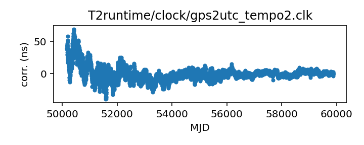
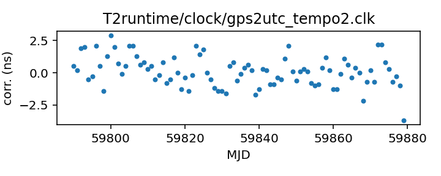

## GPS to UTC (TEMPO2)

GPS to UTC clock corrections

This file is used in the clock correction process for almost all
observatories.

This file is pulled from the TEMPO2 repository and may not be fully up-to-date.

In TEMPO2 this file was traditionally generated by a script that parsed
BIPM Circular T and merged any new data into this file. This has
resulted in some anomalous entries at the merge points and also
a change in entries as Circular T has redefined what it publishes
(early entries in this file are from the column C0, later entries
are from the column C0').

|     |     |
|:--- |:--- |
| File | `T2runtime/clock/gps2utc_tempo2.clk` |
| Authority | temporary |
| URL in repository | <https://raw.githubusercontent.com/nanograv/pulsar-clock-corrections/main/T2runtime/clock/gps2utc_tempo2.clk> |
| Original download URL | <https://bitbucket.org/psrsoft/tempo2/raw/HEAD/T2runtime/clock/gps2utc.clk> |
| Format | tempo2 |
| Bogus last correction | True |
| Clock file start | 1996-03-27 MJD 50169.0 |
| Clock file end | 2020-10-26 MJD 59148.0 |
| Update interval (days) | 7 |
| Last update attempt | 2022-06-02 |
| Last update result | Unchanged |

Log entries from the last few update attempts:
```
2022-05-26 09:15:32.872 - Unchanged
2022-06-02 11:46:29.631 - Unchanged
```
[Full log](https://raw.githubusercontent.com/nanograv/pulsar-clock-corrections/main/log/T2runtime/clock/gps2utc_tempo2.clk.log)


All clock corrections:



Recent clock corrections:



