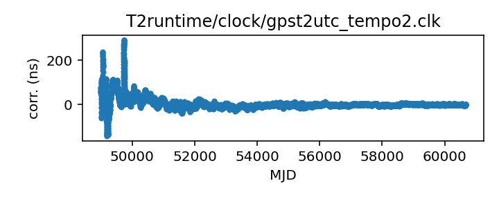
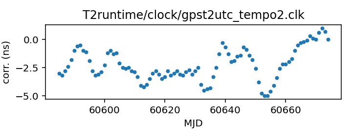

## GPS to UTC (TEMPO2)

GPS to UTC clock corrections

This file is used in the clock correction process for almost all
observatories.

This file is pulled from the TEMPO2 repository and may not be fully
up-to-date.

In TEMPO2 this file was traditionally generated by a script that parsed
BIPM Circular T and merged any new data into this file. This has
resulted in some anomalous entries at the merge points and also
a change in entries as Circular T has redefined what it publishes
(early entries in this file are from the column C0, later entries
are from the column C0').

|     |     |
|:--- |:--- |
| File | `T2runtime/clock/gpst2utc_tempo2.clk` |
| Authority | temporary |
| URL in repository | <https://raw.githubusercontent.com/ipta/pulsar-clock-corrections/main/T2runtime/clock/gpst2utc_tempo2.clk> |
| Original download URL | <https://bitbucket.org/psrsoft/tempo2/raw/HEAD/T2runtime/clock/gpst2utc.clk> |
| Format | tempo2 |
| Bogus last correction | True |
| Clock file start | 1993-01-01 MJD 48988.0 |
| Clock file end | 2024-12-30 MJD 60674.0 |
| Update interval (days) | 7 |
| Last update attempt | 2025-10-20 |
| Last update result | Unchanged |

Log entries from the last few update attempts:
```
2025-08-18 20:37:48.832 - Unchanged
2025-08-25 20:38:32.457 - Unchanged
2025-09-01 20:34:28.853 - Unchanged
2025-09-08 20:36:52.096 - Unchanged
2025-09-15 20:34:36.583 - Unchanged
2025-09-22 20:36:16.616 - Unchanged
2025-09-29 20:33:38.838 - Unchanged
2025-10-06 20:36:19.365 - Unchanged
2025-10-13 20:36:04.109 - Unchanged
2025-10-20 20:38:48.171 - Unchanged
```
[Full log](https://raw.githubusercontent.com/ipta/pulsar-clock-corrections/main/log/T2runtime/clock/gpst2utc_tempo2.clk.log)

Leading comments from clock file:

    # Corrections from UTC inferred from the GPS Combined Clock to UTC.
    # Leap seconds do not appear here, and the Combined Clock is steered
    # to try to make it approximate UTC, but there is some residual drift.
    #
    # Note that the GPS "almanac" signal also includes predictions of its
    # deviations from UTC, so the Combined Clock is not necessarily the best
    # available approximation of UTC; a suitable receiver can do better.
    #
    # The BIPM publishes these values as "C0", from about 1995 to the present.
    # The BIPM also publishes corrections for the predicted UTC, but only from
    # 2011. Those are available in a separate file.
    #
    # The first values in this file are from the BIPM yearly summary tables
    # available for years YY=93 to 03 from
    # ftp://ftp2.bipm.org/pub/tai/scale/UTCGPS/utcgpsYY.ar
    # and for years YY=03 to 11 from
    # ftp://ftp2.bipm.org/pub/tai/scale/UTCGPSGLO/utcgpsgloYY.ar
    # Later entries in the file (there is a comment to mark the place)
    # are obtained from
    # https://webtai.bipm.org/ftp/pub/tai/other-products/utcgnss/utc-gps
    # which is updated monthly.
    #


All clock corrections:



Recent clock corrections:



