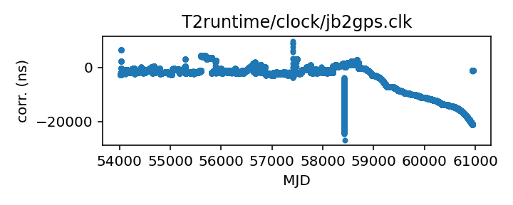

## Jodrell Bank

Jodrell Bank clock corrections file (TEMPO2)

Michael Keith periodically generates, manually checks, and updates
this file in the TEMPO2 repository.

Note that this contains only corrections for the main site clock;
data observed with a specific backend (Roach or DFB) also
need the corrections associated with that backend.

If questions arise, contact Michael Keith
<Michael.Keith@manchester.ac.uk>.

|     |     |
|:--- |:--- |
| File | `T2runtime/clock/jb2gps.clk` |
| Authority | observatory |
| URL in repository | <https://raw.githubusercontent.com/ipta/pulsar-clock-corrections/main/T2runtime/clock/jb2gps.clk> |
| Original download URL | <https://bitbucket.org/psrsoft/tempo2/raw/HEAD/T2runtime/clock/jb2gps.clk> |
| Format | tempo2 |
| Bogus last correction | True |
| Clock file start | 2006-10-13 MJD 54021.4 |
| Clock file end | 2024-11-07 MJD 60621.0 |
| Update interval (days) | 7 |
| Last update attempt | 2025-06-30 |
| Last update result | Unchanged |

Log entries from the last few update attempts:
```
2025-02-12 20:36:27.151 - Unchanged
2025-05-05 14:30:54.046 - Unchanged
2025-05-12 20:38:45.028 - Unchanged
2025-05-19 20:42:09.868 - Unchanged
2025-05-26 20:41:00.932 - Unchanged
2025-06-02 20:43:44.058 - Unchanged
2025-06-09 20:43:55.087 - Unchanged
2025-06-16 20:43:46.598 - Unchanged
2025-06-23 20:43:49.002 - Unchanged
2025-06-30 20:43:28.450 - Unchanged
```
[Full log](https://raw.githubusercontent.com/ipta/pulsar-clock-corrections/main/log/T2runtime/clock/jb2gps.clk.log)


All clock corrections:



Recent clock corrections:


