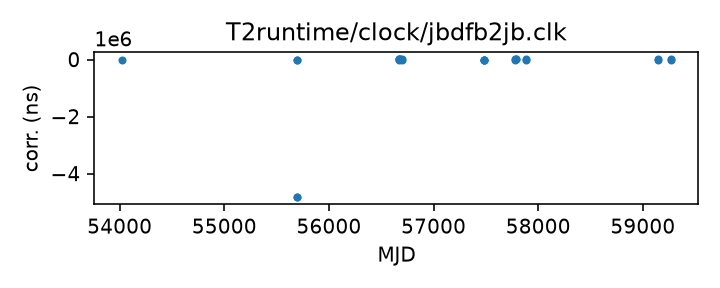

## Jodrell Bank DFB

Jodrell Bank DFB backend

Michael Keith periodically generates, manually checks, and updates
this file in the TEMPO2 repository.

Note that this contains corrections for the DFB backend referenced
to the observatory clock.

If questions arise, contact Michael Keith
<Michael.Keith@manchester.ac.uk>.

|     |     |
|:--- |:--- |
| File | `T2runtime/clock/jbdfb2jb.clk` |
| Authority | observatory |
| URL in repository | <https://raw.githubusercontent.com/ipta/pulsar-clock-corrections/main/T2runtime/clock/jbdfb2jb.clk> |
| Original download URL | <https://bitbucket.org/psrsoft/tempo2/raw/HEAD/T2runtime/clock/jbdfb2jb.clk> |
| Format | tempo2 |
| Bogus last correction | True |
| Clock file start | 2006-10-13 MJD 54021.4 |
| Clock file end | 2021-02-22 MJD 59268.0 |
| Update interval (days) | 7 |
| Last update attempt | 2026-06-05 |
| Last update result | Unchanged |

Log entries from the last few update attempts:
```
2026-04-03 21:02:03.299 - Unchanged
2026-04-10 21:02:51.559 - Unchanged
2026-04-17 21:10:23.342 - Unchanged
2026-04-24 21:13:37.450 - Unchanged
2026-05-01 21:14:44.018 - Unchanged
2026-05-08 21:34:52.557 - Unchanged
2026-05-15 21:35:31.413 - Unchanged
2026-05-22 21:43:11.729 - Unchanged
2026-05-29 22:14:02.307 - Unchanged
2026-06-05 21:54:03.491 - Unchanged
```
[Full log](https://raw.githubusercontent.com/ipta/pulsar-clock-corrections/main/log/T2runtime/clock/jbdfb2jb.clk.log)


All clock corrections:


Recent clock corrections:



