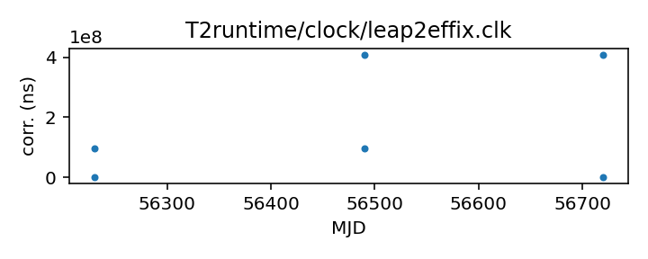
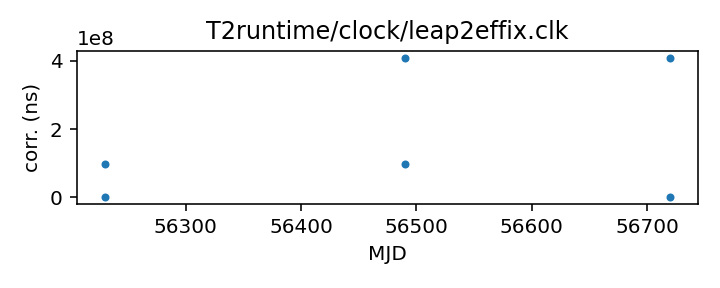

## LEAP

LEAP clock correction file

This file corrects from the LEAP clock to the Effelsberg Asterix
clock; then the effix2gps file can be used to convert to GPS.

This file is pulled from the TEMPO2 repository and may not be fully
up-to-date. The European Pulsar Timing Array maintains an internal
repository of clock corrections, which they have transferred to the TEMPO2
repository, so  EPTA telescope data in the TEMPO2 repository (and
thus here) can be expected to be somewhat up to date.

|     |     |
|:--- |:--- |
| File | `T2runtime/clock/leap2effix.clk` |
| Authority | temporary |
| URL in repository | <https://raw.githubusercontent.com/ipta/pulsar-clock-corrections/main/T2runtime/clock/leap2effix.clk> |
| Original download URL | <https://bitbucket.org/psrsoft/tempo2/raw/HEAD/T2runtime/clock/leap2effix.clk> |
| Format | tempo2 |
| Bogus last correction | True |
| Clock file start | 2012-10-29 MJD 56230.0 |
| Clock file end | 2014-03-04 MJD 56720.0 |
| Update interval (days) | 7 |
| Last update attempt | 2025-11-17 |
| Last update result | Unchanged |

Log entries from the last few update attempts:
```
2025-09-15 20:38:20.188 - Unchanged
2025-09-22 20:40:09.910 - Unchanged
2025-09-29 20:37:18.773 - Unchanged
2025-10-06 20:40:03.186 - Unchanged
2025-10-13 20:39:47.309 - Unchanged
2025-10-20 20:42:33.157 - Unchanged
2025-10-27 20:40:05.147 - Unchanged
2025-11-03 20:42:33.045 - Unchanged
2025-11-10 20:44:46.531 - Unchanged
2025-11-17 20:41:34.909 - Unchanged
```
[Full log](https://raw.githubusercontent.com/ipta/pulsar-clock-corrections/main/log/T2runtime/clock/leap2effix.clk.log)

Leading comments from clock file:

    # Some 'effix' time jumps do not appear in LEAP data
    # So we must account for this...
    #    MJD: 56230 to 56490; offset=-0.0972843 s * pre-removed in LEAP
    #    MJD: 56490 to 56720; offset=-0.409268 s * pre-removed in LEAP
    #


All clock corrections:



Recent clock corrections:



