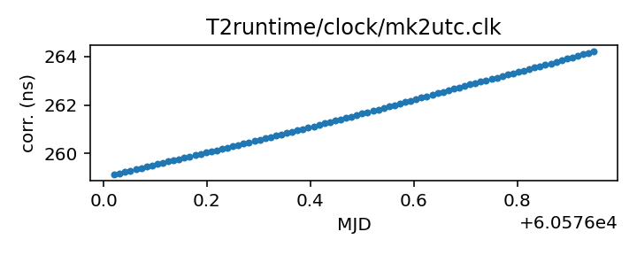

## Meerkat (TEMPO2)

MeerKAT clock corrections file (TEMPO2)

This file is pulled from the TEMPO2 repository and may not be fully
up-to-date.

|     |     |
|:--- |:--- |
| File | `T2runtime/clock/mk2utc.clk` |
| Authority | temporary |
| URL in repository | <https://raw.githubusercontent.com/ipta/pulsar-clock-corrections/main/T2runtime/clock/mk2utc.clk> |
| Original download URL | <https://bitbucket.org/psrsoft/tempo2/raw/HEAD/T2runtime/clock/mk2utc.clk> |
| Format | tempo2 |
| Bogus last correction | True |
| Clock file start | 2019-01-01 MJD 58484.0 |
| Clock file end | 2024-09-23 MJD 60576.9 |
| Update interval (days) | 7 |
| Last update attempt | 2025-01-15 |
| Last update result | Unchanged |

Log entries from the last few update attempts:
```
2024-10-04 20:33:23.000 - Unchanged
2024-10-11 20:39:14.104 - Unchanged
2024-11-27 20:40:00.270 - Updated
2024-12-04 20:40:31.327 - Unchanged
2024-12-11 20:40:47.879 - Unchanged
2024-12-18 20:39:28.794 - Unchanged
2024-12-25 20:35:19.113 - Unchanged
2025-01-01 20:35:41.277 - Unchanged
2025-01-08 20:37:08.862 - Unchanged
2025-01-15 20:35:18.948 - Unchanged
```
[Full log](https://raw.githubusercontent.com/ipta/pulsar-clock-corrections/main/log/T2runtime/clock/mk2utc.clk.log)

Leading comments from clock file:

    # Tie of Karoo Telescope Time to UTC
    # This file is from the KTT-GNSS sensor, and does not include circular-T
    # MJD = (SensorTime(us)/86400e6)+40587    15-minute snapshots
    # Created at unix time 1727533083.381524 from KTT mySQL database.
    #
    # MJD (days)   KTT-UTC (seconds)
    #------------------------------------------------------


All clock corrections:


Recent clock corrections:



