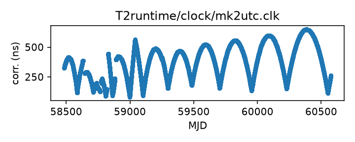
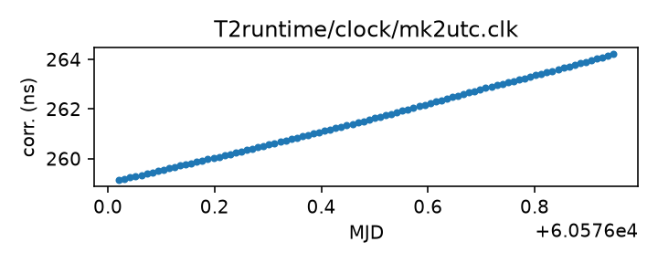

## Meerkat (TEMPO2)

MeerKAT clock corrections file (TEMPO2)

This file is pulled from the TEMPO2 repository and may not be fully
up-to-date.

|     |     |
|:--- |:--- |
| File | `T2runtime/clock/mk2utc.clk` |
| Authority | temporary |
| URL in repository | <https://raw.githubusercontent.com/ipta/pulsar-clock-corrections/main/T2runtime/clock/mk2utc.clk> |
| Original download URL | <https://bitbucket.org/psrsoft/tempo2/raw/HEAD/T2runtime/clock/mk2utc.clk> |
| Format | tempo2 |
| Bogus last correction | True |
| Clock file start | 2019-01-01 MJD 58484.0 |
| Clock file end | 2024-09-23 MJD 60576.9 |
| Update interval (days) | 7 |
| Last update attempt | 2026-07-10 |
| Last update result | Validation failed |

Log entries from the last few update attempts:
```
2026-05-08 21:35:07.638 - Validation failed: New version of T2runtime/clock/mk2utc.clk MJDs differ from old version where they overlap in 8252 places
2026-05-15 21:35:48.077 - Validation failed: New version of T2runtime/clock/mk2utc.clk MJDs differ from old version where they overlap in 8252 places
2026-05-22 21:43:28.820 - Validation failed: New version of T2runtime/clock/mk2utc.clk MJDs differ from old version where they overlap in 8252 places
2026-05-29 22:14:19.304 - Validation failed: New version of T2runtime/clock/mk2utc.clk MJDs differ from old version where they overlap in 8252 places
2026-06-05 21:54:18.451 - Validation failed: New version of T2runtime/clock/mk2utc.clk MJDs differ from old version where they overlap in 8252 places
2026-06-12 22:06:26.183 - Validation failed: New version of T2runtime/clock/mk2utc.clk MJDs differ from old version where they overlap in 8252 places
2026-06-19 21:43:03.918 - Validation failed: New version of T2runtime/clock/mk2utc.clk MJDs differ from old version where they overlap in 8252 places
2026-06-26 21:48:43.605 - Validation failed: New version of T2runtime/clock/mk2utc.clk MJDs differ from old version where they overlap in 8252 places
2026-07-03 21:40:04.559 - Validation failed: New version of T2runtime/clock/mk2utc.clk MJDs differ from old version where they overlap in 8252 places
2026-07-10 21:35:13.106 - Validation failed: New version of T2runtime/clock/mk2utc.clk MJDs differ from old version where they overlap in 8252 places
```
[Full log](https://raw.githubusercontent.com/ipta/pulsar-clock-corrections/main/log/T2runtime/clock/mk2utc.clk.log)

Leading comments from clock file:

    # Tie of Karoo Telescope Time to UTC
    # This file is from the KTT-GNSS sensor, and does not include circular-T
    # MJD = (SensorTime(us)/86400e6)+40587    15-minute snapshots
    # Created at unix time 1727533083.381524 from KTT mySQL database.
    #
    # MJD (days)   KTT-UTC (seconds)
    #------------------------------------------------------


All clock corrections:



Recent clock corrections:



