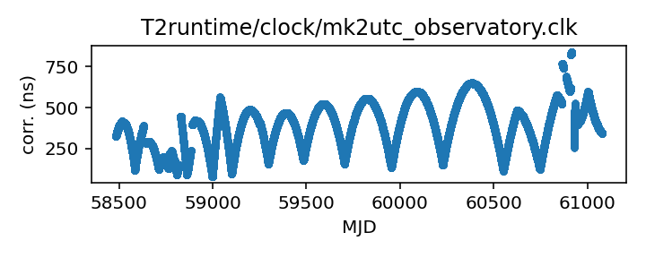
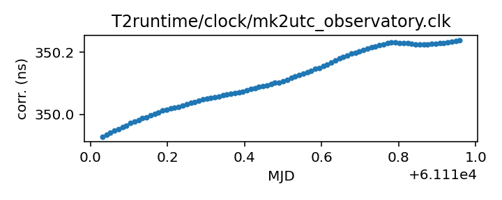

## Meerkat (observatory)

MeerKAT clock corrections file

This file is distributed by the observatory. It records the local
clock difference from (I think) GPS. It may cause some problems
for TEMPO2 as it has a header line "# UTC(MK) UTC" when TEMPO2
would expect "# UTC(meerkat) UTC" or "# UTC(meerkat) UTC(GPS)".

If questions arise, contact Ryan Shannon <rshannon@swin.edu.au>

|     |     |
|:--- |:--- |
| File | `T2runtime/clock/mk2utc_observatory.clk` |
| Authority | observatory |
| URL in repository | <https://raw.githubusercontent.com/ipta/pulsar-clock-corrections/main/T2runtime/clock/mk2utc_observatory.clk> |
| Original download URL | <https://archive-gw-1.kat.ac.za/public/tfr/mk2utc.clk> |
| Format | tempo2 |
| Bogus last correction | False |
| Clock file start | 2019-01-01 MJD 58484.0 |
| Clock file end | 2025-12-06 MJD 61016.0 |
| Update interval (days) | 7 |
| Last update attempt | 2025-12-15 |
| Last update result | Updated |

Log entries from the last few update attempts:
```
2025-10-13 20:39:51.453 - Updated
2025-10-20 20:42:36.844 - Unchanged
2025-10-27 20:40:09.489 - Unchanged
2025-11-03 20:42:59.579 - Unchanged
2025-11-10 20:44:57.437 - Failed to download: <urlopen error _ssl.c:999: The handshake operation timed out>
2025-11-17 20:41:48.816 - Updated
2025-11-24 20:42:17.159 - Updated
2025-12-01 20:40:23.018 - Unchanged
2025-12-08 20:45:25.891 - Unchanged
2025-12-15 20:46:44.305 - Updated
```
[Full log](https://raw.githubusercontent.com/ipta/pulsar-clock-corrections/main/log/T2runtime/clock/mk2utc_observatory.clk.log)

Leading comments from clock file:

    # Tie of Karoo Telescope Time to UTC
    # This file is from the KTT-GNSS sensor, and does not include circular-T
    # MJD = (SensorTime(us)/86400e6)+40587    15-minute snapshots
    # Created at unix time 1765432583.5327 from KTT mySQL database.
    #
    # MJD (days)   KTT-UTC (seconds)
    #------------------------------------------------------


All clock corrections:



Recent clock corrections:



