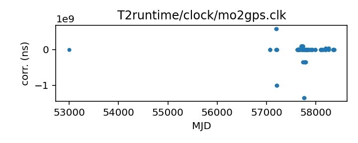
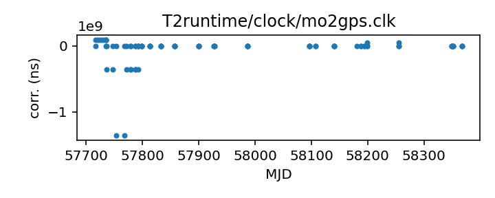

## MOST

Molonglo Observatory Synthesis Telescope clock corrections file (TEMPO2)

This file is pulled from the TEMPO2 repository and may not be fully
up-to-date.

|     |     |
|:--- |:--- |
| File | `T2runtime/clock/mo2gps.clk` |
| Authority | temporary |
| URL in repository | <https://raw.githubusercontent.com/ipta/pulsar-clock-corrections/main/T2runtime/clock/mo2gps.clk> |
| Original download URL | <https://bitbucket.org/psrsoft/tempo2/raw/HEAD/T2runtime/clock/mo2gps.clk> |
| Format | tempo2 |
| Bogus last correction | True |
| Clock file start | 2003-12-27 MJD 53000.0 |
| Clock file end | 2018-09-06 MJD 58367.0 |
| Update interval (days) | 7 |
| Last update attempt | 2025-01-01 |
| Last update result | Unchanged |

Log entries from the last few update attempts:
```
2024-09-20 20:33:35.877 - Unchanged
2024-09-27 20:33:27.443 - Unchanged
2024-10-04 20:33:23.159 - Unchanged
2024-10-11 20:39:14.323 - Unchanged
2024-11-27 20:40:00.454 - Unchanged
2024-12-04 20:40:31.442 - Unchanged
2024-12-11 20:40:48.222 - Unchanged
2024-12-18 20:39:29.130 - Unchanged
2024-12-25 20:35:19.225 - Unchanged
2025-01-01 20:35:41.521 - Unchanged
```
[Full log](https://raw.githubusercontent.com/ipta/pulsar-clock-corrections/main/log/T2runtime/clock/mo2gps.clk.log)

Leading comments from clock file:

    # UTMOST clock correction file
    # generated by find_jumps.py on: 2017-09-28 19:02 local time
    # Fabian Jankowski
    # includes: 24 jumps, 2 drifts.
    #
    # jumps:
    # 1: 57071.1 -> 57071.5 MJD: 48.5693308703 us
    # 2: 57195.0 -> 57196.0 MJD: 586835.237932 us
    # 3: 57204.1 -> 57214.6 MJD: -1000000.0 us
    # 4: 57622.5 -> 57633.1 MJD: 105.0 us
    # 5: 57637.2 -> 57638.1 MJD: -1100.0 us
    # 6: 57638.17 -> 57640.0 MJD: -1300.0 us
    # 7: 57641.0 -> 57641.3 MJD: 79.0 us
    # 8: 57643.23 -> 57655.2 MJD: 11035.0 us
    # 9: 57667.5 -> 57673.7 MJD: 20.0 us
    # 10: 57702.1 -> 57716.6 MJD: 90090.0 us
    # 11: 57717.1 -> 57735.3 MJD: 90145.0 us
    # 12: 57736.4 -> 57747.1 MJD: -355540.0 us
    # 13: 57754.0 -> 57768.7 MJD: -1355310.8 us
    # 14: 57771.9 -> 57779.0 MJD: -355538.0 us
    # 15: 57779.1 -> 57787.9 MJD: -355493.0 us
    # 16: 57788.0 -> 57792.7 MJD: -355508.0 us
    # 17: 57792.8 -> 57798.7 MJD: 35.7 us
    # 18: 57798.8 -> 57813.8 MJD: 30.7 us
    # 19: 57813.9 -> 57833.0 MJD: 25.0 us
    # 20: 57833.1 -> 57857.3 MJD: 55.0 us
    # 21: 57857.4 -> 57900.0 MJD: 68.0 us
    # 22: 57900.1 -> 57927.5 MJD: 68.0 us
    # 23: 57927.6 -> 57987.0 MJD: 30.0 us
    # 24: 57987.1 -> 58100.0 MJD: 30.0 us
    # 25: 58181.1 -> 58193.8 MJD: drift 45 us per day, plus two jumps: 58187: 400 us, 58193.8: 15 us. Looks like one of the jumps might be off by ~10 us
    # 26: 58199.0: 476.15 us. Measured by Matthew Bailes from 0437 data
    # CF/ML -- should this really be 47.615 ms? That's what's actually used below.
    # 27: 58255.01: 40 us jump. Measured by Marcus/Chris. This resets the 48 ms jump above
    # back to zero, with a small offset of 30 us.  CF/ML 31/05/18
    #
    # drifts:
    # 1: 57625.4 -> 57639.9 MJD: -100.0 us/day
    # 2: 57702.2 -> 57735.1 MJD: -2.0 us/day
    #
    # start


All clock corrections:



Recent clock corrections:



