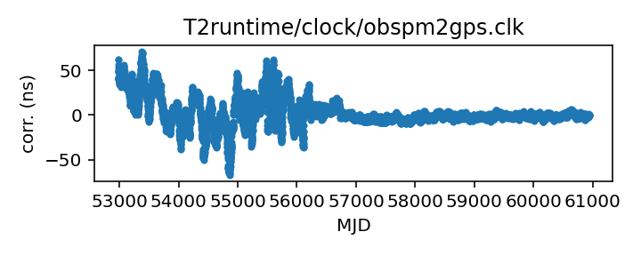
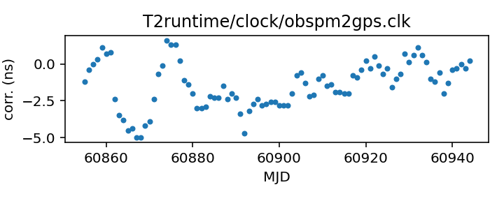

## obspm

Nancay-related clock corrections?

This file is pulled from the TEMPO2 repository and may not be fully up-to-date.

The European Pulsar Timing Array maintains an internal repository
of clock corrections, which they have transferred to the TEMPO2
repository, so  EPTA telescope data in the TEMPO2 repository (and
thus here) can be expected to be somewhat up to date.

|     |     |
|:--- |:--- |
| File | `T2runtime/clock/obspm2gps.clk` |
| Authority | temporary |
| URL in repository | <https://raw.githubusercontent.com/ipta/pulsar-clock-corrections/main/T2runtime/clock/obspm2gps.clk> |
| Original download URL | <https://bitbucket.org/psrsoft/tempo2/raw/HEAD/T2runtime/clock/obspm2gps.clk> |
| Format | tempo2 |
| Bogus last correction | True |
| Clock file start | 2003-12-01 MJD 52974.0 |
| Clock file end | 2021-08-28 MJD 59454.0 |
| Update interval (days) | 7 |
| Last update attempt | 2022-08-31 |
| Last update result | Unchanged |

Log entries from the last few update attempts:
```
2022-06-29 20:36:11.869 - Unchanged
2022-07-06 20:33:11.270 - Unchanged
2022-07-13 20:34:17.039 - Unchanged
2022-07-20 20:36:50.016 - Unchanged
2022-07-27 20:33:05.614 - Unchanged
2022-08-03 20:34:51.409 - Unchanged
2022-08-10 20:34:10.603 - Unchanged
2022-08-17 20:34:06.941 - Unchanged
2022-08-24 20:34:40.842 - Unchanged
2022-08-31 20:34:59.371 - Unchanged
```
[Full log](https://raw.githubusercontent.com/ipta/pulsar-clock-corrections/main/log/T2runtime/clock/obspm2gps.clk.log)


All clock corrections:



Recent clock corrections:



