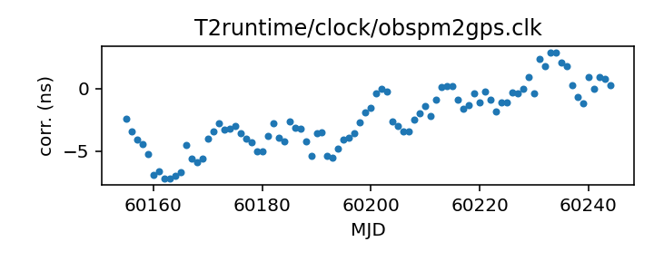

## obspm

Nancay-related clock corrections?

This file is pulled from the TEMPO2 repository and may not be fully up-to-date.

|     |     |
|:--- |:--- |
| File | `T2runtime/clock/obspm2gps.clk` |
| Authority | temporary |
| URL in repository | <https://raw.githubusercontent.com/ipta/pulsar-clock-corrections/main/T2runtime/clock/obspm2gps.clk> |
| Original download URL | <https://bitbucket.org/psrsoft/tempo2/raw/HEAD/T2runtime/clock/obspm2gps.clk> |
| Format | tempo2 |
| Bogus last correction | True |
| Clock file start | 2003-12-01 MJD 52974.0 |
| Clock file end | 2021-08-28 MJD 59454.0 |
| Update interval (days) | 7 |
| Last update attempt | 2022-06-15 |
| Last update result | Unchanged |

Log entries from the last few update attempts:
```
2022-06-08 17:10:54.260 - Unchanged
2022-06-15 16:45:36.005 - Unchanged
```
[Full log](https://raw.githubusercontent.com/ipta/pulsar-clock-corrections/main/log/T2runtime/clock/obspm2gps.clk.log)


All clock corrections:


Recent clock corrections:



