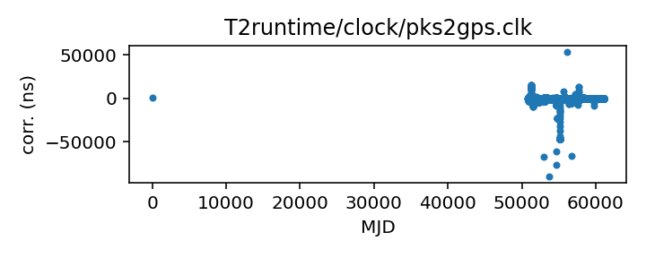
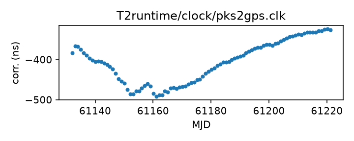

## Parkes

Parkes observatory clock corrections

This file is pulled from the Parkes observatory repository and should 
be up-to-date.

The comments read:

    Tie of Parkes clock to GPS time standard. Sources are listed below.
    Where two clock systems existed simultaneously, the dates refer to
    periods when the given clock was supplied as the observatory 1 PPS

    (before this, clock was tied to Tidbinbilla clock: see pks2tid.clk)
    MJD 50844    - 52311.17     Mark IV clock vs Totally Accurate Clock (GPS)
                                  from: update_clkcorr -t pksgps4 gps??.dat
    MJD 52311.17 - now          Mark VI clock vs GPS East
                                  from: update_clkcorr -t pksgps6 pkclk00.*
    -- Russell Edwards 24 September 2004

The file includes a first entry on MJD 0.00521 with a clock
correction of 1.04 us; while normally we automatically ignore MJD 0
for plotting purposes, this value must be in there for a reason so
we retain it.

|     |     |
|:--- |:--- |
| File | `T2runtime/clock/pks2gps.clk` |
| Authority | temporary |
| URL in repository | <https://raw.githubusercontent.com/ipta/pulsar-clock-corrections/main/T2runtime/clock/pks2gps.clk> |
| Original download URL | <https://www.parkes.atnf.csiro.au/observing/clockfiles/pks2gps.clk.20260301> |
| Format | tempo2 |
| Bogus last correction | False |
| Clock file start | 1858-11-17 MJD 0.0 |
| Clock file end | 2026-02-28 MJD 61099.1 |
| Update interval (days) | 7 |
| Last update attempt | 2026-04-17 |
| Last update result | Unchanged |

Log entries from the last few update attempts:
```
2026-02-03 21:02:01.958 - Unchanged
2026-02-10 21:08:04.203 - Unchanged
2026-02-17 21:03:18.925 - Unchanged
2026-03-06 20:56:13.734 - Updated
2026-03-13 21:00:01.301 - Unchanged
2026-03-20 20:57:42.728 - Unchanged
2026-03-27 21:04:35.375 - Updated
2026-04-03 21:02:09.237 - Unchanged
2026-04-10 21:02:57.430 - Unchanged
2026-04-17 21:10:28.631 - Unchanged
```
[Full log](https://raw.githubusercontent.com/ipta/pulsar-clock-corrections/main/log/T2runtime/clock/pks2gps.clk.log)

Leading comments from clock file:

    #
    # Tie of Parkes clock to GPS time standard. Sources are listed below.
    # Where two clock systems existed simultaneously, the dates refer to
    # periods when the given clock was supplied as the observatory 1 PPS
    #
    # (before this, clock was tied to Tidbinbilla clock: see pks2tid.clk)
    # MJD 50844    - 52311.17     Mark IV clock vs Totally Accurate Clock (GPS)
    #                               from: update_clkcorr -t pksgps4 gps??.dat
    # MJD 52311.17 - now          Mark VI clock vs GPS East
    #                               from: update_clkcorr -t pksgps6 pkclk00.*
    # -- Russell Edwards 24 September 2004
    #-------------------------------------------------------------------------


All clock corrections:



Recent clock corrections:



