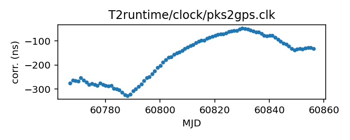

## Parkes

Parkes observatory clock corrections

This file is pulled from the TEMPO2 repository and may not be fully up-to-date.

The comments read:

    Tie of Parkes clock to GPS time standard. Sources are listed below.
    Where two clock systems existed simultaneously, the dates refer to
    periods when the given clock was supplied as the observatory 1 PPS

    (before this, clock was tied to Tidbinbilla clock: see pks2tid.clk)
    MJD 50844    - 52311.17     Mark IV clock vs Totally Accurate Clock (GPS)
                                  from: update_clkcorr -t pksgps4 gps??.dat
    MJD 52311.17 - now          Mark VI clock vs GPS East
                                  from: update_clkcorr -t pksgps6 pkclk00.*
    -- Russell Edwards 24 September 2004

The file includes a first entry on MJD 0.00521 with a clock
correction of 1.04 us; while normally we automatically ignore MJD 0
for plotting purposes, this value must be in there for a reason so
we retain it.

|     |     |
|:--- |:--- |
| File | `T2runtime/clock/pks2gps.clk` |
| Authority | temporary |
| URL in repository | <https://raw.githubusercontent.com/ipta/pulsar-clock-corrections/main/T2runtime/clock/pks2gps.clk> |
| Original download URL | <https://bitbucket.org/psrsoft/tempo2/raw/HEAD/T2runtime/clock/pks2gps.clk> |
| Format | tempo2 |
| Bogus last correction | False |
| Clock file start | 1858-11-17 MJD 0.0 |
| Clock file end | 2019-07-31 MJD 58695.4 |
| Update interval (days) | 7 |
| Last update attempt | 2022-12-14 |
| Last update result | Unchanged |

Log entries from the last few update attempts:
```
2022-10-12 20:43:17.110 - Unchanged
2022-10-19 20:43:38.490 - Unchanged
2022-10-26 20:37:22.250 - Unchanged
2022-11-02 20:34:12.465 - Unchanged
2022-11-09 20:34:50.518 - Unchanged
2022-11-16 20:33:01.684 - Unchanged
2022-11-23 20:30:49.911 - Unchanged
2022-11-30 20:31:25.164 - Unchanged
2022-12-07 20:29:40.602 - Unchanged
2022-12-14 20:29:47.201 - Unchanged
```
[Full log](https://raw.githubusercontent.com/ipta/pulsar-clock-corrections/main/log/T2runtime/clock/pks2gps.clk.log)

Leading comments from clock file:

    #
    # Tie of Parkes clock to GPS time standard. Sources are listed below.
    # Where two clock systems existed simultaneously, the dates refer to
    # periods when the given clock was supplied as the observatory 1 PPS
    #
    # (before this, clock was tied to Tidbinbilla clock: see pks2tid.clk)
    # MJD 50844    - 52311.17     Mark IV clock vs Totally Accurate Clock (GPS)
    #                               from: update_clkcorr -t pksgps4 gps??.dat
    # MJD 52311.17 - now          Mark VI clock vs GPS East
    #                               from: update_clkcorr -t pksgps6 pkclk00.*
    # -- Russell Edwards 24 September 2004
    #-------------------------------------------------------------------------
    #Comments from merged data file:
    #>Fri Oct  1 13:08:03 2004 Imported from file pkclk00.2004
    #Comments from merged data file:
    #>Fri Nov 12 11:04:46 2004 Imported from file pkclk00.2004
    #Comments from merged data file:
    #>Thu Feb 17 10:28:59 2005 Imported from file pkclk00.2004
    #Comments from merged data file:
    #>Thu Feb 17 10:30:07 2005 Imported from file pkclk00.2005
    #Comments from merged data file:
    #>Thu Apr  7 14:23:13 2005 Imported from file pkclk00.2005
    #Comments from merged data file:
    #>Wed May 18 12:03:27 2005 Imported from file pkclk00.2005
    #Comments from merged data file:
    #>Mon Jul 18 15:52:05 2005 Imported from file pkclk00.2005
    #Comments from merged data file:
    #>Thu Sep 29 16:14:28 2005 Imported from file pkclk00.2005
    #Comments from merged data file:
    #>Wed Dec  7 12:26:23 2005 Imported from file pkclk00.2005
    #Comments from merged data file:
    #>Thu Mar 16 14:09:14 2006 Imported from file pkclk00.2005
    #Comments from merged data file:
    #>Thu Mar 16 14:09:16 2006 Imported from file pkclk00.2006
    #Comments from merged data file:
    #>Tue Jun 13 15:25:56 2006 Imported from file pkclk00.2006
    #Comments from merged data file:
    #>Mon Aug 14 14:31:51 2006 Imported from file pkclk00.2006
    #Comments from merged data file:
    #>Thu Jan 11 11:55:21 2007 Imported from file pkclk00.2006
    #Comments from merged data file:
    #>Thu Mar  8 12:15:38 2007 Imported from file pkclk00.2007
    #Comments from merged data file:
    #>Thu Apr  5 11:03:28 2007 Imported from file pkclk00.2007
    #Comments from merged data file:
    #>Thu May  3 11:47:49 2007 Imported from file pkclk00.2007
    #Comments from merged data file:
    #>Thu Jun 14 14:50:54 2007 Imported from file pkclk00.2007
    #Comments from merged data file:
    #>Tue Jul 17 11:15:38 2007 Imported from file pkclk00.2007
    #Comments from merged data file:
    #>Mon Aug  6 11:16:50 2007 Imported from file pkclk00.2007
    #Comments from merged data file:
    #>Thu Sep  6 11:01:30 2007 Imported from file pkclk00.2007
    #Comments from merged data file:
    #>Wed Oct  3 15:25:51 2007 Imported from file pkclk00.2007
    #Comments from merged data file:
    #>Thu Nov  8 14:01:45 2007 Imported from file pkclk00.2007
    #Comments from merged data file:
    #>Fri Dec  7 14:37:15 2007 Imported from file pkclk00.2007
    #Comments from merged data file:
    #>Thu Jan 31 12:32:23 2008 Imported from file pkclk00.2007
    #Comments from merged data file:
    #>Thu Jan 31 13:12:37 2008 Imported from file pkclk00.2008
    #Comments from merged data file:
    #>Wed Mar 12 15:01:02 2008 Imported from file pkclk00.2008
    #Comments from merged data file:
    #>Wed Apr 23 02:05:15 2008 Imported from file pkclk00.2008
    #Comments from merged data file:
    #>Thu Jul 10 13:37:48 2008 Imported from file pkclk00.2008
    #Comments from merged data file:
    #>Wed Aug 13 15:33:15 2008 Imported from file pkclk00.2008
    #Comments from merged data file:
    #>Wed Oct  8 10:57:16 2008 Imported from file pkclk00.2008
    #Comments from merged data file:
    #>Tue Nov 11 15:14:16 2008 Imported from file pkclk00.2008
    #Comments from merged data file:
    #>Wed Dec 10 10:40:19 2008 Imported from file pkclk00.2008
    #Comments from merged data file:
    #>Thu Jan 15 15:09:23 2009 Imported from file pkclk00.2008
    #Comments from merged data file:
    #>Thu Jan 15 15:12:43 2009 Imported from file pkclk00.2009
    #Comments from merged data file:
    #>Thu Feb 19 11:31:27 2009 Imported from file pkclk00.2009
    #Comments from merged data file:
    #>Wed Mar 25 16:00:11 2009 Imported from file pkclk00.2009
    #Comments from merged data file:
    #>Wed May  6 17:06:57 2009 Imported from file pkclk00.2009
    #Comments from merged data file:
    #>Thu Jun 11 14:30:30 2009 Imported from file pkclk00.2009
    #Comments from merged data file:
    #>Mon Aug 17 16:07:37 2009 Imported from file pkclk00.2009
    #Comments from merged data file:
    #>Tue Sep 15 11:19:19 2009 Imported from file pkclk00.2009
    #Comments from merged data file:
    #>Tue Oct  6 11:03:50 2009 Imported from file pkclk00.2009
    #Comments from merged data file:
    #>Mon Oct 12 16:40:55 2009 Imported from file pkclk00.2009
    #Comments from merged data file:
    #>Wed Nov 18 11:15:00 2009 Imported from file pkclk00.2009
    #Comments from merged data file:
    #>Tue Dec  8 11:38:18 2009 Imported from file pkclk00.2009
    #Comments from merged data file:
    #>Thu Dec 17 11:35:40 2009 Imported from file pkclk00.2009
    #Comments from merged data file:
    #>Thu Jan 14 11:23:36 2010 Imported from file pkclk00.2009
    #Comments from merged data file:
    #>Thu Jan 14 12:20:40 2010 Imported from file pkclk00.2010
    #Comments from merged data file:
    #>Wed Feb 24 14:53:42 2010 Imported from file pkclk00.2010
    #Comments from merged data file:
    #>Thu Mar 18 10:49:19 2010 Imported from file pkclk00.2010
    #Comments from merged data file:
    #>Wed Apr 14 14:12:26 2010 Imported from file pkclk00.2010
    #Comments from merged data file:
    #>Wed May 19 15:54:51 2010 Imported from file pkclk00.2010
    #Comments from merged data file:
    #>Tue Jun 22 12:09:22 2010 Imported from file pkclk00.2010
    #Comments from merged data file:
    #>Tue Jul 20 15:26:11 2010 Imported from file pkclk00.2010
    #Comments from merged data file:
    #>Tue Aug 24 11:57:19 2010 Imported from file pkclk00.2010
    #Comments from merged data file:
    #>Thu Sep 23 19:03:15 2010 Imported from file pkclk00.2010
    #Comments from merged data file:
    #>Tue Oct 26 17:34:19 2010 Imported from file pkclk00.2010
    #Comments from merged data file:
    #>Wed Nov 24 14:40:45 2010 Imported from file pkclk00.2010
    #Comments from merged data file:
    #>Thu Jan  6 14:46:16 2011 Imported from file pkclk00.2010
    #Comments from merged data file:
    #>Fri Jan 14 16:46:24 2011 Imported from file pkclk00.2011
    #Comments from merged data file:
    #>Wed Feb 23 10:11:26 2011 Imported from file pkclk00.2011
    #Comments from merged data file:
    #>Wed Mar 23 16:12:17 2011 Imported from file pkclk00.2011
    #Comments from merged data file:
    #>Mon May  2 16:44:08 2011 Imported from file pkclk00.2011
    #Comments from merged data file:
    #>Tue Jul  5 10:18:45 2011 Imported from file pkclk00.2011
    #Comments from merged data file:
    #>Wed Nov 16 19:34:21 2011 Imported from file pkclk00.2011
    #Comments from merged data file:
    #>Sat Oct 27 20:54:21 2012 Imported from file pkclk00.2011
    #Comments from merged data file:
    #>Sat Oct 27 20:57:35 2012 Imported from file pkclk00.2012
    #Comments from merged data file:
    #>Wed Aug 14 10:28:35 2013 Imported from file pkclk00.2012
    #Comments from merged data file:
    #>Fri Nov 28 10:27:58 2014 Imported from file pkclk00.2014
    #Comments from merged data file:
    #>Tue Dec 23 10:19:31 2014 Imported from file pkclk00.log
    #Comments from merged data file:
    #>Wed Dec 31 13:21:04 2014 Imported from file pkclk00.log
    #Comments from merged data file:
    #>Wed Jan  7 12:26:12 2015 Imported from file pkclk00.log
    #Comments from merged data file:
    #>Sun Jan 11 15:22:07 2015 Imported from file pkclk00.log
    #Comments from merged data file:
    #>Tue Feb  3 15:30:26 2015 Imported from file pkclk00.log
    #Comments from merged data file:
    #>Mon Mar  9 05:34:04 2015 Imported from file pkclk00.log
    #Comments from merged data file:
    #>Fri May 29 16:23:20 2015 Imported from file pkclk00.log
    #Comments from merged data file:
    #>Tue Jun 30 15:42:46 2015 Imported from file pkclk00.log
    #Comments from merged data file:
    #>Thu Jul  2 12:00:28 2015 Imported from file pkclk00.log
    #Comments from merged data file:
    #>Thu Aug 20 11:46:54 2015 Imported from file pkclk00.log
    #Comments from merged data file:
    #>Sat Sep 19 14:29:46 2015 Imported from file pkclk00.log
    #Comments from merged data file:
    #>Mon Sep 21 17:06:01 2015 Imported from file big.log
    #Comments from merged data file:
    #>Tue Sep 22 13:07:23 2015 Imported from file pkclk00.log
    #Comments from merged data file:
    #>Sat Oct 17 15:33:50 2015 Imported from file pkclk00.log
    #Comments from merged data file:
    #>Sun Nov  8 19:01:56 2015 Imported from file pkclk00.log
    #Comments from merged data file:
    #>Sat Dec 19 15:35:52 2015 Imported from file pkclk00.log
    #Comments from merged data file:
    #>Mon Jan 11 18:32:23 2016 Imported from file pkclk00.log
    #Comments from merged data file:
    #>Mon Jan 18 18:42:33 2016 Imported from file pkclk00.log
    #Comments from merged data file:
    #>Mon Jan 18 20:29:49 2016 Imported from file pkclk00.log
    #Comments from merged data file:
    #>Wed Mar 16 12:22:40 2016 Imported from file all.log
    #Comments from merged data file:
    #>Wed Mar 16 14:18:43 2016 Imported from file pkclk00.log
    #Comments from merged data file:
    #>Thu Mar 17 18:50:14 2016 Imported from file pkclk00.log
    #Comments from merged data file:
    #>Mon Mar 21 10:41:56 2016 Imported from file pkclk00.log
    #Comments from merged data file:
    #>Sun May  8 15:08:56 2016 Imported from file pkclk00.log.201604
    #Comments from merged data file:
    #>Sun May  8 15:12:17 2016 Imported from file pkclk00.log.201605
    #Comments from merged data file:
    #>Sun May  8 15:12:51 2016 Imported from file pkclk00.log
    #Comments from merged data file:
    #>Tue Jul 12 18:16:59 2016 Imported from file pkclk00.log.201606
    #Comments from merged data file:
    #>Tue Jul 12 18:18:30 2016 Imported from file pkclk00.log.201607
    #Comments from merged data file:
    #>Tue Jul 12 18:19:20 2016 Imported from file pkclk00.log
    #Comments from merged data file:
    #>Fri Sep 16 16:06:29 2016 Imported from file grand.log
    #Comments from merged data file:
    #>Wed Oct  5 10:24:56 2016 Imported from file pkclk00.log.201610
    #Comments from merged data file:
    #>Wed Oct  5 10:26:12 2016 Imported from file pkclk00.log
    #Comments from merged data file:
    #>Wed Nov  2 13:37:38 2016 Imported from file pkclk00.log.201611
    #Comments from merged data file:
    #>Sat Nov 19 13:04:36 2016 Imported from file pkclk00.log
    #Comments from merged data file:
    #>Fri Dec  2 17:00:21 2016 Imported from file pkclk00.log.201612
    #Comments from merged data file:
    #>Fri Dec  2 17:01:17 2016 Imported from file pkclk00.log
    #Comments from merged data file:
    #>Mon Dec 19 09:45:09 2016 Imported from file pkclk00.log
    #Comments from merged data file:
    #>Fri Jan 20 11:33:31 2017 Imported from file grand.log
    #Comments from merged data file:
    #>Fri Jan 27 11:29:38 2017 Imported from file pkclk00.log
    #Comments from merged data file:
    #>Mon Jan 30 12:14:00 2017 Imported from file pkclk00.log
    #Comments from merged data file:
    #>Mon Feb 20 14:49:04 2017 Imported from file pkclk00.log.201702
    #Comments from merged data file:
    #>Mon Feb 20 14:50:08 2017 Imported from file pkclk00.log
    #Comments from merged data file:
    #>Thu Feb 23 15:07:51 2017 Imported from file pkclk00.log
    #Comments from merged data file:
    #>Mon Feb 27 12:21:25 2017 Imported from file pkclk00.log
    #Comments from merged data file:
    #>Sat Mar 25 18:09:22 2017 Imported from file pkclk00.log.201703
    #Comments from merged data file:
    #>Sat Mar 25 18:10:32 2017 Imported from file pkclk00.log
    #Comments from merged data file:
    #>Wed Apr 12 11:32:16 2017 Imported from file pkclk00.log.201704
    #Comments from merged data file:
    #>Wed Apr 12 11:34:38 2017 Imported from file pkclk00.log
    #Comments from merged data file:
    #>Tue Jun  6 16:33:07 2017 Imported from file pkclk00.log.201706
    #Comments from merged data file:
    #>Tue Jul 18 13:53:20 2017 Imported from file pkclk00.log.201707
    #Comments from merged data file:
    #>Tue Aug  1 20:20:53 2017 Imported from file pkclk00.log.201708
    #Comments from merged data file:
    #>Wed Oct  4 10:00:52 2017 Imported from file pkclk00.log.201710
    #Comments from merged data file:
    #>Tue Jan 16 16:03:45 2018 Imported from file pkclk00.log.201801
    #Comments from merged data file:
    #>Fri Mar  9 12:22:43 2018 Imported from file pkclk00.log.201704
    #Comments from merged data file:
    #>Fri Mar  9 12:22:43 2018 Imported from file pkclk00.log.201705
    #Comments from merged data file:
    #>Fri Mar  9 12:22:43 2018 Imported from file pkclk00.log.201706
    #Comments from merged data file:
    #>Fri Mar  9 12:22:43 2018 Imported from file pkclk00.log.201707
    #Comments from merged data file:
    #>Fri Mar  9 12:22:43 2018 Imported from file pkclk00.log.201708
    #Comments from merged data file:
    #>Fri Mar  9 12:22:43 2018 Imported from file pkclk00.log.201709
    #Comments from merged data file:
    #>Fri Mar  9 12:22:43 2018 Imported from file pkclk00.log.201710
    #Comments from merged data file:
    #>Fri Mar  9 12:22:43 2018 Imported from file pkclk00.log.201711
    #Comments from merged data file:
    #>Fri Mar  9 12:22:43 2018 Imported from file pkclk00.log.201712
    #Comments from merged data file:
    #>Fri Mar  9 12:22:43 2018 Imported from file pkclk00.log.201801
    #Comments from merged data file:
    #>Fri Mar  9 12:22:43 2018 Imported from file pkclk00.log.201802
    #Comments from merged data file:
    #>Fri Mar  9 12:22:43 2018 Imported from file pkclk00.log.201803
    #Comments from merged data file:
    #>Thu Aug 16 14:25:38 2018 Imported from file pkclk00.log.201802
    #Comments from merged data file:
    #>Thu Aug 16 14:25:38 2018 Imported from file pkclk00.log.201803
    #Comments from merged data file:
    #>Thu Aug 16 14:25:38 2018 Imported from file pkclk00.log.201804
    #Comments from merged data file:
    #>Thu Aug 16 14:25:38 2018 Imported from file pkclk00.log.201805
    #Comments from merged data file:
    #>Thu Aug 16 14:25:38 2018 Imported from file pkclk00.log.201806
    #Comments from merged data file:
    #>Thu Aug 16 14:25:38 2018 Imported from file pkclk00.log.201807
    #Comments from merged data file:
    #>Thu Aug 16 14:25:38 2018 Imported from file pkclk00.log.201808
    #Comments from merged data file:
    #>Fri Feb  8 10:11:47 2019 Imported from file pkclk00.log.201704
    #Comments from merged data file:
    #>Fri Feb  8 10:11:48 2019 Imported from file pkclk00.log.201705
    #Comments from merged data file:
    #>Fri Feb  8 10:11:48 2019 Imported from file pkclk00.log.201706
    #Comments from merged data file:
    #>Fri Feb  8 10:11:48 2019 Imported from file pkclk00.log.201707
    #Comments from merged data file:
    #>Fri Feb  8 10:11:48 2019 Imported from file pkclk00.log.201708
    #Comments from merged data file:
    #>Fri Feb  8 10:11:48 2019 Imported from file pkclk00.log.201709
    #Comments from merged data file:
    #>Fri Feb  8 10:11:48 2019 Imported from file pkclk00.log.201710
    #Comments from merged data file:
    #>Fri Feb  8 10:11:48 2019 Imported from file pkclk00.log.201711
    #Comments from merged data file:
    #>Fri Feb  8 10:11:48 2019 Imported from file pkclk00.log.201712
    #Comments from merged data file:
    #>Fri Feb  8 10:11:48 2019 Imported from file pkclk00.log.201801
    #Comments from merged data file:
    #>Fri Feb  8 10:11:48 2019 Imported from file pkclk00.log.201802
    #Comments from merged data file:
    #>Fri Feb  8 10:11:48 2019 Imported from file pkclk00.log.201803
    #Comments from merged data file:
    #>Fri Feb  8 10:11:48 2019 Imported from file pkclk00.log.201804
    #Comments from merged data file:
    #>Fri Feb  8 10:11:48 2019 Imported from file pkclk00.log.201805
    #Comments from merged data file:
    #>Fri Feb  8 10:11:48 2019 Imported from file pkclk00.log.201806
    #Comments from merged data file:
    #>Fri Feb  8 10:11:48 2019 Imported from file pkclk00.log.201807
    #Comments from merged data file:
    #>Fri Feb  8 10:11:48 2019 Imported from file pkclk00.log.201808
    #Comments from merged data file:
    #>Fri Feb  8 10:11:48 2019 Imported from file pkclk00.log.201809
    #Comments from merged data file:
    #>Fri Feb  8 10:11:48 2019 Imported from file pkclk00.log.201810
    #Comments from merged data file:
    #>Fri Feb  8 10:11:48 2019 Imported from file pkclk00.log.201811
    #Comments from merged data file:
    #>Fri Feb  8 10:11:48 2019 Imported from file pkclk00.log.201812
    #Comments from merged data file:
    #>Fri Feb  8 10:11:48 2019 Imported from file pkclk00.log.201901
    #Comments from merged data file:
    #>Fri Feb  8 10:11:48 2019 Imported from file pkclk00.log.201902
    #Comments from merged data file:
    #>Fri Aug 30 14:27:54 2019 Imported from file pkclk00.log.201601
    #Comments from merged data file:
    #>Fri Aug 30 14:27:55 2019 Imported from file pkclk00.log.201602
    #Comments from merged data file:
    #>Fri Aug 30 14:27:55 2019 Imported from file pkclk00.log.201603
    #Comments from merged data file:
    #>Fri Aug 30 14:27:55 2019 Imported from file pkclk00.log.201604
    #Comments from merged data file:
    #>Fri Aug 30 14:27:55 2019 Imported from file pkclk00.log.201605
    #Comments from merged data file:
    #>Fri Aug 30 14:27:55 2019 Imported from file pkclk00.log.201606
    #Comments from merged data file:
    #>Fri Aug 30 14:27:55 2019 Imported from file pkclk00.log.201607
    #Comments from merged data file:
    #>Fri Aug 30 14:27:55 2019 Imported from file pkclk00.log.201608
    #Comments from merged data file:
    #>Fri Aug 30 14:27:55 2019 Imported from file pkclk00.log.201609
    #Comments from merged data file:
    #>Fri Aug 30 14:27:55 2019 Imported from file pkclk00.log.201610
    #Comments from merged data file:
    #>Fri Aug 30 14:27:55 2019 Imported from file pkclk00.log.201611
    #Comments from merged data file:
    #>Fri Aug 30 14:27:55 2019 Imported from file pkclk00.log.201612
    #Comments from merged data file:
    #>Fri Aug 30 14:27:55 2019 Imported from file pkclk00.log.201701
    #Comments from merged data file:
    #>Fri Aug 30 14:27:55 2019 Imported from file pkclk00.log.201702
    #Comments from merged data file:
    #>Fri Aug 30 14:27:55 2019 Imported from file pkclk00.log.201703
    #Comments from merged data file:
    #>Fri Aug 30 14:27:55 2019 Imported from file pkclk00.log.201704
    #Comments from merged data file:
    #>Fri Aug 30 14:27:55 2019 Imported from file pkclk00.log.201705
    #Comments from merged data file:
    #>Fri Aug 30 14:27:55 2019 Imported from file pkclk00.log.201706
    #Comments from merged data file:
    #>Fri Aug 30 14:27:55 2019 Imported from file pkclk00.log.201707
    #Comments from merged data file:
    #>Fri Aug 30 14:27:55 2019 Imported from file pkclk00.log.201708
    #Comments from merged data file:
    #>Fri Aug 30 14:27:55 2019 Imported from file pkclk00.log.201709
    #Comments from merged data file:
    #>Fri Aug 30 14:27:55 2019 Imported from file pkclk00.log.201710
    #Comments from merged data file:
    #>Fri Aug 30 14:27:55 2019 Imported from file pkclk00.log.201711
    #Comments from merged data file:
    #>Fri Aug 30 14:27:55 2019 Imported from file pkclk00.log.201712
    #Comments from merged data file:
    #>Fri Aug 30 14:27:55 2019 Imported from file pkclk00.log.201801
    #Comments from merged data file:
    #>Fri Aug 30 14:27:55 2019 Imported from file pkclk00.log.201802
    #Comments from merged data file:
    #>Fri Aug 30 14:27:55 2019 Imported from file pkclk00.log.201803
    #Comments from merged data file:
    #>Fri Aug 30 14:27:56 2019 Imported from file pkclk00.log.201804
    #Comments from merged data file:
    #>Fri Aug 30 14:27:56 2019 Imported from file pkclk00.log.201805
    #Comments from merged data file:
    #>Fri Aug 30 14:27:56 2019 Imported from file pkclk00.log.201806
    #Comments from merged data file:
    #>Fri Aug 30 14:27:56 2019 Imported from file pkclk00.log.201807
    #Comments from merged data file:
    #>Fri Aug 30 14:27:56 2019 Imported from file pkclk00.log.201808
    #Comments from merged data file:
    #>Fri Aug 30 14:27:56 2019 Imported from file pkclk00.log.201809
    #Comments from merged data file:
    #>Fri Aug 30 14:27:56 2019 Imported from file pkclk00.log.201810
    #Comments from merged data file:
    #>Fri Aug 30 14:27:56 2019 Imported from file pkclk00.log.201811
    #Comments from merged data file:
    #>Fri Aug 30 14:27:56 2019 Imported from file pkclk00.log.201812
    #Comments from merged data file:
    #>Fri Aug 30 14:27:56 2019 Imported from file pkclk00.log.201901
    #Comments from merged data file:
    #>Fri Aug 30 14:27:56 2019 Imported from file pkclk00.log.201902
    #Comments from merged data file:
    #>Fri Aug 30 14:27:56 2019 Imported from file pkclk00.log.201903
    #Comments from merged data file:
    #>Fri Aug 30 14:27:56 2019 Imported from file pkclk00.log.201904
    #Comments from merged data file:
    #>Fri Aug 30 14:27:56 2019 Imported from file pkclk00.log.201905
    #Comments from merged data file:
    #>Fri Aug 30 14:27:56 2019 Imported from file pkclk00.log.201906
    #Comments from merged data file:
    #>Fri Aug 30 14:27:56 2019 Imported from file pkclk00.log.201907
    #Comments from merged data file:
    #>Fri Aug 30 14:27:56 2019 Imported from file pkclk00.log.201908


All clock corrections:


Recent clock corrections:



