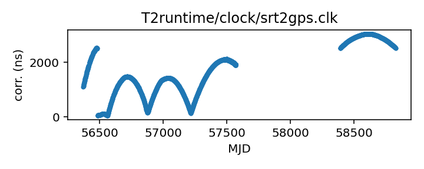
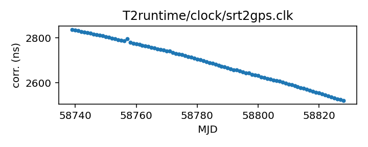

## SRT

Sardinia Radio Telescope clock corrections

This file is pulled from the TEMPO2 repository and may not be fully up-to-date.

|     |     |
|:--- |:--- |
| File | `T2runtime/clock/srt2gps.clk` |
| Authority | temporary |
| URL in repository | <https://raw.githubusercontent.com/nanograv/pulsar-clock-corrections/main/T2runtime/clock/srt2gps.clk> |
| Original download URL | <https://bitbucket.org/psrsoft/tempo2/raw/HEAD/T2runtime/clock/srt2gps.clk> |
| Format | tempo2 |
| Bogus last correction | False |
| Clock file start | 2013-03-20 MJD 56371.0 |
| Clock file end | 2019-12-11 MJD 58828.0 |
| Update interval (days) | 7 |
| Last update attempt | 2022-06-07 |
| Last update result | Unchanged |

Log entries from the last few update attempts:
```
2022-05-26 20:40:07.592 - Unchanged
2022-06-07 13:34:31.198 - Unchanged
```
[Full log](https://raw.githubusercontent.com/nanograv/pulsar-clock-corrections/main/log/T2runtime/clock/srt2gps.clk.log)


All clock corrections:



Recent clock corrections:



