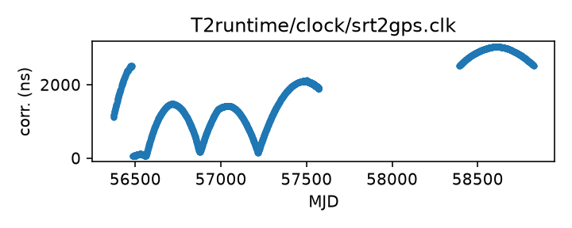
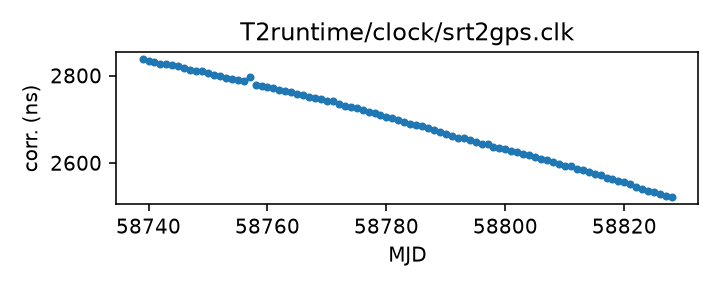

## SRT

Sardinia Radio Telescope clock corrections

This file is pulled from the TEMPO2 repository and may not be fully
up-to-date.

|     |     |
|:--- |:--- |
| File | `T2runtime/clock/srt2gps.clk` |
| Authority | temporary |
| URL in repository | <https://raw.githubusercontent.com/ipta/pulsar-clock-corrections/main/T2runtime/clock/srt2gps.clk> |
| Original download URL | <https://bitbucket.org/psrsoft/tempo2/raw/HEAD/T2runtime/clock/srt2gps.clk> |
| Format | tempo2 |
| Bogus last correction | False |
| Clock file start | 2013-03-20 MJD 56371.0 |
| Clock file end | 2019-12-11 MJD 58828.0 |
| Update interval (days) | 7 |
| Last update attempt | 2026-08-21 |
| Last update result | Unchanged |

Log entries from the last few update attempts:
```
2026-06-19 21:42:57.001 - Unchanged
2026-06-26 21:48:33.866 - Unchanged
2026-07-03 21:39:57.076 - Unchanged
2026-07-10 21:35:05.442 - Unchanged
2026-07-17 21:16:03.573 - Unchanged
2026-07-24 21:37:02.782 - Unchanged
2026-07-31 21:37:32.939 - Unchanged
2026-08-07 21:04:57.750 - Unchanged
2026-08-14 20:55:04.567 - Unchanged
2026-08-21 20:48:54.494 - Unchanged
```
[Full log](https://raw.githubusercontent.com/ipta/pulsar-clock-corrections/main/log/T2runtime/clock/srt2gps.clk.log)


All clock corrections:



Recent clock corrections:



