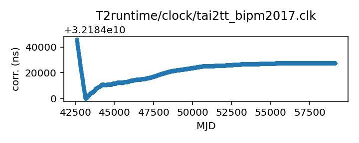
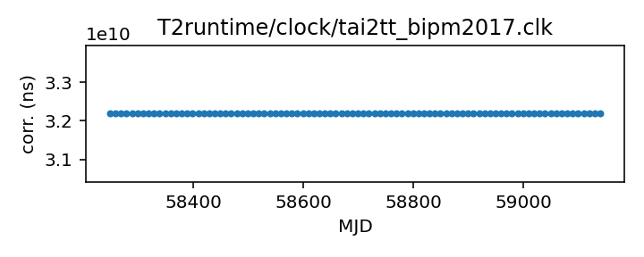

## TAI to TT(BIPM2017)

TAI to BIPM-updated TT, 2017 version

This file is constructed from BIPM published data and should
never change; updated versions will appear approximately
yearly, and do revise old data. Aa result they are given different
clock file names, and are treated as different time scales.

The time scale TT is supposed to be a basis for TDB, and is meant
to be a stable clock for describing the motions of the solar system.
Of necessity it is derived from the practical time scale TAI,
which is produced by an ensemble of atomic clocks. A simple
realization of TT, such as that implemented by Astropy,
simply yields TT = TAI + 32.184 s.

Atomic clocks do wander, and the BIPM can sometimes estimate
that wander in retrospect.  Rather than revise TAI, the BIPM
offers versions of TT that are more stable because they
compensate for variations in TAI. These are defined by yearly
bulletins, and are referred to in TEMPO2 as TT(BIPMyyyy), where
yyyy is the year of the bulletin.

Each bulletin publishes corrections from TAI to TT. It may
revise earlier corrections up to about 10 years back, and it
contains a formula for making predictions past the end of the
data it contains.

This file is pulled from the TEMPO2 repository but is based on
BIPM data and should be unchanging.

|     |     |
|:--- |:--- |
| File | `T2runtime/clock/tai2tt_bipm2017.clk` |
| Authority | temporary |
| URL in repository | <https://raw.githubusercontent.com/ipta/pulsar-clock-corrections/main/T2runtime/clock/tai2tt_bipm2017.clk> |
| Original download URL | <https://bitbucket.org/psrsoft/tempo2/raw/HEAD/T2runtime/clock/tai2tt_bipm2017.clk> |
| Format | tempo2 |
| Bogus last correction | True |
| Clock file start | 1975-06-26 MJD 42589.0 |
| Clock file end | 2020-10-17 MJD 59139.0 |
| Update interval (days) | inf |
| Last update attempt | 2022-06-13 |
| Last update result | Unchanged |

Log entries from the last few update attempts:
```
2022-06-13 13:55:30.220 - Unchanged
```
[Full log](https://raw.githubusercontent.com/ipta/pulsar-clock-corrections/main/log/T2runtime/clock/tai2tt_bipm2017.clk.log)

Leading comments from clock file:

    #
    # 2017 version of BIPM TT scale, see tai2tt_bipm2003.clk for more info
    # IHS 20180319 Copied from tai2tt2013.clk up until 49889 as the tempo
    # bipmnist17.extrap file contains a component from utccorr.tot before that.
    # From 49899 onwards, using bipmnist17.extrap values.
    #


All clock corrections:



Recent clock corrections:




### Further information

- [Description of this repository](index.html)
- [Instructions for using this repository with various software](instructions.html)
- [Status page](status.html)


This repository is currently maintained by Anne Archibald <anne.archibald@nanograv.org>.

