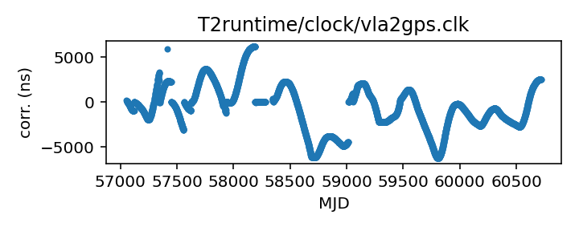
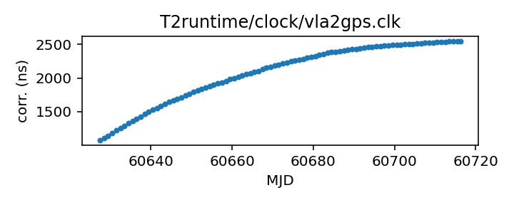

## VLA (TEMPO2)

Very Large Array clock corrections (TEMPO2)

This file is pulled from the TEMPO2 repository and may not be fully
up-to-date.

|     |     |
|:--- |:--- |
| File | `T2runtime/clock/vla2gps.clk` |
| Authority | temporary |
| URL in repository | <https://raw.githubusercontent.com/ipta/pulsar-clock-corrections/main/T2runtime/clock/vla2gps.clk> |
| Original download URL | <https://bitbucket.org/psrsoft/tempo2/raw/HEAD/T2runtime/clock/vla2gps.clk> |
| Format | tempo2 |
| Bogus last correction | False |
| Clock file start | 2015-02-01 MJD 57054.6 |
| Clock file end | 2025-02-10 MJD 60716.2 |
| Update interval (days) | 7 |
| Last update attempt | 2025-05-26 |
| Last update result | Unchanged |

Log entries from the last few update attempts:
```
2025-01-08 20:36:48.857 - Unchanged
2025-01-15 20:34:58.470 - Unchanged
2025-01-22 20:35:00.198 - Unchanged
2025-01-29 20:35:40.862 - Unchanged
2025-02-05 20:37:02.716 - Unchanged
2025-02-12 20:36:27.806 - Unchanged
2025-05-05 14:30:54.781 - Updated
2025-05-12 20:38:45.825 - Unchanged
2025-05-19 20:42:10.618 - Unchanged
2025-05-26 20:41:01.976 - Unchanged
```
[Full log](https://raw.githubusercontent.com/ipta/pulsar-clock-corrections/main/log/T2runtime/clock/vla2gps.clk.log)


All clock corrections:



Recent clock corrections:



