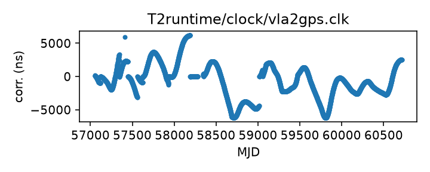
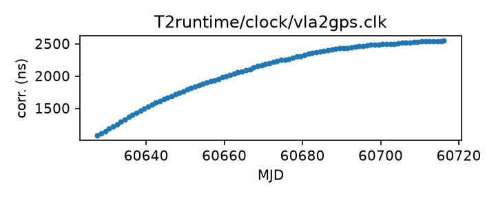

## VLA (TEMPO2)

Very Large Array clock corrections (TEMPO2)

This file is pulled from the TEMPO2 repository and may not be fully
up-to-date.

|     |     |
|:--- |:--- |
| File | `T2runtime/clock/vla2gps.clk` |
| Authority | temporary |
| URL in repository | <https://raw.githubusercontent.com/ipta/pulsar-clock-corrections/main/T2runtime/clock/vla2gps.clk> |
| Original download URL | <https://bitbucket.org/psrsoft/tempo2/raw/HEAD/T2runtime/clock/vla2gps.clk> |
| Format | tempo2 |
| Bogus last correction | False |
| Clock file start | 2015-02-01 MJD 57054.6 |
| Clock file end | 2025-02-10 MJD 60716.2 |
| Update interval (days) | 7 |
| Last update attempt | 2026-04-10 |
| Last update result | Unchanged |

Log entries from the last few update attempts:
```
2026-01-26 20:49:49.695 - Unchanged
2026-02-03 21:01:56.410 - Unchanged
2026-02-10 21:07:58.664 - Unchanged
2026-02-17 21:03:13.122 - Unchanged
2026-03-06 20:56:04.526 - Unchanged
2026-03-13 20:59:55.802 - Unchanged
2026-03-20 20:57:37.677 - Unchanged
2026-03-27 21:04:29.947 - Unchanged
2026-04-03 21:02:03.855 - Unchanged
2026-04-10 21:02:52.042 - Unchanged
```
[Full log](https://raw.githubusercontent.com/ipta/pulsar-clock-corrections/main/log/T2runtime/clock/vla2gps.clk.log)


All clock corrections:



Recent clock corrections:



