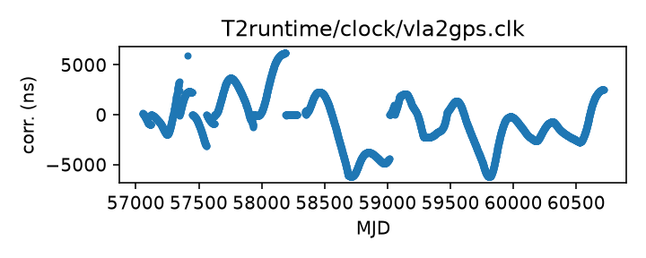
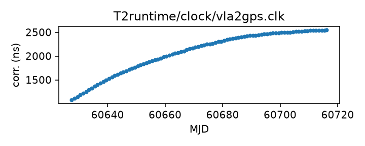

## VLA (TEMPO2)

Very Large Array clock corrections (TEMPO2)

This file is pulled from the TEMPO2 repository and may not be fully
up-to-date.

|     |     |
|:--- |:--- |
| File | `T2runtime/clock/vla2gps.clk` |
| Authority | temporary |
| URL in repository | <https://raw.githubusercontent.com/ipta/pulsar-clock-corrections/main/T2runtime/clock/vla2gps.clk> |
| Original download URL | <https://bitbucket.org/psrsoft/tempo2/raw/HEAD/T2runtime/clock/vla2gps.clk> |
| Format | tempo2 |
| Bogus last correction | False |
| Clock file start | 2015-02-01 MJD 57054.6 |
| Clock file end | 2025-02-10 MJD 60716.2 |
| Update interval (days) | 7 |
| Last update attempt | 2026-08-21 |
| Last update result | Unchanged |

Log entries from the last few update attempts:
```
2026-06-19 21:42:51.478 - Unchanged
2026-06-26 21:48:27.679 - Unchanged
2026-07-03 21:39:51.706 - Unchanged
2026-07-10 21:34:59.408 - Unchanged
2026-07-17 21:15:57.495 - Unchanged
2026-07-24 21:36:57.120 - Unchanged
2026-07-31 21:37:27.176 - Unchanged
2026-08-07 21:04:52.384 - Unchanged
2026-08-14 20:54:58.547 - Unchanged
2026-08-21 20:48:48.827 - Unchanged
```
[Full log](https://raw.githubusercontent.com/ipta/pulsar-clock-corrections/main/log/T2runtime/clock/vla2gps.clk.log)


All clock corrections:



Recent clock corrections:



