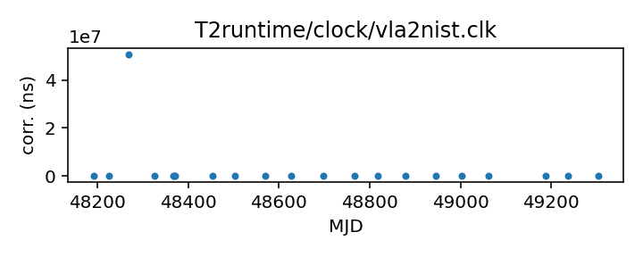
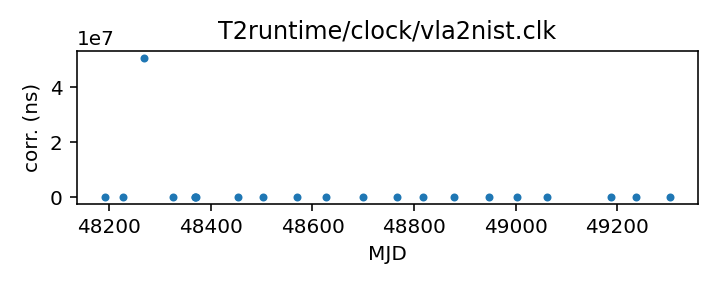

## VLA to NIST

Very Large Array to NIST clock corrections (TEMPO2)

This file is pulled from the TEMPO2 repository and may not be fully up-to-date.

|     |     |
|:--- |:--- |
| File | `T2runtime/clock/vla2nist.clk` |
| Authority | temporary |
| URL in repository | <https://raw.githubusercontent.com/ipta/pulsar-clock-corrections/main/T2runtime/clock/vla2nist.clk> |
| Original download URL | <https://bitbucket.org/psrsoft/tempo2/raw/HEAD/T2runtime/clock/vla2nist.clk> |
| Format | tempo2 |
| Bogus last correction | False |
| Clock file start | 1990-10-27 MJD 48191.2 |
| Clock file end | 1993-11-13 MJD 49304.0 |
| Update interval (days) | 7 |
| Last update attempt | 2022-09-14 |
| Last update result | Unchanged |

Log entries from the last few update attempts:
```
2022-07-13 20:34:15.347 - Unchanged
2022-07-20 20:36:47.939 - Unchanged
2022-07-27 20:33:00.871 - Unchanged
2022-08-03 20:34:46.251 - Unchanged
2022-08-10 20:34:05.733 - Unchanged
2022-08-17 20:34:04.884 - Unchanged
2022-08-24 20:34:36.417 - Unchanged
2022-08-31 20:34:57.441 - Unchanged
2022-09-07 20:40:07.572 - Unchanged
2022-09-14 20:39:53.747 - Unchanged
```
[Full log](https://raw.githubusercontent.com/ipta/pulsar-clock-corrections/main/log/T2runtime/clock/vla2nist.clk.log)

Leading comments from clock file:

    # From old tempo time_vla.dat:
    # awk '$1<50000 {printf("%11.5f %10.5e\n",$1,($3-$2)/1.e6)}' time_vla.dat
    #  > $TEMPO2/clock/vla2nist.clk
    #


All clock corrections:



Recent clock corrections:



