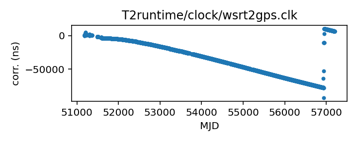
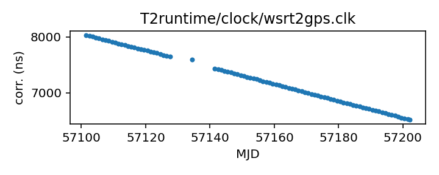

## WSRT

Westerbork Synthesis Radio Telescope clock corrections

This file is pulled from the TEMPO2 repository and may not be fully
up-to-date.

|     |     |
|:--- |:--- |
| File | `T2runtime/clock/wsrt2gps.clk` |
| Authority | temporary |
| URL in repository | <https://raw.githubusercontent.com/ipta/pulsar-clock-corrections/main/T2runtime/clock/wsrt2gps.clk> |
| Original download URL | <https://bitbucket.org/psrsoft/tempo2/raw/HEAD/T2runtime/clock/wsrt2gps.clk> |
| Format | tempo2 |
| Bogus last correction | False |
| Clock file start | 1999-01-01 MJD 51179.5 |
| Clock file end | 2015-06-29 MJD 57202.1 |
| Update interval (days) | 7 |
| Last update attempt | 2025-09-22 |
| Last update result | Unchanged |

Log entries from the last few update attempts:
```
2025-07-21 20:45:21.928 - Unchanged
2025-07-28 20:46:15.371 - Unchanged
2025-08-04 20:47:14.680 - Unchanged
2025-08-11 20:42:44.355 - Unchanged
2025-08-18 20:41:30.858 - Unchanged
2025-08-25 20:42:24.020 - Unchanged
2025-09-01 20:38:22.807 - Unchanged
2025-09-08 20:40:29.067 - Unchanged
2025-09-15 20:38:13.962 - Unchanged
2025-09-22 20:40:04.015 - Unchanged
```
[Full log](https://raw.githubusercontent.com/ipta/pulsar-clock-corrections/main/log/T2runtime/clock/wsrt2gps.clk.log)

Leading comments from clock file:

    ##51178.5 1.6347e-05 66.287 GPSWB1 1jan 1999, leap sec


All clock corrections:



Recent clock corrections:



