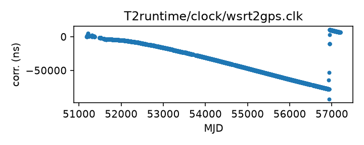
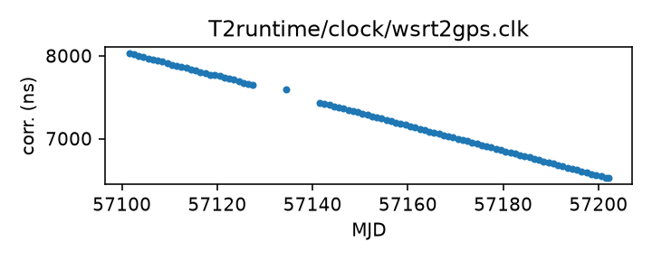

## WSRT

Westerbork Synthesis Radio Telescope clock corrections

This file is pulled from the TEMPO2 repository and may not be fully
up-to-date.

|     |     |
|:--- |:--- |
| File | `T2runtime/clock/wsrt2gps.clk` |
| Authority | temporary |
| URL in repository | <https://raw.githubusercontent.com/ipta/pulsar-clock-corrections/main/T2runtime/clock/wsrt2gps.clk> |
| Original download URL | <https://bitbucket.org/psrsoft/tempo2/raw/HEAD/T2runtime/clock/wsrt2gps.clk> |
| Format | tempo2 |
| Bogus last correction | False |
| Clock file start | 1999-01-01 MJD 51179.5 |
| Clock file end | 2015-06-29 MJD 57202.1 |
| Update interval (days) | 7 |
| Last update attempt | 2026-07-17 |
| Last update result | Unchanged |

Log entries from the last few update attempts:
```
2026-05-15 21:35:33.100 - Unchanged
2026-05-22 21:43:13.185 - Unchanged
2026-05-29 22:14:04.634 - Unchanged
2026-06-05 21:54:04.555 - Unchanged
2026-06-12 22:06:11.786 - Unchanged
2026-06-19 21:42:51.866 - Unchanged
2026-06-26 21:48:28.688 - Unchanged
2026-07-03 21:39:52.047 - Unchanged
2026-07-10 21:34:59.794 - Unchanged
2026-07-17 21:15:58.020 - Unchanged
```
[Full log](https://raw.githubusercontent.com/ipta/pulsar-clock-corrections/main/log/T2runtime/clock/wsrt2gps.clk.log)

Leading comments from clock file:

    ##51178.5 1.6347e-05 66.287 GPSWB1 1jan 1999, leap sec


All clock corrections:



Recent clock corrections:



