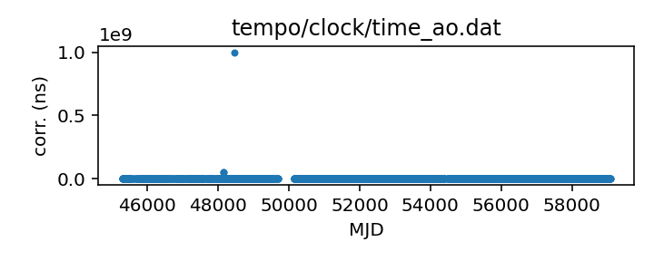
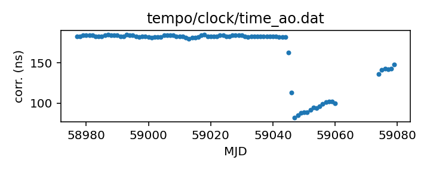

## Arecibo

Arecibo clock correction file

This file covers clock corrections up to the final shut-down before
the collapse. Any updates are expected to be retroactive
corrections.

The earliest clock corrections in this file predate GPS and are
actually referenced to NIST time directly. Clock corrections from
after 1995 are referenced to GPS. This file does not distinguish
between the two.

If questions arise, contact David Nice <niced@lafayette.edu>.

|     |     |
|:--- |:--- |
| File | `tempo/clock/time_ao.dat` |
| Authority | temporary |
| URL in repository | <https://raw.githubusercontent.com/nanograv/pulsar-clock-corrections/main/tempo/clock/time_ao.dat> |
| Original download URL | <https://sourceforge.net/p/tempo/tempo/ci/master/tree/clock/time_ao.dat?format=raw> |
| Format | tempo |
| Bogus last correction | False |
| Clock file start | 1982-11-29 MJD 45302.8 |
| Clock file end | 2020-08-18 MJD 59079.0 |
| Update interval (days) | inf |
| Last update attempt | 2022-05-26 |
| Last update result | Updated |

Log entries from the last few update attempts:
```
2022-05-24 15:36:40.733 - Validation failed: New version of tempo/clock/time_ao.dat MJDs differ from old version where they overlap in 8609 places
2022-05-24 16:28:59.665 - Validation failed: New version of tempo/clock/time_ao.dat MJDs differ from old version where they overlap in 8609 places
2022-05-24 17:59:44.362 - Validation failed: New version of tempo/clock/time_ao.dat MJDs differ from old version where they overlap in 8609 places
2022-05-26 08:30:05.009 - Validation failed: Unable to read new version of tempo/clock/time_ao.dat: Clock file /tmp/astropy-download-15491-z0oxpt3s in format tempo appears to be out of order
2022-05-26 08:35:03.527 - Updated
```
[Full log](https://raw.githubusercontent.com/nanograv/pulsar-clock-corrections/main/log/tempo/clock/time_ao.dat.log)


All clock corrections:



Recent clock corrections:



