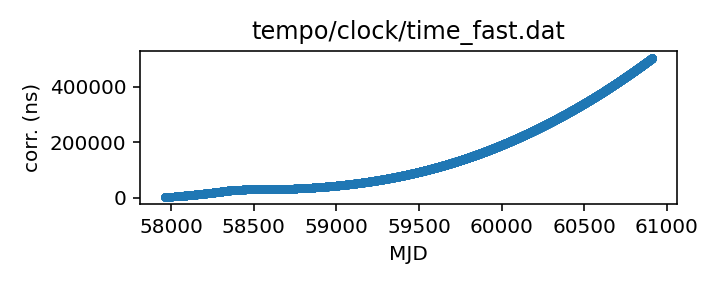
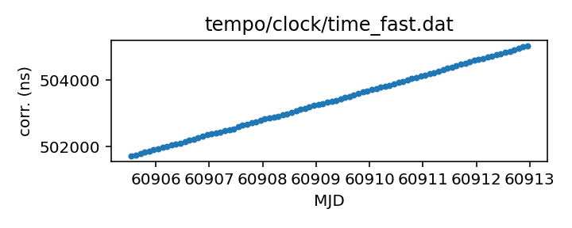

## FAST

FAST clock correction file

This file is pulled from the FAST_ClockFile repository.

|     |     |
|:--- |:--- |
| File | `tempo/clock/time_fast.dat` |
| Authority | temporary |
| URL in repository | <https://raw.githubusercontent.com/ipta/pulsar-clock-corrections/main/tempo/clock/time_fast.dat> |
| Original download URL | <https://raw.githubusercontent.com/NAOC-pulsar/FAST_ClockFile/master/time_fast.dat> |
| Format | tempo |
| Bogus last correction | False |
| Clock file start | 2017-07-27 MJD 57961.0 |
| Clock file end | 2025-06-29 MJD 60856.0 |
| Update interval (days) | 7 |
| Last update attempt | 2025-06-30 |
| Last update result | Updated |

Log entries from the last few update attempts:
```
2025-02-12 20:36:28.294 - Updated
2025-05-05 14:30:55.463 - Updated
2025-05-12 20:38:46.424 - Updated
2025-05-19 20:42:11.064 - Updated
2025-05-26 20:41:02.533 - Updated
2025-06-02 20:43:46.376 - Updated
2025-06-09 20:43:56.626 - Updated
2025-06-16 20:43:48.812 - Unchanged
2025-06-23 20:43:50.152 - Updated
2025-06-30 20:43:30.435 - Updated
```
[Full log](https://raw.githubusercontent.com/ipta/pulsar-clock-corrections/main/log/tempo/clock/time_fast.dat.log)


All clock corrections:



Recent clock corrections:



