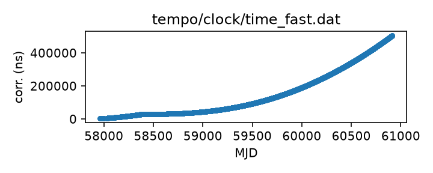
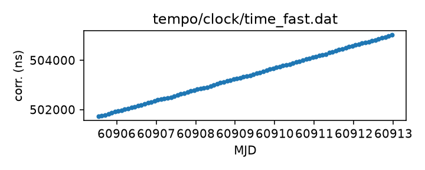

## FAST

FAST clock correction file

This file is pulled from the FAST_ClockFile repository.

|     |     |
|:--- |:--- |
| File | `tempo/clock/time_fast.dat` |
| Authority | temporary |
| URL in repository | <https://raw.githubusercontent.com/ipta/pulsar-clock-corrections/main/tempo/clock/time_fast.dat> |
| Original download URL | <https://raw.githubusercontent.com/NAOC-pulsar/FAST_ClockFile/master/time_fast.dat> |
| Format | tempo |
| Bogus last correction | False |
| Clock file start | 2017-07-27 MJD 57961.0 |
| Clock file end | 2025-08-25 MJD 60913.0 |
| Update interval (days) | 7 |
| Last update attempt | 2026-06-26 |
| Last update result | Failed to download |

Log entries from the last few update attempts:
```
2026-04-24 21:13:38.554 - Failed to download: HTTP Error 404: Not Found
2026-05-01 21:14:45.109 - Failed to download: HTTP Error 404: Not Found
2026-05-08 21:34:53.279 - Failed to download: HTTP Error 404: Not Found
2026-05-15 21:35:32.560 - Failed to download: HTTP Error 404: Not Found
2026-05-22 21:43:12.879 - Failed to download: HTTP Error 404: Not Found
2026-05-29 22:14:04.143 - Failed to download: HTTP Error 404: Not Found
2026-06-05 21:54:04.290 - Failed to download: HTTP Error 404: Not Found
2026-06-12 22:06:11.606 - Failed to download: HTTP Error 404: Not Found
2026-06-19 21:42:51.691 - Failed to download: HTTP Error 404: Not Found
2026-06-26 21:48:28.186 - Failed to download: HTTP Error 404: Not Found
```
[Full log](https://raw.githubusercontent.com/ipta/pulsar-clock-corrections/main/log/tempo/clock/time_fast.dat.log)


All clock corrections:



Recent clock corrections:



