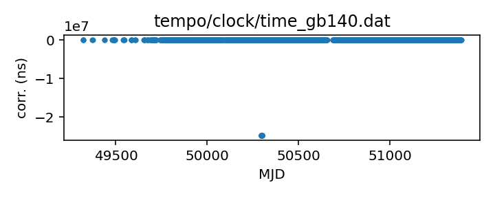
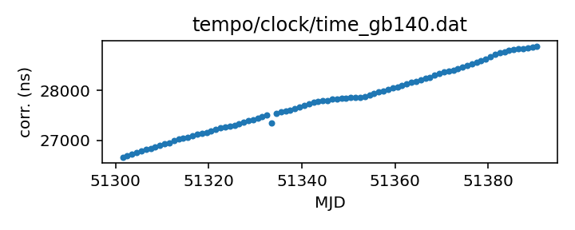

## GB140

Green Bank 140-foot telescope

This telescope is not currently operating and so updated clock
corrections should not be necessary. That said, this clock
correction file is pulled from the TEMPO repository and may not
cover the entire time that the telescope was operational.

If questions arise, contact Ryan S. Lynch <rlynch@nrao.edu>.

|     |     |
|:--- |:--- |
| File | `tempo/clock/time_gb140.dat` |
| Authority | temporary |
| URL in repository | <https://raw.githubusercontent.com/ipta/pulsar-clock-corrections/main/tempo/clock/time_gb140.dat> |
| Original download URL | <https://sourceforge.net/p/tempo/tempo/ci/master/tree/clock/time_gb140.dat?format=raw> |
| Format | tempo |
| Bogus last correction | False |
| Clock file start | 1993-11-29 MJD 49320.5 |
| Clock file end | 1999-07-31 MJD 51390.5 |
| Update interval (days) | inf |
| Last update attempt | 2022-06-01 |
| Last update result | Updated |

Log entries from the last few update attempts:
```
2022-06-01 12:20:20.531 - Updated
```
[Full log](https://raw.githubusercontent.com/ipta/pulsar-clock-corrections/main/log/tempo/clock/time_gb140.dat.log)


All clock corrections:



Recent clock corrections:



