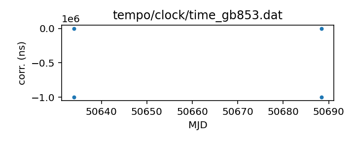

## GB853

Green Bank 85-3 telescope

This is one telescope of a set of three built as a sort of
prototype interferometer for the VLA. It was operated as a pulsar
observing instrument for some time after its initial purpose was
satisfied.

This telescope is not currently operating and so updated clock
corrections should not be necessary. That said, this clock
correction file is pulled from the TEMPO repository and may not
cover the entire time that the telescope was operational.

If questions arise, contact Ryan S. Lynch <rlynch@nrao.edu>.

|     |     |
|:--- |:--- |
| File | `tempo/clock/time_gb853.dat` |
| Authority | temporary |
| URL in repository | <https://raw.githubusercontent.com/ipta/pulsar-clock-corrections/main/tempo/clock/time_gb853.dat> |
| Original download URL | <https://sourceforge.net/p/tempo/tempo/ci/master/tree/clock/time_gb853.dat?format=raw> |
| Format | tempo |
| Bogus last correction | True |
| Clock file start | 1997-07-04 MJD 50634.0 |
| Clock file end | 1997-08-28 MJD 50688.4 |
| Update interval (days) | inf |
| Last update attempt | 2022-06-01 |
| Last update result | Unchanged |

Log entries from the last few update attempts:
```
2022-06-01 12:20:20.920 - Unchanged
```
[Full log](https://raw.githubusercontent.com/ipta/pulsar-clock-corrections/main/log/tempo/clock/time_gb853.dat.log)


All clock corrections:



Recent clock corrections:


### Further information

- [Description of this repository](index.html)
- [Instructions for using this repository with various software](instructions.html)
- [Status page](status.html)


This repository is currently maintained by Anne Archibald <anne.archibald@nanograv.org>.

