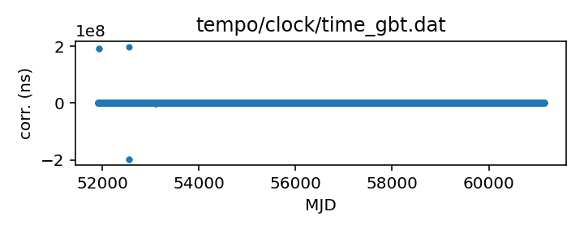
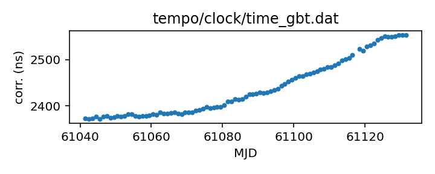

## GBT

Green Bank Telescope clock correction file

This file records the difference between UTC(GBT) and UTC(GPS).

The observatory distributes this file on the Web, updated about daily.

A discrepancy arose between the observatory-distributed file and the
file in this repository (which had been identical to the 
observatory-distributed one up to that point). Around 
2023-03-20 (MJD 60023), the first ~11 entries in the 
observatory-distributed file were changed to zero.
Ryan Lynch expressed surprise that this had occurred, but no
resolution had arisen as of 2024-02-14. Since this resulted in
the new file failing validation and the file in this repository
not updating, at that point I (Anne Archibald) decided to
switch those entries to match the observatory values. The old values
are available from the version of the file in git tag 
"gbt-mystery-values".

If questions arise, contact Ryan S. Lynch <rlynch@nrao.edu>.

|     |     |
|:--- |:--- |
| File | `tempo/clock/time_gbt.dat` |
| Authority | observatory |
| URL in repository | <https://raw.githubusercontent.com/ipta/pulsar-clock-corrections/main/tempo/clock/time_gbt.dat> |
| Original download URL | <https://www.gb.nrao.edu/~fghigo/timer/time_gbt.dat> |
| Format | tempo |
| Bogus last correction | False |
| Clock file start | 2000-12-31 MJD 51909.5 |
| Clock file end | 2024-05-18 MJD 60448.5 |
| Update interval (days) | 1 |
| Last update attempt | 2024-09-19 |
| Last update result | Validation failed |

Log entries from the last few update attempts:
```
2024-09-10 20:32:04.127 - Validation failed: New version of tempo/clock/time_gbt.dat clock corrections differ from old version where they overlap in 11 places
2024-09-11 20:31:12.847 - Validation failed: New version of tempo/clock/time_gbt.dat clock corrections differ from old version where they overlap in 11 places
2024-09-12 20:31:59.941 - Validation failed: New version of tempo/clock/time_gbt.dat clock corrections differ from old version where they overlap in 11 places
2024-09-13 20:31:59.762 - Validation failed: New version of tempo/clock/time_gbt.dat clock corrections differ from old version where they overlap in 11 places
2024-09-14 20:32:38.721 - Validation failed: New version of tempo/clock/time_gbt.dat clock corrections differ from old version where they overlap in 11 places
2024-09-15 20:31:14.468 - Validation failed: New version of tempo/clock/time_gbt.dat clock corrections differ from old version where they overlap in 11 places
2024-09-16 20:33:29.940 - Validation failed: New version of tempo/clock/time_gbt.dat clock corrections differ from old version where they overlap in 11 places
2024-09-17 20:32:52.012 - Validation failed: New version of tempo/clock/time_gbt.dat clock corrections differ from old version where they overlap in 11 places
2024-09-18 20:32:45.028 - Validation failed: New version of tempo/clock/time_gbt.dat clock corrections differ from old version where they overlap in 11 places
2024-09-19 20:32:12.008 - Validation failed: New version of tempo/clock/time_gbt.dat clock corrections differ from old version where they overlap in 11 places
```
[Full log](https://raw.githubusercontent.com/ipta/pulsar-clock-corrections/main/log/tempo/clock/time_gbt.dat.log)


All clock corrections:



Recent clock corrections:



