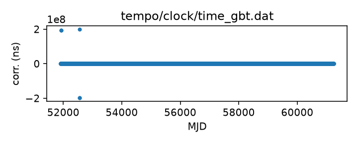
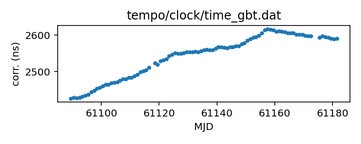

## GBT

Green Bank Telescope clock correction file

This file records the difference between UTC(GBT) and UTC(GPS).

The observatory distributes this file on the Web, updated about daily.

A discrepancy arose between the observatory-distributed file and the
file in this repository (which had been identical to the 
observatory-distributed one up to that point). Around 
2023-03-20 (MJD 60023), the first ~11 entries in the 
observatory-distributed file were changed to zero.
Ryan Lynch expressed surprise that this had occurred, but no
resolution had arisen as of 2024-02-14. Since this resulted in
the new file failing validation and the file in this repository
not updating, at that point I (Anne Archibald) decided to
switch those entries to match the observatory values. The old values
are available from the version of the file in git tag 
"gbt-mystery-values".

In May 2024, the values were changed back in the source file.
This resulted in the file failing validation and refusing to update,
again. As of February 2025, this should be fully resolved and the
original values restored, on both ends.

If questions arise, contact Ryan S. Lynch <rlynch@nrao.edu>.

|     |     |
|:--- |:--- |
| File | `tempo/clock/time_gbt.dat` |
| Authority | observatory |
| URL in repository | <https://raw.githubusercontent.com/ipta/pulsar-clock-corrections/main/tempo/clock/time_gbt.dat> |
| Original download URL | <https://www.gb.nrao.edu/~fghigo/timer/time_gbt.dat> |
| Format | tempo |
| Bogus last correction | False |
| Clock file start | 2000-12-31 MJD 51909.5 |
| Clock file end | 2026-04-27 MJD 61157.5 |
| Update interval (days) | 1 |
| Last update attempt | 2026-04-28 |
| Last update result | Updated |

Log entries from the last few update attempts:
```
2026-04-19 21:02:14.906 - Updated
2026-04-20 21:08:27.110 - Updated
2026-04-21 21:12:33.483 - Updated
2026-04-22 21:16:14.560 - Updated
2026-04-23 21:14:47.580 - Updated
2026-04-24 21:13:35.402 - Updated
2026-04-25 21:04:17.431 - Updated
2026-04-26 21:04:23.928 - Updated
2026-04-27 21:34:59.103 - Updated
2026-04-28 21:37:33.213 - Updated
```
[Full log](https://raw.githubusercontent.com/ipta/pulsar-clock-corrections/main/log/tempo/clock/time_gbt.dat.log)


All clock corrections:



Recent clock corrections:



