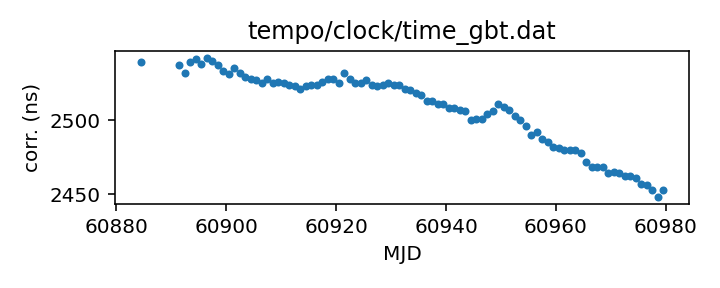

## GBT

Green Bank Telescope clock correction file

This file records the difference between UTC(GBT) and UTC(GPS).

The observatory distributes this file on the Web, updated about daily.

If questions arise, contact Ryan S. Lynch <rlynch@nrao.edu>.

|     |     |
|:--- |:--- |
| File | `tempo/clock/time_gbt.dat` |
| Authority | observatory |
| URL in repository | <https://raw.githubusercontent.com/ipta/pulsar-clock-corrections/main/tempo/clock/time_gbt.dat> |
| Original download URL | <https://www.gb.nrao.edu/~fghigo/timer/time_gbt.dat> |
| Format | tempo |
| Bogus last correction | False |
| Clock file start | 2000-12-31 MJD 51909.5 |
| Clock file end | 2023-03-04 MJD 60007.5 |
| Update interval (days) | 1 |
| Last update attempt | 2023-03-05 |
| Last update result | Updated |

Log entries from the last few update attempts:
```
2023-02-24 20:30:16.689 - Updated
2023-02-25 20:29:15.298 - Updated
2023-02-26 20:28:44.522 - Updated
2023-02-27 20:30:43.405 - Updated
2023-02-28 20:30:53.273 - Updated
2023-03-01 20:30:49.461 - Updated
2023-03-02 20:30:45.609 - Updated
2023-03-03 20:29:52.340 - Updated
2023-03-04 20:28:06.195 - Updated
2023-03-05 20:28:30.458 - Updated
```
[Full log](https://raw.githubusercontent.com/ipta/pulsar-clock-corrections/main/log/tempo/clock/time_gbt.dat.log)


All clock corrections:


Recent clock corrections:



