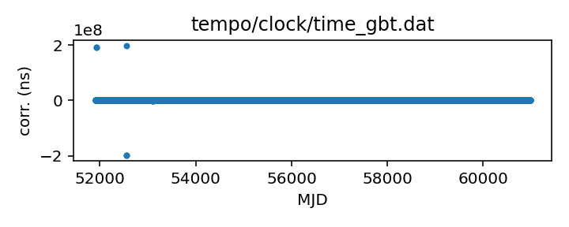

## GBT

Green Bank Telescope clock correction file

This file records the difference between UTC(GBT) and UTC(GPS).

The observatory distributes this file on the Web, updated about daily.

If questions arise, contact Ryan S. Lynch <rlynch@nrao.edu>.

|     |     |
|:--- |:--- |
| File | `tempo/clock/time_gbt.dat` |
| Authority | observatory |
| URL in repository | <https://raw.githubusercontent.com/ipta/pulsar-clock-corrections/main/tempo/clock/time_gbt.dat> |
| Original download URL | <https://www.gb.nrao.edu/~fghigo/timer/time_gbt.dat> |
| Format | tempo |
| Bogus last correction | False |
| Clock file start | 2000-12-31 MJD 51909.5 |
| Clock file end | 2023-03-20 MJD 60023.5 |
| Update interval (days) | 1 |
| Last update attempt | 2023-03-25 |
| Last update result | Validation failed |

Log entries from the last few update attempts:
```
2023-03-16 20:29:06.327 - Updated
2023-03-17 20:28:55.067 - Updated
2023-03-18 20:27:22.644 - Updated
2023-03-19 20:28:07.770 - Updated
2023-03-20 20:27:17.269 - Updated
2023-03-21 20:26:24.411 - Updated
2023-03-22 20:26:16.613 - Validation failed: New version of tempo/clock/time_gbt.dat clock corrections differ from old version where they overlap in 1 places
2023-03-23 20:27:44.221 - Validation failed: New version of tempo/clock/time_gbt.dat clock corrections differ from old version where they overlap in 1 places
2023-03-24 20:27:47.181 - Validation failed: New version of tempo/clock/time_gbt.dat clock corrections differ from old version where they overlap in 2 places
2023-03-25 20:26:24.443 - Validation failed: New version of tempo/clock/time_gbt.dat clock corrections differ from old version where they overlap in 2 places
```
[Full log](https://raw.githubusercontent.com/ipta/pulsar-clock-corrections/main/log/tempo/clock/time_gbt.dat.log)


All clock corrections:



Recent clock corrections:


