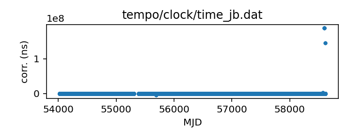

## Jodrell Bank (TEMPO)

Jodrell Bank clock correction file

This file is pulled from the TEMPO repository and may not be fully up-to-date.

|     |     |
|:--- |:--- |
| File | `tempo/clock/time_jb.dat` |
| Authority | temporary |
| URL in repository | <https://raw.githubusercontent.com/ipta/pulsar-clock-corrections/main/tempo/clock/time_jb.dat> |
| Original download URL | <https://sourceforge.net/p/tempo/tempo/ci/master/tree/clock/time_jb.dat?format=raw> |
| Format | tempo |
| Bogus last correction | True |
| Clock file start | 2006-10-13 MJD 54021.4 |
| Clock file end | 2019-05-13 MJD 58616.2 |
| Update interval (days) | 7 |
| Last update attempt | 2022-12-15 |
| Last update result | Unchanged |

Log entries from the last few update attempts:
```
2022-10-13 20:42:37.893 - Unchanged
2022-10-20 20:43:22.605 - Unchanged
2022-10-27 20:36:41.705 - Unchanged
2022-11-03 20:28:52.787 - Unchanged
2022-11-10 20:35:53.189 - Unchanged
2022-11-17 20:32:51.337 - Unchanged
2022-11-24 20:30:33.610 - Unchanged
2022-12-01 20:29:02.429 - Unchanged
2022-12-08 20:29:26.004 - Unchanged
2022-12-15 20:27:51.841 - Unchanged
```
[Full log](https://raw.githubusercontent.com/ipta/pulsar-clock-corrections/main/log/tempo/clock/time_jb.dat.log)


All clock corrections:



Recent clock corrections:


